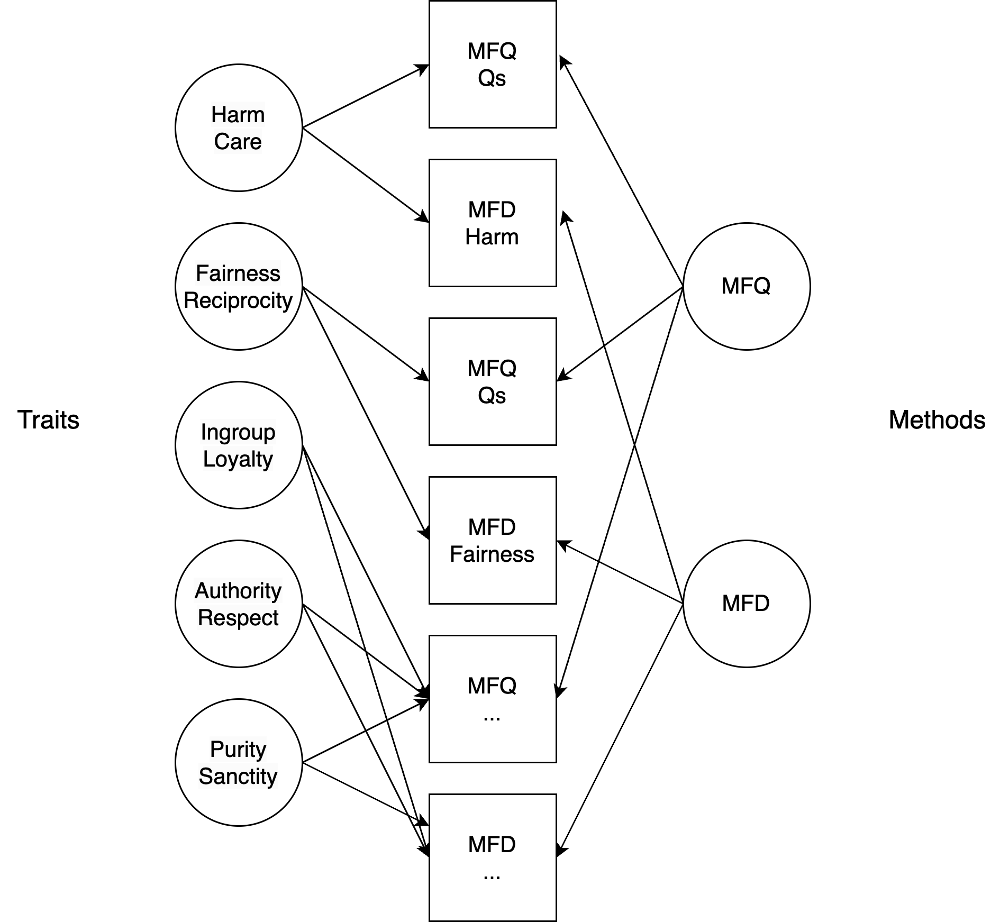

```{r load_packages, include = FALSE}
library(papaja)
library(MuMIn)
library(reshape)
library(nlme)
library(ggplot2)
library(expss)
library(MOTE)
library(quanteda)
library(quanteda.textstats)
library(tm)
library(ngram)
library(ggplot2)
library(reshape)
library(knitr)
library(performance)
library(dplyr)
library(rio)
library(mice)
library(semPlot)
library(lavaan)
library(broom)
library(tidyr)

# to install this package 
# tmp <- tempfile()
# system2("git", c("clone", "--recursive",
#                  shQuote("https://github.com/leslie-huang/r-corpus.git"), shQuote(tmp)))
# devtools::install(tmp)
library(corpus)

knitr::opts_chunk$set(cache = TRUE)
options(tinytex.verbose = TRUE)
percentmiss <- function(x){ sum(is.na(x)) / length(x) * 100 }
```

The field of moral psychology has a long history with modern moral
psychology beginning in the late 1960s with Lawrence Kohlberg's theory
of moral development [@Kohlberg1977]. Since then, Kohlberg's theory has
been highly criticized with numerous theories and hypotheses proposed to
replace it. One of these theories is Moral Foundations Theory (MFT)
proposed by Haidt and colleagues [@haidt2004; @Haidt2007]. While the
theory itself has been widely criticized and debated, the goal of the
current work is to tackle a related measurement issue, the Moral
Foundations Dictionary [MFD, @Graham2009]. @Graham2009 developed the
MFD - a lexicon-based linguistic measure of MFT - arguing that moral
concerns and the propositions of MFT could be measured and tested with
the words people use. Here we first review evidence and criticisms
against this assumption. We then provide our own test of the MFD using
partisan news articles.

## Moral Foundations Measurement

Haidt and Joseph [-\@haidt2004] and Haidt and Graham [-@Haidt2007]
formulated MFT as a method by which to capture the entirety of humans'
moral domain. They argued that older theories of moral psychology were
focused primarily on issues of justice, fairness, and caring, which are
individually focused foundations of morality that align with the beliefs
of political liberals. In other words, moral psychology ignored the
valid moral foundations of conservatives. MFT holds that people's moral
domain can be mapped by quantifying their endorsement of five moral
foundations: *harm/care*, *fairness/reciprocity*, *ingroup/loyalty*,
*authority/respect*, and *purity/sanctity* [@Haidt2007]. Thus, they
proposed that the addition of these two additional domains could
adequately capture the broader spectrum of morality.

Measurement of MFT has traditionally focused on two options: 1) the
Moral Foundations Questionnaire (MFQ) - a typical Likert-type survey
instrument that measures moral relevance of each foundation to an
individual and the moral judgment of various scenarios depicting each
foundation, and 2) the Moral Foundations Dictionary (MFD) which was
designed to capture language's role in moral reasoning and justification
as used in speech and text [@Graham2009; @graham2011]. The MFQ is a
30-item scale with 15 items on the moral relevance and judgment
scenarios. The 15 moral relevance items are equally divided among the
five foundations and examine how relevant a condition is to making a
moral judgment on a scale of 1 (*not at all relevant*) to 6 (*extremely
relevant*). These relevance items include examples such as: "Whether or
not someone used violence (*harm*)," "Whether or not someone was denied
his or her rights (*fairness*)," "Whether or not someone showed a lack
of loyalty (*ingroup*)," "Whether or not an action caused chaos or
disorder (*authority*)," and "Whether or not someone did something
disgusting (*purity*)." The moral judgments items are also equally
divided between the foundations and ask on a six-point scale how much
one agrees with each of the statements. These judgment items include:
"One of the worst things a person can do is hurt a defenseless animal
(*harm*)," "Justice is the most important requirement of a society
(*fairness*)," "I am proud of my country's history (*ingroup*)," "Men
and women each have different roles to play in society (*authority*),"
and "Chastity is an important and valuable virtue (*purity*)."

The internal consistency of the MFQ from @Graham2011 was $\alpha$ = .73
averaged across subscales with a range of $\alpha$ = .65-.84. Across six
studies, the MFQ was found to have an average Cronbach's alpha of .63
for *harm*, .64 for *fairness*, .56 for *ingroup*, .59 for *authority*,
and .71 for *purity* [@Federico2013; @Graham2009; @Graham2012;
@Weber2013]. Test-retest reliability was *r* = .68-.82 using a sample of
123 college students. Confirmatory factor analysis supported a
well-fitted five-factor model (*harm/care*, *fairness/reciprocity*,
*ingroup/loyalty*, *authority/respect*, and *purity/sanctity*) over two,
individual (*harm* and *fairness*) versus group (*ingroup*, *authority*,
and *purity*) foundations, or three, autonomy (*harm*, *fairness*),
community (*ingroup*, *authority*), and divinity (*purity*) ethics,
foundations factor model. The five-factor structure also fit for
non-Western samples, thus, providing evidence of the MFQ
generalizability. Convergent validity was supported with correlations on
other measures of morality [@Graham2011].

The MFD is composed of 259 words, with around 50 words assigned to each
of the five foundations. @Graham2009 created a preliminary list of words
that they believed would be associated with the five foundations. Words
such as *war* and *peace* should indicate a greater concern with *harm*
foundation whereas words such as *homeland* and *terrorism* should
indicate a greater concern with the *ingroup* foundation. The other
foundation dictionaries include *equal* and *justice* (*fairness*),
*honor* and *protest* (*authority*), and *holy* and *sin* (*purity*). To
validate the word sets, @Graham2009 examined the frequency of MFD words
in liberal and conservative sermons using the Linguistic Inquiry and
Word Count [LIWC; @Pennebaker2007] computer program. They found liberal
ministers used *harm*, *fairness*, and *ingroup* words more often than
conservative ministers who used *authority* and *purity* words more
often. Although conservative ministers were expected to use more
*ingroup* words based on political ideology and previous research, an
examination of the way liberal ministers used *ingroup* words revealed a
tendency for the use of *ingroup* words to glorify rebellion and promote
independence (i.e., the opposite direction from *ingroup* definitions).
Effect sizes indicated relatively sizable difference between liberal and
conservative sermons with Cohen's *d* values ranging from 0.56 to 1.27.

In contrast to this approach, @Sagi2014 explored how moral words were
used paired with other co-occurring concepts using Latent Semantic
Analysis (LSA). They examined three different moral issues in different
contexts to piece out specific moral words and their collocates. First,
they looked at how moral words were used in relation to the World Trade
Center compared to the Empire State Building in the New York Times from
1987-2007. After 9-11, the number of moral words associated with the
World Trade Center increased, specifically *harm* words from the MFD.
Second, they considered the changes in how moral words were paired with
mosque used in blogs as a response to the debate of building a mosque
near Ground Zero following 9-11. They found words from the MFD were used
more often with mosque during the main debate and then the co-occurrence
decreased afterwards. Lastly, they examined moral language tied to the
abortion debate in Congress. Republicans used more moral language
overall; more specifically, Republicans tended to use more words
associated with the *purity* foundation; while Democrats used more words
associated with the *fairness* foundation.

## Critiques of Moral Foundations

MFT has received criticism on the grounds that its assumptions regarding
moral intuitions have little empirical basis. @Suhler2011 criticized the
content and taxonomy of the five foundations and question whether or not
the foundations are sufficiently distinct as to stand as their own
foundation. Likewise, @Gray2015 argues that the measurement of the moral
foundations confounds morality with other constructs (such as weirdness)
and the moral foundations lack statistical and conceptual distinction.
@Schein2015 argues that harm-based morality is the most parsimonious and
logical explanation for MFT findings.

Beyond the critiques of the theory itself, many have also provided
strong critiques of the measurement using MFD. Conducting two close
conceptual replication studies using religious sermons and six extension
studies using U.S. Congressional speeches, party platforms, State of the
Union addresses, media outlets, and political organization texts,
@Frimer2020 found that the liberal-conservative differences found in the
original study replicated in only 30% of cases and the effect sizes were
over 30 times smaller than reported in @Graham2009. In a meta-analysis,
the theorized differences were only found for authority and purity
(e.g., conservatives used more authority and purity words). Loyalty was
contrary to theoretical predictions (e.g., used more by liberals), and
no differences were found for harm and fairness. Additionally,
@Frimer2020 tested the theory under the most forgiving conditions using
not only the original MFD but also the revised MFD2 as well using log
transformed scores and raw scores. Even under the best circumstances
(log transformed MFD2 scores), only two of the foundations showed
theorized differences but with very small effects. Other studies have
also found conflicting findings which fail to support the basic
assertions of MFT. Exploring the political Twitterverse, @Sterling2018
found differences in the MFD depend on political sophistication. For
example, harm words were used more by liberals only if they had low
levels of political sophistication; at high levels of political
sophistication, conservatives used more harm words. While the MFD has
not been extensively used (at least in published research), studies
which have use the MFD to test partisan differences have found mixed
results in terms of supporting MFT [@Clifford2013; @Frimer2015;
@Sagi2014]. Like @Frimer2020, we attempt to give the MFD the best chance
for success by incorporating a weighting method to address the
skewedness and sparsity of the linguistic data.

The most successful attempts to validate a linguistic measure of moral
foundations have used more complex methods (compared to the original
dictionary-based approach). These attempts generally fall into two
categories: human annotations and semantic representations. @Hopp2021
represents the first approach where instead of relying on 'experts', a
large sample of lay people were crowdsourced to manually annotate
document for content relevant to each foundation. While
resource-intensive, this method better captures how people may encounter
and judge moral issues in everyday life leading to a more ecologically
valid dictionary. @Garten2016 represents the second categories which
instead relies on data-driven semantic analysis. Using shallow neural
net models like word2vec [@mikolov_efficient_2013], moral foundations
were measured using semantic similarity vectors rather than simple word
counts. Here, we try to augment the simpler approach to add more context
to see if the MFD liberal-conservative differences can be replicated.

First, we use the MFQ and MFD in a multi-trait multi-method approach to
determine if the dictionary can be improved and mapped into the
theoretical MFT traits. This study examined the measurement overlap
between these two sources, as well as the latent traits after
controlling for the overlap. Using the results from this study, we
examined two conceptual replications of @Frimer2020. We test the
liberal-conservative difference proposed by MFT using partisan media
content and the MFD. We first test differences in a general news corpus
compared liberal sources (National Public Radio [NPR] and the New York
Times [NYT]) to conservative sources (Fox News and Breitbart). Second,
we examined news about specific political events: Brett Kavanaugh's U.S.
Supreme Court nomination and the U.S. Government Shutdown in 2018-2019.
In the second study, the news sources were expanded to cover NYT, NPR,
Slate, Huffington Post, and Politico on the liberal side and Fox News,
Breitbart, The Rush Limbaugh Show, The Blaze, and Sean Hannity on the
conservative side. To address potential issues of measurement with the
MFD, the MFD was combined with the information produced in Study 1 and
weighted by valence to create weighted percentages to better specify
endorsement. Like @Frimer2020, results were judged based on the
direction of the liberal-conservative difference compared MFT
predictions and the size of the effect compared to past studies.

# Study 1

We approached this study with the intention to answer a method question.
That is, this portion of the current research was conducted in order to
solidify the best method by which to analyze political news text under
the MFT framework while also alleviating some of the aforementioned
potential dictionary issues with the MFD. In this set of studies, we
examined the MFD and MFQ within the same study. The first two
sub-studies were used to develop a (potentially) larger dictionary for
the MFD and collect data on both scales. The original dictionary was
developed conceptually, identifying words that *should* go with each
moral trait. In Study 1.1 and 1.2, we collect data to expand the
dictionary. The last sub-study examined the MFD and MFQ using
multi-trait multi-method (MTMM) analysis using guidelines from
@byrne2001 and @widaman1985.

## Study 1.1

In this study, participants were given a word association task elicit
additional semantically related word forms for each moral foundation.
This data was used to expand the MFD for each latent area to determine
if these additional words could improve scores and test measurement
relation to the MFQ in Study 1.3.

### Participants

```{r demos-mtmm-study-1.1, include = FALSE}
exp1data <- import("../../study1_data/study1.1_fixed_associations.csv")

# clear out completely columns we don't need
crapcolumns <- c(1, 2, 3, 5:14)
study1.1DF <- exp1data[ , -crapcolumns]

# accuracy
summary(study1.1DF) #Check Q15_1 and Q23 for in-range scores -WP
study1.1DF$Q23 <- factor(study1.1DF$Q23,
                         levels = 1:3,
                         labels = c("Democrat", "Republican", "Independent"))

# missing data 
missing <- apply(study1.1DF, 1, percentmiss)
table(missing)
# a few missing here and there
# do not want to replace entire MFQ, other missing is political orientation
# no replacement 

# outliers on MFQ only 
mahal1.1 <- mahalanobis(study1.1DF[ , -c(1:6,22,23)], 
                    colMeans(study1.1DF[ , -c(1:6,22,23)], na.rm = TRUE),
                    cov(study1.1DF[ , -c(1:6,22,23)], use = "pairwise.complete.obs"))
#mahal1.1
cutoff1.1 <- qchisq(1 - .001, ncol(study1.1DF[ , -c(1:6,22,23)]))
df1.1 <- ncol(study1.1DF[ , -c(1:6,22,23)])
summary1.1 <- summary(mahal1.1 < cutoff1.1) # nas will be excluded because they don't have the full scale 
noout1.1 <- subset(study1.1DF, mahal1.1 < cutoff1.1)

# assumptions
# correlations for MFQ
correlations1.1 <- cor(noout1.1[,-c(1:6,22,23)], use = "pairwise.complete.obs")
correlations1.1
symnum(correlations1.1)

# making the random stuff
random1.1 <- rchisq(nrow(noout1.1), 7)
fake1.1 <- lm(random1.1 ~ ., data = noout1.1[ , -c(1:6, 22, 23)])
# normal
standardized1.1 <- rstudent(fake1.1)
hist(standardized1.1, breaks = 15) # some skew 

# linear
{qqnorm(standardized1.1) 
abline(0,1)}
# fairly linear 

# homog + s
fitvalues1.1 <- scale(fake1.1$fitted.values)
{plot(fitvalues1.1, standardized1.1) 
abline(0,0)
abline(v = 0)}
# actually pretty good minus that one outlier 

# create subscales 
noout1.1$harmMFQ <- apply(noout1.1[ , 7:9], 1, sum)
noout1.1$fairMFQ <- apply(noout1.1[ , 10:12], 1, sum)
noout1.1$ingroupMFQ <- apply(noout1.1[ , 13:15], 1, sum)
noout1.1$authorityMFQ <- apply(noout1.1[ , 16:18], 1, sum)
noout1.1$purityMFQ <- apply(noout1.1[ , 19:21], 1, sum)

party <- table(noout1.1$Q23, useNA = "ifany")
```

`r nrow(exp1data)` participants were assessed from a large Midwestern
university. Participants were given course credit for their introductory
psychology course for completing the study. `r unname(summary1.1[4])`
participants had missing data on the MFQ and were excluded from
analyses. The MFQ data was screened for multivariate outliers with
Mahalanobis distance as described in @Tabachnick2012, and
`r unname(summary1.1[2])` outliers were found using
$\chi^2_{p < .001}$(`r df1.1`) = `r apa_num(cutoff1.1)`. These participants
were excluded from further analyses, representing `r nrow(noout1.1)`
final participants. Participants were asked to denote their political
party, and `r printnum(party["Democrat"]/sum(party)*100,digits = 1)`%
indicated they were Democrats,
`r printnum(party["Republican"]/sum(party)*100,digits = 1)`% were
Republican, and
`r printnum(party["Independent"]/sum(party)*100,digits = 1)`% indicated
they were Independent. `r printnum(party[4]/sum(party)*100,digits = 1)`%
of values were missing for this question.

### Materials and Procedure

A complete example of the survey can be found online at
<https://osf.io/6mv2g>. First, participants were given a description of
associative memory as the relation between words that comes about
through many pairings in writing and speech. Next, the free association
task, similar to that used in @nelson2004 and @dedeyne2019 was described
to the participants as listing the "first word that pops into mind". The
participants were then given three example free association cues,
*lost*, *old*, and *article*. For each cue, participants were asked to
write all the words that come to mind. To elicit free association to the
moral foundation areas, participants were given the following
instructions:

"Moral Foundations Theory states that when making moral
judgments/decisions, the concerns people have can be divided into five
categories. Below are labels of each of these five categories. You will
then be asked to list words you think are associated with each of the
labels."

Each of the foundation pairs were listed together (i.e., *harm/care*,
*fairness/reciprocity,* etc.) with a space for participants to list
their free association concepts. After the free association task,
participants were then given the 15-items from the moral relevance
section of the MFQ as described in the introduction. Last, participants
were asked to denote their political orientation from 1 *conservative*
to 10 *liberal*, as well as which political party they associated with:
Democrat, Republican, and Independent. The survey was delivered through
Qualtrics, and participants were recruited through the online
participant management system for the university (SONA). Each
participant signed an online consent form at the beginning of the study
and was given participation credit at the end of the study.

### Results

All data was screening for inaccurate responses, as well as missing
data, as described in the participant section. The final MFQ data was
screened for assumptions of normality, linearity, and homoscedasticity.
The MFQ data was slightly skewed but otherwise linear and homoscedastic
after accounting for skew. No transform was applied. The sum of each
moral foundation area was calculated in order to determine which words
were linked to their respective moral foundation. The average scores
were: harm (*M* = `r printnum(mean(noout1.1$harmMFQ))`, *SD*  = 
`r printnum(sd(noout1.1$harmMFQ))`), fairness (*M*  = 
`r printnum(mean(noout1.1$fairMFQ))`, *SD*  = 
`r printnum(sd(noout1.1$fairMFQ))`), ingroup (*M*  = 
`r printnum(mean(noout1.1$ingroupMFQ))`, *SD*  = 
`r printnum(sd(noout1.1$ingroupMFQ))`), authority (*M*  = 
`r printnum(mean(noout1.1$authorityMFQ))`, *SD*  = 
`r printnum(sd(noout1.1$authorityMFQ))`), and purity (*M*  = 
`r printnum(mean(noout1.1$purityMFQ))`, *SD*  = 
`r printnum(sd(noout1.1$purityMFQ))`). Participants free association
responses were processed using the *tm* [@feinerer2008] and *corpus*
[@perry2024] libraries after manual correction of spelling errors. Each
set of answers was cleaned for punctuation, English stop words (e.g.,
*the*, *an*, *of*) were removed, and each word was stemmed using the
English library in *tm*. We did not combine related words in this
section (i.e., *injure* and *injury*, which have different stems *injur*
and *injuri*) to allow for maximum coverage of different word forms
present in the dictionary. Additionally, with the use of automated
stemmers like that present in the *tm* library, leaving both word forms
in the dictionary would capture more of the concepts present in future
analyses with a different corpus without the requirement on the coder to
manually recode all word forms. Frequency counts of the stemmed words
were tabulated and only words mentioned with at least one percent
frequency were used in the subsequent analyses. The complete set of word
frequencies for each foundation can be found in our supplemental
materials.

For clarity, the processing pipeline for each separate domain was:

1.  Manual spell checking of free association responses.
2.  Word tokenization and stemming.
3.  Create a term by document matrix.
4.  Remove punctuation and stopwords via the *tm* stopword list.
5.  Calculate percent frequency across documents.
6.  Remove words with less than 1% mentions across participants.

```{r harm-analysis-1.1, include = FALSE}
#q27 through 34 are the writing columns
noout1.1$Q27 <- as.character(noout1.1$Q27)

# stem the data
for (i in 1:nrow(noout1.1)) {
  noout1.1$Q27[i] <- paste(unlist(
    text_tokens(noout1.1$Q27[i], stemmer = "en")), collapse = " ")
}

# create a corpus
harm_corpus <- Corpus(VectorSource(noout1.1$Q27))
harm_TDM <- as.matrix(TermDocumentMatrix(harm_corpus,
                              control = list(removePunctuation = TRUE,
                                             stopwords = TRUE)))

# calculate the most frequent words
harm_freq <- data.frame(Word = rownames(harm_TDM),
                       Freq = rowSums(harm_TDM),
                       row.names = NULL)
harm_freq$Word <- as.character(harm_freq$Word)
harm_freq$percent <- harm_freq$Freq/nrow(noout1.1) *100

write.csv(harm_freq, "../../study1_data/study1.1_harm_freq.csv", row.names = F)

# subset out to only words with 1% mentions
harm_words <- harm_freq$Word[harm_freq$percent >= 1]
# turn sideways to add to dataset
harm_TDM  <- as.data.frame(t(harm_TDM))
harm_TDM  <- harm_TDM[ , harm_words]

# final dataset for harm
harm_final <- cbind(noout1.1[ , c("ResponseId", "Q15_1", "Q23", "harmMFQ")],
                   harm_TDM)

harm_cor <- apply(harm_final[ , 5:ncol(harm_final)], 2, function (x) { cor(x, harm_final$harmMFQ)})

harmcut <- mean(harm_cor) + 2*sd(harm_cor)
harm_words_reduce <- names(harm_cor[abs(harm_cor) >= harmcut])
```

```{r fair-analysi-1.1, include = FALSE}
#q27 through 34 are the writing columns
noout1.1$Q29 <- as.character(noout1.1$Q29)

# stem the data
for (i in 1:nrow(noout1.1)) {
  noout1.1$Q29[i] <- paste(unlist(
    text_tokens(noout1.1$Q29[i], stemmer = "en")), collapse = " ")
}

##create a corpus
fair_corpus <- Corpus(VectorSource(noout1.1$Q29))
fair_TDM <- as.matrix(TermDocumentMatrix(fair_corpus,
                              control = list(removePunctuation = TRUE,
                                             stopwords = TRUE)))

##view the most frequent words
fair_freq <- data.frame(Word = rownames(fair_TDM),
                       Freq = rowSums(fair_TDM),
                       row.names = NULL)
fair_freq$Word <- as.character(fair_freq$Word)
fair_freq$percent <- fair_freq$Freq/nrow(noout1.1) *100

write.csv(fair_freq, "../../study1_data/study1.1_fair_freq.csv", row.names = F)

# subset out to only words with 1% mentions
fair_words <- fair_freq$Word[fair_freq$percent >= 1]
# turn sideways to add to dataset
fair_TDM <- as.data.frame(t(fair_TDM))
fair_TDM <- fair_TDM[ , fair_words]

# final dataset for fair
fair_final <- cbind(noout1.1[ , c("ResponseId", "Q15_1", "Q23", "fairMFQ")],
                   fair_TDM)

fair_cor <- apply(fair_final[ , 5:ncol(fair_final)], 2, function (x) { cor(x, fair_final$fairMFQ)})

faircut <- mean(fair_cor) + 2*sd(fair_cor)
fair_words_reduce <- names(fair_cor[abs(fair_cor) >= faircut])
```

```{r ingroup-analysis-1.1, include = FALSE}
#q27 through 34 are the writing columns
noout1.1$Q30 <- as.character(noout1.1$Q30)

##stem the data
for (i in 1:nrow(noout1.1)) {
  noout1.1$Q30[i] <- paste(unlist(
    text_tokens(noout1.1$Q30[i], stemmer = "en")), collapse = " ")
}

##create a corpus
ingroup_corpus <- Corpus(VectorSource(noout1.1$Q30))
ingroup_TDM <- as.matrix(TermDocumentMatrix(ingroup_corpus,
                              control = list(removePunctuation = TRUE,
                                             stopwords = TRUE)))

# view the most frequent words
ingroup_freq <- data.frame(Word = rownames(ingroup_TDM),
                       Freq = rowSums(ingroup_TDM),
                       row.names = NULL)
ingroup_freq$Word <- as.character(ingroup_freq$Word)
ingroup_freq$percent <- ingroup_freq$Freq/nrow(noout1.1) *100

write.csv(ingroup_freq, "../../study1_data/study1.1_ingroup_freq.csv", row.names = F)

# subset out to only words with 1% mentions
ingroup_words <- ingroup_freq$Word[ingroup_freq$percent >= 1]
# turn sideways to add to dataset
ingroup_TDM <- as.data.frame(t(ingroup_TDM))
ingroup_TDM <- ingroup_TDM[ , ingroup_words]

# final dataset for ingroup
ingroup_final <- cbind(noout1.1[ , c("ResponseId", "Q15_1", "Q23", "ingroupMFQ")],
                   ingroup_TDM)

ingroup_cor <- apply(ingroup_final[ , 5:ncol(ingroup_final)], 2, function (x) { cor(x, ingroup_final$ingroupMFQ)})

ingroupcut <- mean(ingroup_cor) + 2*sd(ingroup_cor)
ingroup_words_reduce <- names(ingroup_cor[abs(ingroup_cor) >= ingroupcut])
```

```{r authority-analysis-1.1, include = FALSE}
#q27 through 34 are the writing columns
noout1.1$Q32 <- as.character(noout1.1$Q32)

##stem the data
for (i in 1:nrow(noout1.1)) {
  noout1.1$Q32[i] <- paste(unlist(
    text_tokens(noout1.1$Q32[i], stemmer = "en")), collapse = " ")
}

# create a corpus
authority_corpus <- Corpus(VectorSource(noout1.1$Q32))
authority_TDM <- as.matrix(TermDocumentMatrix(authority_corpus,
                              control = list(removePunctuation = TRUE,
                                             stopwords = TRUE)))

# view the most frequent words
authority_freq <- data.frame(Word = rownames(authority_TDM),
                       Freq = rowSums(authority_TDM),
                       row.names = NULL)
authority_freq$Word <- as.character(authority_freq$Word)
authority_freq$percent <- authority_freq$Freq/nrow(noout1.1) *100

write.csv(authority_freq, "../../study1_data/study1.1_authority_freq.csv", row.names = F)

# subset out to only words with 1% mentions
authority_words <- authority_freq$Word[authority_freq$percent >= 1]
# turn sideways to add to dataset
authority_TDM <- as.data.frame(t(authority_TDM))
authority_TDM <- authority_TDM[ , authority_words]

# final dataset for authority
authority_final <- cbind(noout1.1[ , c("ResponseId", "Q15_1", "Q23", "authorityMFQ")],
                   authority_TDM)

authority_cor <- apply(authority_final[ , 5:ncol(authority_final)], 2, function (x) { cor(x, authority_final$authorityMFQ)})

authoritycut <- mean(authority_cor) + 2*sd(authority_cor)
authority_words_reduce <- names(authority_cor[abs(authority_cor) >= authoritycut])
```

```{r purity-analysis-1.1, include = FALSE}
#q27 through 34 are the writing columns
noout1.1$Q34 <- as.character(noout1.1$Q34)

# stem the data
for (i in 1:nrow(noout1.1)) {
  noout1.1$Q34[i] <- paste(unlist(
    text_tokens(noout1.1$Q34[i], stemmer = "en")), collapse = " ")
}

# create a corpus
purity_corpus <- Corpus(VectorSource(noout1.1$Q34))
purity_TDM <- as.matrix(TermDocumentMatrix(purity_corpus,
                              control = list(removePunctuation = TRUE,
                                             stopwords = TRUE)))

# view the most frequent words
purity_freq <- data.frame(Word = rownames(purity_TDM),
                       Freq = rowSums(purity_TDM),
                       row.names = NULL)
purity_freq$Word <- as.character(purity_freq$Word)
purity_freq$percent <- purity_freq$Freq/nrow(noout1.1) *100

write.csv(purity_freq, "../../study1_data/study1.1_purity_freq.csv", row.names = F)

# subset out to only words with 1% mentions
purity_words <- purity_freq$Word[purity_freq$percent >= 1]
# turn sideways to add to dataset
purity_TDM <- as.data.frame(t(purity_TDM))
purity_TDM <- purity_TDM[ , purity_words]

##final dataset for purity
purity_final <- cbind(noout1.1[ , c("ResponseId", "Q15_1", "Q23", "purityMFQ")],
                   purity_TDM)

purity_cor <- apply(purity_final[ , 5:ncol(purity_final)], 2, function (x) { cor(x, purity_final$purityMFQ)})

puritycut <- mean(purity_cor) + 2*sd(purity_cor)
purity_words_reduce <- names(purity_cor[abs(purity_cor) >= puritycut])
```

This procedure generated a large frequency of words for a new dictionary
of moral foundations: harm `r length(harm_words)`, fairness
`r length(fair_words)`, ingroup `r length(ingroup_words)`, authority
`r length(authority_words)`, and purity `r length(purity_words)`. These
concepts were included in the full dictionary used for Study 1.3. We
additionally created a reduced dictionary that included only concepts
correlated with their respective moral foundations scores. Correlations
between word frequency and the sum of the MFQ were calculated for each
foundation and set of concepts. Words were included in the reduced
dictionary if their correlation was two standard deviations away from
the mean correlation for that foundation. The reduced dataset included
the following number of words for each foundation: harm
`r length(harm_words_reduce)`, fairness `r length(fair_words_reduce)`,
ingroup `r length(ingroup_words_reduce)`, authority
`r length(authority_words_reduce)`, and purity
`r length(purity_words_reduce)`.

## Study 1.2

In this study, participants were asked to write about chemical warfare
(wave 1), abortion, same-sex marriage, and environmentalism (wave 2).
These prompts were designed to elicit writing about moral concepts that
would relate to the moral foundations areas for expansion of the
dictionary.

### Participants

```{r demos-mtmm-study-1.2, include = FALSE, warning = FALSE}
sample1 <- read.csv("../../study1_data/study1.2_fixed_sample 1.csv", stringsAsFactors = F)
sample2 <- read.csv("../../study1_data/study1.2_fixed_sample 2.csv", stringsAsFactors = F)

##merge files together
study1.2DF <- merge(sample1, sample2, all = TRUE)

##merge together the writing samples
#q24, q25, q26, q7 
study1.2DF$writing <- apply(study1.2DF[, c("Q24", "Q25", "Q26", "Q7")], 
                           1, function(x) toString(na.omit(x)))

##clear out completely columns we don't need
crapcolumns <- c(1, 2, 3, 5, 6, 7, 8, 9, 10, 11, 51:61)
study1.2DF <- study1.2DF[ , -crapcolumns]

##accuracy
summary(study1.2DF[ , 2:40])

study1.2DF$Q10 <- factor(study1.2DF$Q10,
                         levels = 1:2,
                         labels = c("Man", "Woman"))
study1.2DF$Q11 <- as.numeric(study1.2DF$Q11)
study1.2DF$Q12 <- factor(study1.2DF$Q12,
                         levels = 1:7,
                         labels = c("White", "Black", 
                                    "Hispanic", "Asian",
                                    "Native American", 
                                    "Mixed", "Other"))

gender <- table(study1.2DF$Q10)/sum(table(study1.2DF$Q10))*100
race <- table(study1.2DF$Q12)/sum(table(study1.2DF$Q12))*100

write.csv(study1.2DF, '../../study1_data/study1.2_finalsample.csv', row.names = FALSE)
newMFD <- import('../../study1_data/study1.2_finalsample_newMFD.csv')
colnames(newMFD)[1:41] <- colnames(study1.2DF)[1:41]
newMFD <- newMFD[,c(1,42:55)]
study1.2DF <- merge(study1.2DF, newMFD, by = "ResponseId")

##take out the people with less than 25 words
##use the ngram library to examine the data
##preprocess only works on one string at a time, so going to use a loop go through all the rows (apply won't work because we only want to work on one column)

for (i in 1:nrow(study1.2DF)) {
  
  study1.2DF$writing[i] <- preprocess(study1.2DF$writing[i], case = "lower", remove.punct = TRUE)
  study1.2DF$wordcount[i] <- string.summary(study1.2DF$writing[i])$words
  
}

#remove small words people
finalwords <- subset(study1.2DF, wordcount >= 25)

##check out missing data
#missing by row
missing <- apply(finalwords, 1, percentmiss)
table(missing)
goodrows <- subset(finalwords, missing <=  5)

#missing by column
apply(goodrows, 2, percentmiss)

##don't fill in Q10 to the end, be sure to merge these back together
goodcolumns <- goodrows[ , -c(32:42)]
badcolumns <- goodrows[ , c(32:42)]

#fill in missing data points
tempnomiss <- mice(goodcolumns)
nomiss <- complete(tempnomiss, 1)
summary(nomiss)
#merge
allcolumns <- cbind(nomiss, badcolumns) 
summary(allcolumns)

##outliers
mahal1.2 <- mahalanobis(allcolumns[ , -c(1,46:56)], 
                    colMeans(allcolumns[ , -c(1,46:56)], na.rm = TRUE),
                    cov(allcolumns[ , -c(1,46:56)], use = "pairwise.complete.obs"))
#mahal1.2
cutoff1.2 <- qchisq(1 - .001,ncol(allcolumns[ , -c(1,46:56)]))
cutoff1.2
ncol(allcolumns[ , -c(1,46:56)])
summary(mahal1.2 < cutoff1.2) #Hmm what to do w/ NAs?? 
noout1.2 <- subset(allcolumns, mahal1.2 < cutoff1.2)

##assumptions on the questions i.e., not Q10 to the end
#correlations
correlations1.2 <- cor(noout1.2[,-c(1,46:56)], use = "pairwise.complete.obs")
#correlations1.2
symnum(correlations1.2)

#the random stuff
random1.2 <- rchisq(nrow(noout1.2), 7)
fake1.2 <- lm(random1.2 ~ ., data = noout1.2[ , -c(1,46:56)])

#normal
standardized1.2 <- rstudent(fake1.2)
hist(standardized1.2, breaks = 15)

#linear
{qqnorm(standardized1.2)   
abline(0,1)}    

#homog + s
fitvalues1.2 <- scale(fake1.2$fitted.values)
{plot(fitvalues1.2, standardized1.2) 
abline(0,0)
abline(v = 0)}

####create the MFQ subscales####
noout1.2$harmMFQ <- apply(noout1.2[ , 2:4], 1, sum)
noout1.2$fairMFQ <- apply(noout1.2[ , 5:7], 1, sum)
noout1.2$ingroupMFQ <- apply(noout1.2[ , 8:10], 1, sum)
noout1.2$authorityMFQ <- apply(noout1.2[ , 11:13], 1, sum)
noout1.2$purityMFQ <- apply(noout1.2[ , 14:16], 1, sum)
```

Participants were recruited in two waves as part of a larger
investigation on priming political and religious attitudes. Participants
were recruited via an online research system (SONA) and were given
course credit for their participation. `r nrow(study1.2DF)`
participants were included in the this study. The study was mostly women
(`r printnum(gender["Woman"], digits = 1)`%) and White
(`r printnum(race["White"], digits = 1)`%) participants with a mix of
minority participants: Black (`r printnum(race["Black"], digits = 1)`%),
(`r printnum(race["Hispanic"], digits = 1)`%),
(`r printnum(race["Asian"], digits = 1)`%), Native American
(`r printnum(race["Native American"], digits = 1)`%), Mixed
(`r printnum(race["Mixed"], digits = 1)`%) and Other
(`r printnum(race["Other"], digits = 1)`%). The average listed age was
`r printnum(mean(study1.2DF$Q11, na.rm = T))` (*SD*  = 
`r printnum(sd(study1.2DF$Q11, na.rm = T))`).

### Materials and Procedure

#### Wave 1

Data was again collected via Qualtrics. Four fake new stories
were presented to participants, which were roughly 400 words each.
First, all news stories included a few sentences describing the use of
chemical weapons in the Syrian civil war. The news stories were
manipulated with political (Republican v. Democrat) and religious
(religious v. not) quotes in a 2 x 2 between-subjects design. News
stories can be found in the online materials. After consenting to
participate in the study, participants were randomly shown one of the
four new articles about Syria's use of chemical weapons. Participants
were then asked to write for 5-10 minutes about their reaction to
Syria's use of chemical weapons and the needed response from the United
States. Participants also completed the 30-item version of the MFQ as
described previously. In addition to basic demographics (gender, age),
participant political orientation was assessed with the same scale
described in Study 1.1.

#### Wave 2

The second wave of data collection included different writing prompts
designed to capture more of the moral foundation areas in their writing.
The following writing prompt(s) were used, "Please write about your
attitudes on abortion (or same-sex marriage or environmentalism) as well
as your reason for this stance." The three prompts were chosen to create
a more varied word set by using topics that should elicit words from
each moral foundations category by soliciting a moral response. The
writing prompts were randomized within participant, and each participant
completed all three prompts. Participants then completed the MFQ,
demographics, and the political orientation scale.

### Results

Participant data was first spell checked and screening for inaccurate
responses. Participants who did not write more than fifty words in
response to a given prompt were excluded (*n*  = 
`r nrow(study1.2DF) - nrow(finalwords)`). One missing datapoint was
estimated using the *mice* library from *R* for a missing MFQ question
[@buuren2011], and all other missing data was present in the
demographics sections, which were not filled in. The MFQ data were
screened for outliers using Mahalanobis distance, and `r nrow(finalwords) - nrow(noout1.2)` outliers were
found at $\chi^2_{p<.001}$(`r ncol(allcolumns[ , -c(1,32:42)])`)  = 
`r printnum(cutoff1.2)`. These data were excluded leading to a final
sample size of `r nrow(noout1.2)`. Data were screened for assumptions
described in Study 1.1 and were found to be satisfactory.

```{r writing-analysis-1.2, include = FALSE}
##stem the data
for (i in 1:nrow(noout1.2)) {
  noout1.2$writing2[i] <- paste(unlist(
    text_tokens(noout1.2$writing[i], stemmer = "en")), collapse = " ")
}

##create a corpus
overall_corpus <- Corpus(VectorSource(noout1.2$writing2))
overall_TDM <- as.matrix(TermDocumentMatrix(overall_corpus,
                              control = list(removePunctuation = TRUE,
                                             stopwords = TRUE)))

##view the most frequent words
overall_freq <- data.frame(Word = rownames(overall_TDM),
                          Freq = rowSums(overall_TDM),
                          row.names = NULL)
overall_freq$Word <- as.character(overall_freq$Word)
overall_freq$percent <- overall_freq$Freq/nrow(noout1.2)*100

write.csv(overall_freq, "../../study1_data/study1.2_freq.csv", row.names = F)

##subset out to only words with 1% mentions
##this goes over 100% but mostly want to subset out things that were only mentioned
##a few times by participants
all_words <- overall_freq$Word[overall_freq$percent >= 1]

##turn sideways to add to dataset
overall_TDM <- as.data.frame(t(overall_TDM))
overall_TDM <- overall_TDM[ , all_words]

##final dataset
overall_final <- cbind(noout1.2[ , c("ResponseId", "harmMFQ", "fairMFQ",
                                  "authorityMFQ", "purityMFQ","ingroupMFQ")],
                   overall_TDM)
```

```{r mfq-cor-1.2, include = FALSE}
##harm
harm_cor <- apply(overall_final[ , 7:ncol(overall_final)], 2, function (x) { cor(x, overall_final$harmMFQ)})

harmcut <- mean(harm_cor) + 2*sd(harm_cor)
harm_words_reduce_exp2 <- names(harm_cor[abs(harm_cor) >= harmcut])

##fair
fair_cor <- apply(overall_final[ , 7:ncol(overall_final)], 2, function (x) { cor(x, overall_final$fairMFQ)})

faircut <- mean(fair_cor) + 2*sd(fair_cor)
fair_words_reduce_exp2 <- names(fair_cor[abs(fair_cor) >= faircut])

##purity
purity_cor <- apply(overall_final[ , 7:ncol(overall_final)], 2, function (x) { cor(x, overall_final$purityMFQ)})

puritycut <- mean(purity_cor) + 2*sd(purity_cor)
purity_words_reduce_exp2 <- names(purity_cor[abs(purity_cor) >= puritycut])

##authority
authority_cor <- apply(overall_final[ , 7:ncol(overall_final)], 2, function (x) { cor(x, overall_final$authorityMFQ)})

authoritycut <- mean(authority_cor) + 2*sd(authority_cor)
authority_words_reduce_exp2 <- names(authority_cor[abs(authority_cor) >= authoritycut])

##ingroup
ingroup_cor <- apply(overall_final[ , 7:ncol(overall_final)], 2, function (x) { cor(x, overall_final$ingroupMFQ)})

ingroupcut <- mean(ingroup_cor) + 2*sd(ingroup_cor)
ingroup_words_reduce_exp2 <- names(ingroup_cor[abs(ingroup_cor) >= ingroupcut])

#print out words list to look at for further analysis
write.csv(harm_words_reduce_exp2, "../../study1_data/words/harm_exp2.csv", row.names = F)
write.csv(fair_words_reduce_exp2, "../../study1_data/words/fair_exp2.csv", row.names = F)
write.csv(authority_words_reduce_exp2, "../../study1_data/words/authority_exp2.csv", row.names = F)
write.csv(purity_words_reduce_exp2, "../../study1_data/words/purity_exp2.csv", row.names = F)
write.csv(ingroup_words_reduce_exp2, "../../study1_data/words/ingroup_exp2.csv", row.names = F)
```

In the first study, only free association responses were collected, but
in this study, full writing samples were collected. Therefore, we
expected many of the words listed to be part of creating a cohesive
discourse, rather than only related to the moral foundation targeted. To
find only the most related words, the correlation between word frequency
and MFQ subscore was calculated, and words with correlations greater
than two standard deviations outside the mean were selected for the
dictionary analysis in Study 1.3. The sum of each MFQ subscore
was calculated for the correlation analysis. The average scores were: harm (*M*  = 
`r printnum(mean(noout1.2$harmMFQ))`, *SD*  = 
`r printnum(sd(noout1.2$harmMFQ))`), fairness (*M*  = 
`r printnum(mean(noout1.2$fairMFQ))`, *SD*  = 
`r printnum(sd(noout1.2$fairMFQ))`), ingroup (*M*  = 
`r printnum(mean(noout1.2$ingroupMFQ))`, *SD*  = 
`r printnum(sd(noout1.2$ingroupMFQ))`), authority (*M*  = 
`r printnum(mean(noout1.2$authorityMFQ))`, *SD*  = 
`r printnum(sd(noout1.2$authorityMFQ))`), and purity (*M*  = 
`r printnum(mean(noout1.2$purityMFQ))`, *SD*  = 
`r printnum(sd(noout1.2$purityMFQ))`).

```{r compare-ratings-1.2, include = FALSE}
authority_erin <- read.csv("../../study1_data/words/authority_study1.2 erin.csv", stringsAsFactors = F)
authority_will <- read.csv("../../study1_data/words/authority_study1.2 will.csv", stringsAsFactors = F)
authority_erin$x[authority_erin$use != authority_will$use]

authority_words_reduce_exp2 <- authority_words_reduce_exp2[authority_words_reduce_exp2 %in% authority_will$x[authority_will$use == 1]]

fair_erin <- read.csv("../../study1_data/words/fair_study1.2 erin.csv", stringsAsFactors = F)
fair_will <- read.csv("../../study1_data/words/fair_study1.2 will.csv", stringsAsFactors = F)
fair_erin$x[fair_erin$use != fair_will$use]
fair_will$use[fair_will$x == "carbon"] <- 0
fair_will$use[fair_will$x == "emiss"] <- 0
#exclude carbon and emiss due to the prompt

fair_words_reduce_exp2 <- fair_words_reduce_exp2[fair_words_reduce_exp2 %in% fair_will$x[fair_will$use == 1]]

purity_erin <- read.csv("../../study1_data/words/purity_study1.2 erin.csv", stringsAsFactors = F)
purity_will <- read.csv("../../study1_data/words/purity_study1.2 will.csv", stringsAsFactors = F)
purity_erin$x[purity_erin$use != purity_will$use]
purity_will$use[purity_will$x == "befor"] <- 1
#before include because of "before sex/ruined/etc."

purity_words_reduce_exp2 = purity_words_reduce_exp2[purity_words_reduce_exp2 %in% purity_will$x[purity_will$use == 1]]

ingroup_erin <- read.csv("../../study1_data/words/ingroup_study1.2 erin.csv", stringsAsFactors = F)
ingroup_will <- read.csv("../../study1_data/words/ingroup_study1.2 will.csv", stringsAsFactors = F)
ingroup_erin$x[ingroup_erin$use != ingroup_will$use]
ingroup_will$use[ingroup_will$x == "mean"] <- 1
#mean should be included

ingroup_words_reduce_exp2 <- ingroup_words_reduce_exp2[ingroup_words_reduce_exp2 %in% ingroup_will$x[ingroup_will$use == 1]]

harm_erin <- read.csv("../../study1_data/words/harm_study1.2 erin.csv", stringsAsFactors = F)
harm_will <- read.csv("../../study1_data/words/harm_study1.2 will.csv", stringsAsFactors = F)
harm_erin$x[harm_erin$use != harm_will$use]
harm_will$use[harm_will$x == "import"] <- 1
# import for important 

harm_words_reduce_exp2 = harm_words_reduce_exp2[harm_words_reduce_exp2 %in% harm_will$x[harm_will$use == 1]]
```

The correlated set of words was then coded by two of the authors (EB, WP) for relevancy to the MFQ subscore and all disagreements were discussed to determine final inclusion. For
example, for harm words in this study both *also* and *Syria* appeared
as correlated words to the harm foundation. The first word does not meet
face validity of correlation with the dictionary, and these type of
function words or ambiguous verbs (i.e., *get*, *can*) were usually
excluded. The second example is likely because of the writing prompt,
and therefore, proper nouns were also excluded. The reduced dataset
included the following number of words for each foundation: harm
`r length(harm_words_reduce_exp2)`, fairness
`r length(fair_words_reduce_exp2)`, ingroup
`r length(ingroup_words_reduce_exp2)`, authority
`r length(authority_words_reduce_exp2)`, and purity
`r length(purity_words_reduce_exp2)`.

## Study 1.3

MTMM analyses use latent variable modeling to represent the underlying
structure of a proposed phenomenon, while also accounting for the
measurement of that phenomenon. As shown in Figure \@ref(fig:fig-mtmm),
MTMM models are programmed to represent the traits that are measured
(left hand side circles) and the methods used to measure those traits
(right hand side circles). The squares in the middle represent the
actual observed data, which is the MFQ questions and MFD scores. In the
first model, *correlated traits correlated methods*, the latent
variables are allowed to correlate on the traits and methods side, but
not cross correlate from traits to methods. All models are then compared
to this model to examine fit, convergent, and divergent validity. In the
second model, *no traits correlated methods*, the trait side of the
model is deleted and only methods are considered. The model should
significantly degrade in fit, as the traits should be useful in
explaining model variance for convergent validity (i.e., you do not want
a model that suggests all the variances is due to measurement).

In the third model, *perfectly correlated traits freely correlated methods*, the traits are added back to the model, but each correlation
is set to one. The fit is compared to model 1, indicating if divergent
validity of the traits has occurred. A significant degrade in fit should
be found to indicate that trait correlations are not perfect. Last,
model four *correlated traits uncorrelated methods*, the traits are
allowed to naturally correlate but the methods correlations are set to
zero. In comparison with model 1, the model should be roughly equal for
divergent validity. This result would indicate that the methods each
represent a different component to the measurement of the model, and do
not represent the same measurement twice.

Given the goal of improved measurement, we compared model 1 of the MTMM
steps across several dictionaries to determine the best measurement for
the dictionary. To assess model fit, we used the Root Mean Squared Error
of Approximation [RMSEA, @steiger1990], the Root Mean Squared Residual
[RMSR, @jöreskog1971], the Confirmatory Fit Index [CFI, @bentler1990],
the Tucker-Lewis Index [TLI, @bentler1980]. The RMSEA and RMSR should be
low for adequate model fit (\< .10) and the CFI and TLI should be high
for adequate model fit (\> .90). For model comparison, we used a
$\Delta$ CFI of greater than .01 to indicate a significant degradation
in fit [@hu1999]. We will additionally use the standardized loadings for
each of the traits to determine which model has the best measurement of
moral foundations (\> .30 desired).


```{r fig-mtmm, fig.cap = "Representation of the multi-trait multi-method model for the MFD and MFQ. Not all measured variables (squares) are shown for ease of reading. The left hand side represents the traits or foundation areas of MFT, while the right hand side represents the two measurement tools for the MFT. "}

```

### Method

#### MFD Dictionaries  

We created three versions of the MFD for separate MTMM analyses. The first dataset *original MFD* was comprised of the original concepts from the MFD. We added all versions of the original words (i.e., abuse --> abusive, abuser, abused) to ensure all forms of the words were captured within the stemming procedure. These words where then stemmed using the same procedures as the data processing described for the overall study to match the data processing completed on the participant prompt responses in Study 1.2. The *complete MFD* dataset included the original MFD concepts, all concepts listed from Study 1.1, and concepts from Study 1.2. The *reduced MFD* dataset included all concepts from the original MFD, correlated concepts from Study 1.2, and concepts from Study 1.2 (only correlated concepts were selected in Study 1.2). The percent of concepts within each moral found area was calculated on the writing prompts from Study 1.2. The percent values were calculated on the processed data excluding all stop words. These values are represented as the MFD squares in Figure \@ref(fig:fig-mtmm).

#### MFQ Subscore

The MFQ individual questions for each participant were used from Study 1.2. These values are represented as the MFQ Qs squares in Figure \@ref(fig:fig-mtmm). The final number of participants included in this model was `r nrow(noout1.2)`.

#### Models 

For clarity, we programmed the following models:

1.  Model 1 *Correlated Traits Correlated Methods*
    a.  *Original* Original MFD Words
    b.  *Complete* Original MFD Words + Study 1.1 + Study 1.2 Words
    c.  *Reduced* Original MFD Words + Study 1.1 Reduced + Study 1.2 Words
    d.  Determine if model suggests a feasible structure (fit indices
        adequate + loadings adequate)
    e.  Pick the best model to continue (using model comparison)
2.  Model 2 *No Traits Correlated Methods*
3.  Model 3 *Perfectly Correlated Traits Correlated Methods*
4.  Model 4 *Correlated Traits Uncorrelated Methods*

```{r mtmm-setup, include = FALSE}
##original mfd words
original_mfd <- read.csv("../../study1_data/original_mfd.csv", stringsAsFactors = F)

##adding forms/conjugations of words to original_mfd
#harm/care
original_mfd[c(27:95),1] <- c("abusive","abuser","abused","abusing",
                             "sympathetic","sympathies","damaged",
                             "damaging","attacked","attacking","attacker",
                             "attacks","attackers", "benefits", "benefitted",
                             "benefitting", "cares", "cared", "caring", "crushes",
                             "crushing", "crushed", "dangerous", "defends", "defending",
                             "defended", "detroys", "destroyed", "destroying",
                             "fights", "fought", "fighting", "guards", "guarded",
                             "guarding", "harms", "harmed", "harming", "hurts",
                             "hurting", "kills", "killed", "killing", "preserves",
                             "preserved", "preserving", "protects", "protected",
                             "protecting", "protection", "ruins", "ruined", "ruining",
                             "safely", "safer", "shelters", "sheltered", "sheltering",
                             "spurns", "spurned", "spurning", "stomps", "stomped",
                             "stomping", "suffers", "suffered", "suffering",
                             "violence", "warring")
                             
#fairness/reciprocity
original_mfd[c(20:64),2] <- c("balances", "balanced", "balancing","biased",
                             "biases", "discriminates", "discriminated",
                             "discriminating", "discrimination", "equals",
                             "equaled", "equaling", "equates", "equated",
                             "equating", "evens", "evened", "evening",
                             "excludes", "excluded", "excluding", "fairness",
                             "favors", "favored", "favoring", "honesty",
                             "impariality", "justice", "justifies", "justified",
                             "justifying", "prefers", "preferred", "preferring",
                             "prejudices", "prejudiced", "prejudicing", "reasons",
                             "reasoned", "reasoning", "rights", "tolerates",
                             "tolerated", "tolerating", "toleration")

#ingroup/loyalty
original_mfd[c(16:47),3] <- c("collects", "collected", "collecting", "collective",
                             "communities", "deceives", "deceived", "deceiving",
                             "deception", "deceptions", "deserts", "deserted",
                             "deserting", "desertion", "families", "fellows",
                             "foreigners", "groups", "grouped", "grouping",
                             "indviduals", "indvidualize", "individualized",
                             "individualizing", "members", "nations", "sides",
                             "togetherness", "traits", "unites", "united", "uniting")

#authority/respect
original_mfd[c(31:112),4] <- c("abides", "abided", "abiding", "authorities",
                              "classes", "classed", "classing", "command",
                              "commanded", "commanding", "controls", "controlled",
                              "controlling", "defects", "defected", "defecting",
                              "defers", "deferred", "deferring", "deference",
                              "defies", "defied", "defying", "defiance", "deserts",
                              "deserted", "deserting", "desertion", "duties",
                              "faiths", "fathers", "fathered", "fathering",
                              "honors", "honored", "honoring", "laws", "leads",
                              "leading", "mothers", "mothered", "mothering",
                              "obeys", "obeyed", "obeying", "opposes", "opposed",
                              "opposing", "orders", "ordered", "ordering", "permits",
                              "permitted", "permitting", "positions", "positioned",
                              "positioning", "preserves", "preserved", "preserving",
                              "preservation", "protests", "protested", "protesting",
                              "refuses", "refused", "refusing", "refusal", "respects",
                              "respected", "respecting", "respectful", "reveres",
                              "revered", "revering", "reverence", "serves", "served",
                              "serving", "traditions", "traditional", "traits")

#purity/sanctity
original_mfd[c(21:60),5] <- c("abstains", "abstained", "abstaining", "abstinence",
                             "adulteries", "adulterous", "adulterer", "adulterers",
                             "churches", "cleans", "cleaned", "cleaning", "cleanse",
                             "cleanliness", "dirty", "diseases", "diseased", 
                             "disgusts", "disgusted", "disgusting", "grossness",
                             "innocence", "modesty", "preserves", "preserved",
                             "preserving", "preservation", "promiscuity",
                             "promiscuities", "purity", "rights", "ruins", "ruined",
                             "ruining", "sacredness", "sickness", "sicknesses",
                             "sins", "wholeness", "wholesome")

##stem the original mfd
for(i in 1:nrow(original_mfd)) {
  original_mfd$h2[i] <- stemDocument(original_mfd$h2[i], language = "english")
  original_mfd$f2[i] <- stemDocument(original_mfd$f2[i], language = "english")
  original_mfd$i2[i] <- stemDocument(original_mfd$i2[i], language = "english")
  original_mfd$a2[i] <- stemDocument(original_mfd$a2[i], language = "english")
  original_mfd$p2[i] <- stemDocument(original_mfd$p2[i], language = "english")
}

mtmmdata <- noout1.2[ , c(1:31, 45) ]

####figure out the percents for the exp2 data
for (i in 1:nrow(mtmmdata)) {
  
  ##figure out the sum for just the original mfd
  mtmmdata$harm_orig[i] <- sum(overall_final[ i , colnames(overall_final) %in% unique(original_mfd$h2[original_mfd$h2 != "" & original_mfd$h2 != "NA"])])
  
  mtmmdata$purity_orig[i] <- sum(overall_final[ i , colnames(overall_final) %in% unique(original_mfd$p2[original_mfd$p2 != "" & original_mfd$p2 != "NA"])])
    
  mtmmdata$fair_orig[i] <- sum(overall_final[ i , colnames(overall_final) %in% unique(original_mfd$f2[original_mfd$f2 != "" & original_mfd$f2 != "NA"])])

  mtmmdata$authority_orig[i] <- sum(overall_final[ i , colnames(overall_final) %in% unique(original_mfd$a2[original_mfd$a2 != "" & original_mfd$a2 != "NA"])])
  
  mtmmdata$ingroup_orig[i] <- sum(overall_final[ i , colnames(overall_final) %in% unique(original_mfd$i2[original_mfd$i2 != "" & original_mfd$i2 != "NA"])])
  
  ##figure out the sum for all words ever 
  mtmmdata$harm_all[i] <- sum(overall_final[ i , colnames(overall_final) %in% unique(c(original_mfd$h2[original_mfd$h2 != "" & original_mfd$h2 != "NA"], harm_words, harm_words_reduce_exp2))])
  
  mtmmdata$purity_all[i] <- sum(overall_final[ i , colnames(overall_final) %in% unique(c(original_mfd$p2[original_mfd$p2 != "" & original_mfd$p2 != "NA"], purity_words, purity_words_reduce_exp2))])
    
  mtmmdata$fair_all[i] <- sum(overall_final[ i , colnames(overall_final) %in% unique(c(original_mfd$f2[original_mfd$f2 != "" & original_mfd$f2 != "NA"], fair_words, fair_words_reduce_exp2))])

  mtmmdata$authority_all[i] <- sum(overall_final[ i , colnames(overall_final) %in% unique(c(original_mfd$a2[original_mfd$a2 != "" & original_mfd$a2 != "NA"], authority_words, authority_words_reduce_exp2))])
  
  mtmmdata$ingroup_all[i] <- sum(overall_final[ i , colnames(overall_final) %in% unique(c(original_mfd$i2[original_mfd$i2 != "" & original_mfd$i2 != "NA"], ingroup_words, ingroup_words_reduce_exp2))])
  
  ##figure out the sum for reduced words
  mtmmdata$harm_reduce[i] <- sum(overall_final[ i , colnames(overall_final) %in% unique(c(original_mfd$h2[original_mfd$h2 != "" & original_mfd$h2 != "NA"], harm_words_reduce, harm_words_reduce_exp2))])
  
  mtmmdata$purity_reduce[i] <- sum(overall_final[ i , colnames(overall_final) %in% unique(c(original_mfd$p2[original_mfd$p2 != "" & original_mfd$p2 != "NA"], purity_words_reduce, purity_words_reduce_exp2))])
    
  mtmmdata$fair_reduce[i] <- sum(overall_final[ i , colnames(overall_final) %in% unique(c(original_mfd$f2[original_mfd$f2 != "" & original_mfd$f2 != "NA"], fair_words_reduce, fair_words_reduce_exp2))])

  mtmmdata$authority_reduce[i] <- sum(overall_final[ i , colnames(overall_final) %in% unique(c(original_mfd$a2[original_mfd$a2 != "" & original_mfd$a2 != "NA"], authority_words_reduce, authority_words_reduce_exp2))])
  
  mtmmdata$ingroup_reduce[i] <- sum(overall_final[ i , colnames(overall_final) %in% unique(c(original_mfd$i2[original_mfd$i2 != "" & original_mfd$i2 != "NA"], ingroup_words_reduce, ingroup_words_reduce_exp2))])

}

#create percents instead of frequencies
mtmmdata[ , c(33:47)] <- mtmmdata[ , c(33:47)] / mtmmdata$wordcount * 100 
summary(mtmmdata[ , 33:47])
```

### Results

```{r tab-mtmm, results = 'asis'}
# table of the percents for each with the means from the studies 
mtmmdata <- mtmmdata %>% 
  mutate(harm_total = Q8_1+Q8_2+Q8_3,
         fair_total = Q8_4+Q8_5+Q8_6, 
         ingroup_total = Q8_7+Q8_8+Q8_9,
         authority_total = Q8_10+Q8_11+Q8_12,
         purity_total = Q8_13+Q8_14+Q8_15)

mtmmdata.summary <- mtmmdata %>% 
  summarize(
    m_harm_mfq = mean(harm_total),
    m_fair_mfq = mean(fair_total),
    m_ingroup_mfq = mean(ingroup_total),
    m_authority_mfq = mean(authority_total),
    m_purity_mfq = mean(purity_total),
    sd_harm_mfq = sd(harm_total),
    sd_fair_mfq = sd(fair_total),
    sd_ingroup_mfq = sd(ingroup_total),
    sd_authority_mfq = sd(authority_total),
    sd_purity_mfq = sd(purity_total),
    
    m_harm_orig = mean(harm_orig),
    m_fair_orig = mean(fair_orig),
    m_ingroup_orig = mean(ingroup_orig),
    m_authority_orig = mean(authority_orig),
    m_purity_orig = mean(purity_orig),
    sd_harm_orig = sd(harm_orig),
    sd_fair_orig = sd(fair_orig),
    sd_ingroup_orig = sd(ingroup_orig),
    sd_authority_orig = sd(authority_orig),
    sd_purity_orig = sd(purity_orig),
    
    m_harm_all = mean(harm_all),
    m_fair_all = mean(fair_all),
    m_ingroup_all = mean(ingroup_all),
    m_authority_all = mean(authority_all),
    m_purity_all = mean(purity_all),
    sd_harm_all = sd(harm_all),
    sd_fair_all = sd(fair_all),
    sd_ingroup_all = sd(ingroup_all),
    sd_authority_all = sd(authority_all),
    sd_purity_all = sd(purity_all),
    
    m_harm_reduce = mean(harm_reduce),
    m_fair_reduce = mean(fair_reduce),
    m_ingroup_reduce = mean(ingroup_reduce),
    m_authority_reduce = mean(authority_reduce),
    m_purity_reduce = mean(purity_reduce),
    sd_harm_reduce = sd(harm_reduce),
    sd_fair_reduce = sd(fair_reduce),
    sd_ingroup_reduce = sd(ingroup_reduce),
    sd_authority_reduce = sd(authority_reduce),
    sd_purity_reduce = sd(purity_reduce)
  ) %>% 
  pivot_longer(
    cols = everything(),                      # Pivot all columns
    names_to = c("Statistic", "Foundation_Area", "Dataset"),         # Split names into `type` and `variable`
    names_sep = "_",                          # Split names on the underscore "_"
    values_to = "value"                       # Values go into the `value` column
  ) %>%
  pivot_wider(
    names_from = Statistic,                        # Pivot the `type` column (m, sd)
    values_from = value                       # Populate `M` and `SD` columns
  ) %>% 
  mutate(Foundation_Area = factor(Foundation_Area, 
                                  levels = names(table(Foundation_Area)), 
                                  labels = c("Authority",
                                             "Fair", 
                                             "Harm", 
                                             "Ingroup",
                                             "Purity")),
         Dataset = factor(Dataset,
                          levels = names(table(Dataset)),
                          labels = c("Complete", "MFQ", "Original", 
                                     "Reduced")),
         Dataset = factor(Dataset, levels = c("MFQ", 
                                              "Original",
                                              "Complete",
                                              "Reduced"))) %>% 
  arrange(Foundation_Area, Dataset)

apa_table(mtmmdata.summary, 
          note = "Mean percents for dictionaries, mean total subscores for the MFQ.",
          caption = "Mean Percent Scores and MFQ Scores for Foundation Areas",
          col.names = c("Foundation Area", "Dictionary/MFQ", "M", "SD"),
          format = "latex",
          escape = F,
          align = c("l", "l", "c", "c"),
          font_size = 'footnotesize',
          placement = "h"
          )
```

Table \@ref(tab:tab-mtmm) indicates the average percents found for each dictionary within each moral foundation area. The original MFD shows the lowest percentage of moral words for each foundation area, while the complete and reduced dataset show increases in the percent of text that would be considered moral words. 

#### Model 1

```{r mtmm-model1, include = FALSE}
{model1 <- '
harmL =~ Q8_1+Q8_2+Q8_3+harm_orig
fairL =~ Q8_4+Q8_5+Q8_6+fair_orig
ingroupL =~ Q8_7+Q8_8+Q8_9+ingroup_orig
authorityL =~ Q8_10+Q8_11+Q8_12+authority_orig
purityL =~ Q8_13+Q8_14+Q8_15+purity_orig 
mfq =~ Q8_1+Q8_2+Q8_3+Q8_4+Q8_5+Q8_6+Q8_7+Q8_8+Q8_9+Q8_10+Q8_11+Q8_12+Q8_13+Q8_14+Q8_15
mfd =~ harm_orig+fair_orig+ingroup_orig+authority_orig+purity_orig

##fix the covariances
harmL~~0*mfq
fairL~~0*mfq
ingroupL~~0*mfq
authorityL~~0*mfq
purityL~~0*mfq
harmL~~0*mfd
fairL~~0*mfd
ingroupL~~0*mfd
authorityL~~0*mfd
purityL~~0*mfd
'}

model1.fit <- cfa(model1, data = mtmmdata, std.lv = TRUE)
model1.orig.results <- broom::tidy(model1.fit) 
model1.orig.fit.results <- broom::glance(model1.fit)

write.csv(model1.orig.results, "mtmm_results/original_model1.csv", row.names = F)

{model1 <- '
harmL =~ Q8_1+Q8_2+Q8_3+harm_all
fairL =~ Q8_4+Q8_5+Q8_6+fair_all
ingroupL =~ Q8_7+Q8_8+Q8_9+ingroup_all
authorityL =~ Q8_10+Q8_11+Q8_12+authority_all
purityL =~ Q8_13+Q8_14+Q8_15+purity_all 
mfq =~ Q8_1+Q8_2+Q8_3+Q8_4+Q8_5+Q8_6+Q8_7+Q8_8+Q8_9+Q8_10+Q8_11+Q8_12+Q8_13+Q8_14+Q8_15
mfd =~ harm_all+fair_all+ingroup_all+authority_all+purity_all

##fix the covariances
harmL~~0*mfq
fairL~~0*mfq
ingroupL~~0*mfq
authorityL~~0*mfq
purityL~~0*mfq
harmL~~0*mfd
fairL~~0*mfd
ingroupL~~0*mfd
authorityL~~0*mfd
purityL~~0*mfd
'}

model1.fit <- cfa(model1, data = mtmmdata, std.lv = TRUE)
model1.all.results <- broom::tidy(model1.fit) 
model1.all.fit.results <- broom::glance(model1.fit)

write.csv(model1.all.results, "mtmm_results/all_model1.csv", row.names = F)

{model1 <- '
harmL =~ Q8_1+Q8_2+Q8_3+harm_reduce
fairL =~ Q8_4+Q8_5+Q8_6+fair_reduce
ingroupL =~ Q8_7+Q8_8+Q8_9+ingroup_reduce
authorityL =~ Q8_10+Q8_11+Q8_12+authority_reduce
purityL =~ Q8_13+Q8_14+Q8_15+purity_reduce 
mfq =~ Q8_1+Q8_2+Q8_3+Q8_4+Q8_5+Q8_6+Q8_7+Q8_8+Q8_9+Q8_10+Q8_11+Q8_12+Q8_13+Q8_14+Q8_15
mfd =~ harm_reduce+fair_reduce+ingroup_reduce+authority_reduce+purity_reduce

##fix the covariances
harmL~~0*mfq
fairL~~0*mfq
ingroupL~~0*mfq
authorityL~~0*mfq
purityL~~0*mfq
harmL~~0*mfd
fairL~~0*mfd
ingroupL~~0*mfd
authorityL~~0*mfd
purityL~~0*mfd
'}

model1.fit <- cfa(model1, data = mtmmdata, std.lv = TRUE)
model1.reduce.results <- broom::tidy(model1.fit) 
model1.reduce.fit.results <- broom::glance(model1.fit)

write.csv(model1.reduce.results, "mtmm_results/reduce_model1.csv", row.names = F)
```

Fit indices from the MTMM Model 1 step are shown in Table \@ref(tab:mtmm-model1-table). The complete parameter estimates from these models are saved online for full inspection due to their length. The fit indices from these models indicate that all models showed good fit. The original and complete MFD models showed equal fit ($\Delta$ CFA <= .01), and both models were better than the reduced MFD model. We then inspected the loadings to determine the adequacy of the loadings for the MFQ and MFD. These results are shown in Table \@ref(tab:mtmm-model1-table2). All but one question for the MFQ load adequately (>.30) on each of their moral foundation areas. None of the MFD areas load onto their moral foundation area, as all loadings are close to zero (and non-significant, see online). The excellent model fit was likely due to the structure of the MFQ, as the MFD results do not show relation to their foundation area. We did not run further models, as the goal was to show that Model 1 was the best model with appropriate loadings for foundations.  

```{r mtmm-model1-table, results = 'asis'}
apa_table(
  bind_rows(
  model1.orig.fit.results, model1.all.fit.results, model1.reduce.fit.results
) %>% 
  mutate(Model = c("Original", "Complete", "Reduced")) %>% 
  select(Model, chisq, npar, rmsea, srmr, cfi, tli, AIC)
  , 
          caption = "MTMM Fit Indices for Model 1 MTMM",
          col.names = c("Model", "Chi-Sq", "df", "RMSEA", "SRMR", "CFI", "TLI", "AIC"),
          format = "latex",
          escape = F,
          align = c("l", "l", "c", "c"),
          font_size = 'footnotesize',
          placement = "h"
          )
```

```{r mtmm-model1-table2, results = 'asis'}
est.table <-   bind_rows(
  model1.orig.results %>% 
    mutate(Model = "Original") %>% 
    filter(op == "=~"), 
  model1.all.results %>% 
    mutate(Model = "All") %>% 
    filter(op == "=~"), 
  model1.reduce.results %>% 
    mutate(Model = "Reduce") %>% 
    filter(op == "=~")
) %>% 
  mutate(term = gsub("_orig|_all|_reduce", "", term)) %>% 
  select(term, std.all, Model) %>% 
  pivot_wider(
    data = .,
    id_cols = c(term), 
    names_from = Model,
    values_from = std.all
    ) %>% 
  slice_head(n = 20) %>% 
  mutate(Latent = rep(c("Harm", "Fair", "Ingroup", "Authority", "Purity"), each = 4),
         Measured = rep(c("1", "2", "3", "MFD"), times = 5)) %>% 
  select(Latent, Measured, Original:Reduce)

apa_table(est.table, 
          note = "Estimates are completely standardized loadings from the model.",
          caption = "MTMM Fit Estimates for Model 1 Loadings",
          col.names = c("Latent Variable", "Measured Variable", 
                        "Original", "All", "Reduced"),
          format = "latex",
          escape = F,
          align = c("l", "l", "c", "c"),
          font_size = 'footnotesize',
          placement = "h"
          )
```

## Discussion

Study 1 was designed to investigate if the original MFD could be improved with additional concepts. As shown in Table \@ref(tab:tab-mtmm), the original MFD is often heavily skewed toward zero with very low percentages of moral words used in text. These results were found even when writing about concepts that should theoretically active moral values. The suggested improvements did increase percentages of included words; however, the results from the MTMM indicate that the MFD does not appear to relate to the MFQ moral foundations. In a separate set of studies, we examined if the original MFD proposed results for liberal and conservative values could be found within new sources [@Sagi2014]. Further, we examined if the MFD could be improved with markers of valence (i.e., positive, negative), rather than just inclusion of more words. 

# Study 2

## Method

We hypothesized the news sources generally perceived as liberal leaning
(*NPR* and *The New York Times*) would contain MFD words and valences
indicating endorsements of the individualizing moral foundations
(*harm/care* and *fairness/reciprocity*). Additionally, we hypothesized
the two sources generally perceived to be conservative leaning (*Fox News* 
and *Breitbart*) would feature MFD words and valences indicating
equal endorsement of all five foundations.

### Sources

Political articles were collected from the websites of four notable U.S.
news sources, a process known as web scraping. The sources were *NYT*,
*NPR*, *Fox News*, and *Breitbart*. They were selected for their
widespread recognition and the fact political partisans have strong
preferences for some sources over others. We determined the political
lean of each source by referencing @Mitchell2014's article demonstrating
the self-reported ideological consistency represented by the consumers
of several news sources. In general, the *NYT* and *NPR* are preferred
by consumers reporting a liberal bias or lean. In contrast, *Fox News*
and *Breitbart* are believed to have a conservative bias or lean.
@Mitchell2014's article presented political ideology as a scale ranging
from "consistently liberal" to "consistently conservative." In between
these extremes lie more moderate positions, including "mostly liberal,"
"mixed," and "mostly conservative." Owing to the lower number of sources
analyzed herein, we elected to categorize the sources as either
"liberal" and "conservative" in order to form a basis for comparison. At
the time of our data collection, these sources were also selected
because they were open (i.e., no subscription required to access
articles), and their websites were designed in a way that made
webscraping possible.

Political articles in particular were identified and subsequently
scraped by including the specific URL directing to each source's
political content in the *R* script. For example, rather than scrape
from nytimes.com, which would return undesired results (non-political
features, reviews, etc.), we instead included
nytimes.com/section/politics so that more or less exclusively political
content was obtained. All code for this manuscript can be found at
<https://osf.io/5kpj7/>, and the scripts are provided inline with this
manuscript written with the *papaja* library [@Aust2017].

Identification of the sources' political URLs presented a problem for
two of the sources owing to complications with how their particular
sites were structured. While in the multi-week process of scraping
articles, we noticed word counts for *NPR* and *Fox News* were not
growing at a similar pace as those from the *NYT* and *Breitbart*. Upon
investigation, we found another, more robust URL for political content
from NPR: their politics content "archive." The page structure on NPR's
website was such that only a limited selection of articles is displayed
to the user at a given time. Scraping both the archive and the normal
politics page ensured we were obtaining most (if not all) new articles
as they were published. We later ran a process in order to exclude any
duplicate articles. *Fox News* presented a similar issue. We discovered
*Fox News* utilized six URLs in addition to the regular politics page.
These URLs led to pages containing content pertaining the U.S. Executive
Branch, Senate, House of Representatives, Judicial Branch, foreign
policy, and elections. Once again, duplicates were subsequently
eliminated from any analyses.

### Materials

Using the *rvest* library in the statistical package *R*, we pulled body
text for individual articles from each of the aforementioned sources
(identified using CSS language) and compiled them into a dataset
[@Wickham2016]. Using this dataset, we identified word count and average
word count per source. This process was completed once daily starting in
February 2018 until March 2018. Starting in mid-March 2018, the process
was completed twice daily - once in the morning and again in the
evening. Data collection was terminated once 250,000 words per source
was collected in April 2018.

```{r include = F, eval = F}
# to see the web scraping and data cleanup for this section see web_scraping.Rmd
# this code was run previously to create the data for this manuscript
# note that website changes to places like the NYT means it likely does
# not run in the same way anymore
```

### Data analysis

Once data collection ended, the text was scanned using the *ngram*
package in *R* [@Schmidt2017]. This package includes a word count
function, which was used to remove articles that came through as blank
text, as well as to eliminate text picked up from the Disqus commenting
system used by certain websites. At this point, duplicate articles were
discarded.

The article text was processed using the *tm* and *ngram* packages in
*R* in order to render the text in lowercase, remove punctuation, and
fix spacing issues [@Feinerer2017]. The individual words were then
reduced to their stems (i.e., *abused* was stemmed to *abus*). The same
procedure was applied to the MFD words and the words in the
@Warriner2013 dataset. Using the @Warriner2013 dictionary, the words
making up each of the five foundations in the MFD were matched to their
respective valence value.

The @Warriner2013 data includes nearly 14,000 English lemmas that have
been rated for their valence, arousal, and dominance [mirroring
@bradley1999]. Word emotion ratings have been used to estimate the
sentiment of a text - a very popular task within classification
research - by generally averaging the valence scores of the the words
matched between the text and the available norms [@leveau2012]. Other
suggestions include the simple summation of word's positive or negative
valence from a text or respective weighting based on word frequency
[@hutto2021; @loria2020]. In each of these cases, an overall polarity is
desired, which is the case here, creating an overall score for each of
the five MFD domains. Sentiment coding packages often score items from
-1 to 1 or other values around zero wherein negative scores represent
negative sentiment, while positive scores represent positive sentiment.
The @Warriner2013 dataset ranges from 1 (*unhappy*) to 9 (*happy*).
Thus, to ensure that we anchored their valences around zero, we
*z*-scored the dataset so that negative scores represented values below
the average sentiment and positive scores represented values above the
average sentiment.

Given the results from Study 1.3, we used the original MFD to calculate 
the number of words included for each moral foundation area. We could 
also suggest using the larger complete dataset, given that the CFI indicated 
similar models, and we note here that the pattern of results do not change 
if that dictionary is used instead. The total number of times each of those words
was used in an article was calculated. This information was merged with
the valence values from the @Warriner2013 dataset. A weighted score was
calculated by multiplying the frequency of occurrence within a document
times the *z*-scored valence values and divided by the word count for
that article. The final score was multiplied by 100 to represented a
weighted percentage. Finally, the weighted scores were summed within in
each article to get a total weighted percentage of the use of moral area
specific words by article. Valences were *z*-scored in order to
eliminate any ambiguity regarding the direction of the valence. Positive
values indicate positive valence, and negative values indicate negative
valence. Words were categorized in accordance to their MFD affiliation,
creating a weighted sum for each moral foundation. See Table
\@ref(tab:example-weight) for an example.

```{r stem_text, eval = TRUE, include = FALSE}
final = read.csv("../../study2_data/finaldata.csv", stringsAsFactors = F)
final = na.omit(final) #one weird NA line

#process the Text column (write a loop) - save processed text as a separate column
for(i in 1:nrow(final)) {

  final$edited[i] = preprocess(final$Text[i], #one value at a time
           case = "lower",
           remove.punct = TRUE,
           remove.numbers = FALSE,
           fix.spacing = TRUE)

##stem the words - do this second in the loop
  final$stemmed[i] = stemDocument(final$edited[i], language = "english")
}

```

```{r stem_warriner, include = FALSE}
##open the Warriner data for later
warriner = read.csv("../../study2_data/BRM-emot-submit.csv", stringsAsFactors = F) #want v.mean.sum
warriner$V.Mean.Sum = scale(warriner$V.Mean.Sum)

for(i in 1:nrow(warriner)) {
  warriner$Word2[i] = stemDocument(warriner$Word[i], language = "english")
}
```

```{r create_datasets_harm, echo = F, include = FALSE}
#read in the harm total words from the mtmm project
harm_all = read.csv("../../study2_data/harm_words_total.csv", stringsAsFactors = F) %>% 
  filter(dataset == "orig")

harm_final_data = data.frame("URL" = NA, "Source" = NA, "Var1" = NA, "Freq" = NA, "wordcount" = NA)

for (i in 1:nrow(final)) {
##first make a table of a response, unlisting everything
temp = as.data.frame(table(unlist(strsplit(final$stemmed[i], " "))))

#only pull the words in the dataset for each foundation
temp2 = temp[temp$Var1 %in% unique(harm_all$words[harm_all$words != "" & harm_all$words != "NA" & !is.na(harm_all$words)]), ]

#control here for times when no words
if (nrow(temp2) == 0){
  temp2 = data.frame("Var1" = 0, "Freq" = 0)
}

#add to the dataset
temp2$URL = final$Url[i]
temp2$Source = final$Source[i]
temp2$wordcount = final$wordcount[i]

#bind with original
harm_final_data = rbind(harm_final_data, temp2)
}

#pull in the data from Warriner
harm_final_data$valence = vlookup(harm_final_data$Var1, #index in original data
                                  warriner, #where's the stuff you want to put in
                                  "V.Mean.Sum", #what column is the stuff you want
                                  "Word2") #what's the matching index

#figure out stupid words
#table(harm_final_data$Var1[is.na(harm_final_data$valence) & harm_final_data$Freq > 0])
#fought, safer, spurn
harm_final_data$valence[harm_final_data$Var1 == "fought"] = warriner$V.Mean.Sum[warriner$Word2 == "fight"]
harm_final_data$valence[harm_final_data$Var1 == "safer"] = warriner$V.Mean.Sum[warriner$Word2 == "safe"]
#no spurn available
```

```{r create_datasets_fair, include = FALSE}
fair_all = read.csv("../../study2_data/fair_words_total.csv", stringsAsFactors = F) %>% 
  filter(dataset == "orig")

fair_final_data = data.frame("URL" = NA, "Source" = NA, "Var1" = NA, "Freq" = NA, "wordcount" = NA)

for (i in 1:nrow(final)) {
##first make a table of a response, unlisting everything
temp = as.data.frame(table(unlist(strsplit(final$stemmed[i], " "))))

#only pull the words in the dataset for each foundation
temp2 = temp[temp$Var1 %in% unique(fair_all$words[fair_all$words != "" & fair_all$words != "NA" & !is.na(fair_all$words)]), ]

#control here for times when no words
if (nrow(temp2) == 0){
  temp2 = data.frame("Var1" = 0, "Freq" = 0)
}

#add to the dataset
temp2$URL = final$Url[i]
temp2$Source = final$Source[i]
temp2$wordcount = final$wordcount[i]

#bind with original
fair_final_data = rbind(fair_final_data, temp2)
}

fair_final_data$valence = vlookup(fair_final_data$Var1, #index in original data
                                  warriner, #where's the stuff you want to put in
                                  "V.Mean.Sum", #what column is the stuff you want
                                  "Word2") #what's the matching index

#figure out stupid words
table(fair_final_data$Var1[is.na(fair_final_data$valence) & fair_final_data$Freq > 0])
#just plagiar safer
fair_final_data$valence[fair_final_data$Var1 == "safer"] = warriner$V.Mean.Sum[warriner$Word2 == "safe"]
#nothing for just or plagiarism
```

```{r create_datasets_ingroup, include = FALSE}
ingroup_all = read.csv("../../study2_data/ingroup_words_total.csv", stringsAsFactors = F) %>% 
  filter(dataset == "orig")

ingroup_final_data = data.frame("URL" = NA, "Source" = NA, "Var1" = NA, "Freq" = NA, "wordcount" = NA)

for (i in 1:nrow(final)) {
##first make a table of a response, unlisting everything
temp = as.data.frame(table(unlist(strsplit(final$stemmed[i], " "))))

#only pull the words in the dataset for each foundation
temp2 = temp[temp$Var1 %in% unique(ingroup_all$words[ingroup_all$words != "" & ingroup_all$words != "NA" & !is.na(ingroup_all$words)]), ]

#control here for times when no words
if (nrow(temp2) == 0){
  temp2 = data.frame("Var1" = 0, "Freq" = 0)
}

#add to the dataset
temp2$URL = final$Url[i]
temp2$Source = final$Source[i]
temp2$wordcount = final$wordcount[i]

#bind with original
ingroup_final_data = rbind(ingroup_final_data, temp2)
}

ingroup_final_data$valence = vlookup(ingroup_final_data$Var1, #index in original data
                                  warriner, #where's the stuff you want to put in
                                  "V.Mean.Sum", #what column is the stuff you want
                                  "Word2") #what's the matching index

#figure out stupid words
table(ingroup_final_data$Var1[is.na(ingroup_final_data$valence) & ingroup_final_data$Freq > 0])
#backstabb  benedict      best      fals   indvidu      juda    knight      true
ingroup_final_data$valence[ingroup_final_data$Var1 == "fals"] = warriner$V.Mean.Sum[warriner$Word2 == "FALSE"]
ingroup_final_data$valence[ingroup_final_data$Var1 == "indvidu"] = mean(warriner$V.Mean.Sum[warriner$Word2 == "individu"])
ingroup_final_data$valence[ingroup_final_data$Var1 == "true"] = mean(warriner$V.Mean.Sum[warriner$Word2 == "TRUE"])
```

```{r create_datasets_authority, include = FALSE}
authority_all = read.csv("../../study2_data/authority_words_total.csv", stringsAsFactors = F) %>% 
  filter(dataset == "orig")

authority_final_data = data.frame("URL" = NA, "Source" = NA, "Var1" = NA, "Freq" = NA, "wordcount" = NA)

for (i in 1:nrow(final)) {
##first make a table of a response, unlisting everything
temp = as.data.frame(table(unlist(strsplit(final$stemmed[i], " "))))

#only pull the words in the dataset for each foundation
temp2 = temp[temp$Var1 %in% unique(authority_all$words[authority_all$words != "" & authority_all$words != "NA" & !is.na(authority_all$words)]), ]

#control here for times when no words
if (nrow(temp2) == 0){
  temp2 = data.frame("Var1" = 0, "Freq" = 0)
}

#add to the dataset
temp2$URL = final$Url[i]
temp2$Source = final$Source[i]
temp2$wordcount = final$wordcount[i]

#bind with original
authority_final_data = rbind(authority_final_data, temp2)
}

authority_final_data$valence = vlookup(authority_final_data$Var1, #index in original data
                                  warriner, #where's the stuff you want to put in
                                  "V.Mean.Sum", #what column is the stuff you want
                                  "Word2") #what's the matching index

#figure out stupid words
table(authority_final_data$Var1[is.na(authority_final_data$valence) & authority_final_data$Freq > 0])
#  abov behind   gase higher  older  taken
authority_final_data$valence[authority_final_data$Var1 == "gase"] = warriner$V.Mean.Sum[warriner$Word2 == "gas"]
authority_final_data$valence[authority_final_data$Var1 == "higher"] = mean(warriner$V.Mean.Sum[warriner$Word2 == "high"])
authority_final_data$valence[authority_final_data$Var1 == "older"] = mean(warriner$V.Mean.Sum[warriner$Word2 == "old"])
authority_final_data$valence[authority_final_data$Var1 == "taken"] = mean(warriner$V.Mean.Sum[warriner$Word2 == "take"])
```

```{r create_datasets_purity, include = FALSE}
purity_all = read.csv("../../study2_data/purity_words_total.csv", stringsAsFactors = F) %>% 
  filter(dataset == "orig")

purity_final_data = data.frame("URL" = NA, "Source" = NA, "Var1" = NA, "Freq" = NA, "wordcount" = NA)

for (i in 1:nrow(final)) {
##first make a table of a response, unlisting everything
temp = as.data.frame(table(unlist(strsplit(final$stemmed[i], " "))))

#only pull the words in the dataset for each foundation
temp2 = temp[temp$Var1 %in% unique(purity_all$words[purity_all$words != "" & purity_all$words != "NA" & !is.na(purity_all$words)]), ]

#control here for times when no words
if (nrow(temp2) == 0){
  temp2 = data.frame("Var1" = 0, "Freq" = 0)
}

#add to the dataset
temp2$URL = final$Url[i]
temp2$Source = final$Source[i]
temp2$wordcount = final$wordcount[i]

#bind with original
purity_final_data = rbind(purity_final_data, temp2)
}

purity_final_data$valence = vlookup(purity_final_data$Var1, #index in original data
                                  warriner, #where's the stuff you want to put in
                                  "V.Mean.Sum", #what column is the stuff you want
                                  "Word2") #what's the matching index

#figure out stupid words
table(purity_final_data$Var1[is.na(purity_final_data$valence) & purity_final_data$Freq > 0])
#befor christian     jesus      mari      none    sacred    someon      true     women
purity_final_data$valence[purity_final_data$Var1 == "sacred"] = warriner$V.Mean.Sum[warriner$Word2 == "sacr"]
purity_final_data$valence[purity_final_data$Var1 == "true"] = mean(warriner$V.Mean.Sum[warriner$Word2 == "TRUE"])
purity_final_data$valence[purity_final_data$Var1 == "women"] = mean(warriner$V.Mean.Sum[warriner$Word2 == "woman"])
```

```{r descriptives, echo = F, include = FALSE}
#summarize the dataset so that you have the total and percent for each foundation
# summary(harm_final_data)
# summary(fair_final_data)
# summary(ingroup_final_data)
# summary(authority_final_data)
# summary(purity_final_data)
# #report descriptive statistics of the foundations
# mean(harm_final_data$valence)
# sd(harm_final_data$valence)
# mean(fair_final_data$valence)
# sd(fair_final_data$valence)
# mean(ingroup_final_data$valence)
# sd(ingroup_final_data$valence)
# mean(authority_final_data$valence)
# sd(authority_final_data$valence)
# mean(purity_final_data$valence)
# sd(purity_final_data$valence)
#note that a big problem is the valence of the words
```

```{r analysis_harm, include = FALSE}
#final_data clean up
#multiply by frequency and create percentage
harm_final_data$weight = harm_final_data$Freq * harm_final_data$valence / harm_final_data$wordcount * 100

#flatten down to sum by article
harm_final_temp = aggregate(harm_final_data$weight,
          by = list(harm_final_data$URL),
          FUN = sum, na.rm = T)
colnames(harm_final_temp) = c("URL", "MFDweight")

harm_final_temp <- harm_final_temp %>% 
  left_join(
    harm_final_data %>% 
  group_by(URL) %>% 
  summarize(percent = sum(Freq)/unique(wordcount)*100), 
  by = "URL"
  )
  
harm_final_temp$lean[grepl("nytimes.com", harm_final_temp$URL) |
                       grepl("npr.org", harm_final_temp$URL)] = "Liberal"
harm_final_temp$lean[grepl("breitbart.com", harm_final_temp$URL) |
                       grepl("foxnews.com", harm_final_temp$URL)] = "Conservative"

harm_final_temp$Source[grepl("nytimes.com", harm_final_temp$URL)] = "NY Times"
harm_final_temp$Source[grepl("npr.org", harm_final_temp$URL)] = "NPR"
harm_final_temp$Source[grepl("foxnews.com", harm_final_temp$URL)] = "Fox"
harm_final_temp$Source[grepl("breitbart.com", harm_final_temp$URL)] = "Breitbart"

harm_icc <- lme(MFDweight ~ 1, 
                data = harm_final_temp,
                 method = "ML",
                 na.action = "na.omit",
                 random = list(~1|Source)
                )

harm_icc_p <- lme(percent ~ 1, 
                data = harm_final_temp,
                 method = "ML",
                 na.action = "na.omit",
                 random = list(~1|Source)
                )

harm_model = lme(MFDweight ~ lean,
                 data = harm_final_temp,
                 method = "ML",
                 na.action = "na.omit",
                 random = list(~1|Source)
                 )

harm_model_p = lme(percent ~ lean,
                 data = harm_final_temp,
                 method = "ML",
                 na.action = "na.omit",
                 random = list(~1|Source)
                 )

# check linearity
random <- rchisq(nrow(harm_final_temp), 7)
residuals <- scale(residuals(harm_model))
fitted <- scale(fitted(harm_model))
hist(residuals)
{qqnorm(residuals); abline(0,1)}
{plot(fitted, residuals); abline(h = 0); abline(v = 0)}
```

```{r analysis_fair, include = FALSE}
#final_data clean up
#multiply by frequency and create percentage
fair_final_data$weight = fair_final_data$Freq * fair_final_data$valence / fair_final_data$wordcount * 100

#flatten down to sum by article
fair_final_temp = aggregate(fair_final_data$weight,
          by = list(fair_final_data$URL),
          FUN = sum, na.rm = T)
colnames(fair_final_temp) = c("URL", "MFDweight")

fair_final_temp <- fair_final_temp %>% 
  left_join(
    fair_final_data %>% 
  group_by(URL) %>% 
  summarize(percent = sum(Freq)/unique(wordcount)*100), 
  by = "URL"
  )

fair_final_temp$lean[grepl("nytimes.com", fair_final_temp$URL) |
                       grepl("npr.org", fair_final_temp$URL)] = "Liberal"
fair_final_temp$lean[grepl("breitbart.com", fair_final_temp$URL) |
                       grepl("foxnews.com", fair_final_temp$URL)] = "Conservative"

fair_final_temp$Source[grepl("nytimes.com", fair_final_temp$URL)] = "NY Times"
fair_final_temp$Source[grepl("npr.org", fair_final_temp$URL)] = "NPR"
fair_final_temp$Source[grepl("foxnews.com", fair_final_temp$URL)] = "Fox"
fair_final_temp$Source[grepl("breitbart.com", fair_final_temp$URL)] = "Breitbart"

fair_icc <- lme(MFDweight ~ 1, 
                data = fair_final_temp,
                 method = "ML",
                 na.action = "na.omit",
                 random = list(~1|Source)
                )

fair_icc_p <- lme(percent ~ 1, 
                data = fair_final_temp,
                 method = "ML",
                 na.action = "na.omit",
                 random = list(~1|Source)
                )

fair_model = lme(MFDweight ~ lean,
                 data = fair_final_temp,
                 method = "ML",
                 na.action = "na.omit",
                 random = list(~1|Source)
                 )

fair_model_p = lme(percent ~ lean,
                 data = fair_final_temp,
                 method = "ML",
                 na.action = "na.omit",
                 random = list(~1|Source)
                 )

# check linearity
random <- rchisq(nrow(fair_final_temp), 7)
residuals <- scale(residuals(fair_model))
fitted <- scale(fitted(fair_model))
hist(residuals)
{qqnorm(residuals); abline(0,1)}
{plot(fitted, residuals); abline(h = 0); abline(v = 0)}
```

```{r analysis_ingroup, include = FALSE}
#final_data clean up
#multiply by frequency and create percentage
ingroup_final_data$weight = ingroup_final_data$Freq * ingroup_final_data$valence / ingroup_final_data$wordcount * 100

#flatten down to sum by article
ingroup_final_temp = aggregate(ingroup_final_data$weight,
          by = list(ingroup_final_data$URL),
          FUN = sum, na.rm = T)
colnames(ingroup_final_temp) = c("URL", "MFDweight")

ingroup_final_temp <- ingroup_final_temp %>% 
  left_join(
    ingroup_final_data %>% 
  group_by(URL) %>% 
  summarize(percent = sum(Freq)/unique(wordcount)*100), 
  by = "URL"
  )

ingroup_final_temp$lean[grepl("nytimes.com", ingroup_final_temp$URL) |
                       grepl("npr.org", ingroup_final_temp$URL)] = "Liberal"
ingroup_final_temp$lean[grepl("breitbart.com", ingroup_final_temp$URL) |
                       grepl("foxnews.com", ingroup_final_temp$URL)] = "Conservative"

ingroup_final_temp$Source[grepl("nytimes.com", ingroup_final_temp$URL)] = "NY Times"
ingroup_final_temp$Source[grepl("npr.org", ingroup_final_temp$URL)] = "NPR"
ingroup_final_temp$Source[grepl("foxnews.com", ingroup_final_temp$URL)] = "Fox"
ingroup_final_temp$Source[grepl("breitbart.com", ingroup_final_temp$URL)] = "Breitbart"

ingroup_icc <- lme(MFDweight ~ 1, 
                data = ingroup_final_temp,
                 method = "ML",
                 na.action = "na.omit",
                 random = list(~1|Source)
                )

ingroup_icc_p <- lme(percent ~ 1, 
                data = ingroup_final_temp,
                 method = "ML",
                 na.action = "na.omit",
                 random = list(~1|Source)
                )

ingroup_model = lme(MFDweight ~ lean,
                 data = ingroup_final_temp,
                 method = "ML",
                 na.action = "na.omit",
                 random = list(~1|Source)
                 )

ingroup_model_p = lme(percent ~ lean,
                 data = ingroup_final_temp,
                 method = "ML",
                 na.action = "na.omit",
                 random = list(~1|Source)
                 )

# check linearity
random <- rchisq(nrow(ingroup_final_temp), 7)
residuals <- scale(residuals(ingroup_model))
fitted <- scale(fitted(ingroup_model))
hist(residuals)
{qqnorm(residuals); abline(0,1)}
{plot(fitted, residuals); abline(h = 0); abline(v = 0)}
```

```{r analysis_authority, include = FALSE}
#final_data clean up
#multiply by frequency and create percentage
authority_final_data$weight = authority_final_data$Freq * authority_final_data$valence / authority_final_data$wordcount * 100

#flatten down to sum by article
authority_final_temp = aggregate(authority_final_data$weight,
          by = list(authority_final_data$URL),
          FUN = sum, na.rm = T)
colnames(authority_final_temp) = c("URL", "MFDweight")

authority_final_temp <- authority_final_temp %>% 
  left_join(
    authority_final_data %>% 
  group_by(URL) %>% 
  summarize(percent = sum(Freq)/unique(wordcount)*100), 
  by = "URL"
  )

authority_final_temp$lean[grepl("nytimes.com", authority_final_temp$URL) |
                       grepl("npr.org", authority_final_temp$URL)] = "Liberal"
authority_final_temp$lean[grepl("breitbart.com", authority_final_temp$URL) |
                       grepl("foxnews.com", authority_final_temp$URL)] = "Conservative"

authority_final_temp$Source[grepl("nytimes.com", authority_final_temp$URL)] = "NY Times"
authority_final_temp$Source[grepl("npr.org", authority_final_temp$URL)] = "NPR"
authority_final_temp$Source[grepl("foxnews.com", authority_final_temp$URL)] = "Fox"
authority_final_temp$Source[grepl("breitbart.com", authority_final_temp$URL)] = "Breitbart"

authority_icc <- lme(MFDweight ~ 1, 
                data = authority_final_temp,
                 method = "ML",
                 na.action = "na.omit",
                 random = list(~1|Source)
                )

authority_icc_p <- lme(percent ~ 1, 
                data = authority_final_temp,
                 method = "ML",
                 na.action = "na.omit",
                 random = list(~1|Source)
                )

authority_model = lme(MFDweight ~ lean,
                 data = authority_final_temp,
                 method = "ML",
                 na.action = "na.omit",
                 random = list(~1|Source)
                 )

authority_model_p = lme(percent ~ lean,
                 data = authority_final_temp,
                 method = "ML",
                 na.action = "na.omit",
                 random = list(~1|Source)
                 )

# check linearity
random <- rchisq(nrow(authority_final_temp), 7)
residuals <- scale(residuals(authority_model))
fitted <- scale(fitted(authority_model))
hist(residuals)
{qqnorm(residuals); abline(0,1)}
{plot(fitted, residuals); abline(h = 0); abline(v = 0)}
```

```{r analysis_purity, include = FALSE}
#final_data clean up
#multiply by frequency and create percentage
purity_final_data$weight = purity_final_data$Freq * purity_final_data$valence / purity_final_data$wordcount * 100

#flatten down to sum by article
purity_final_temp = aggregate(purity_final_data$weight,
          by = list(purity_final_data$URL),
          FUN = sum, na.rm = T)
colnames(purity_final_temp) = c("URL", "MFDweight")

purity_final_temp <- purity_final_temp %>% 
  left_join(
    purity_final_data %>% 
  group_by(URL) %>% 
  summarize(percent = sum(Freq)/unique(wordcount)*100), 
  by = "URL"
  )

purity_final_temp$lean[grepl("nytimes.com", purity_final_temp$URL) |
                       grepl("npr.org", purity_final_temp$URL)] = "Liberal"
purity_final_temp$lean[grepl("breitbart.com", purity_final_temp$URL) |
                       grepl("foxnews.com", purity_final_temp$URL)] = "Conservative"

purity_final_temp$Source[grepl("nytimes.com", purity_final_temp$URL)] = "NY Times"
purity_final_temp$Source[grepl("npr.org", purity_final_temp$URL)] = "NPR"
purity_final_temp$Source[grepl("foxnews.com", purity_final_temp$URL)] = "Fox"
purity_final_temp$Source[grepl("breitbart.com", purity_final_temp$URL)] = "Breitbart"

purity_icc <- lme(MFDweight ~ 1, 
                data = purity_final_temp,
                 method = "ML",
                 na.action = "na.omit",
                 random = list(~1|Source)
                )

purity_icc_p <- lme(percent ~ 1, 
                data = purity_final_temp,
                 method = "ML",
                 na.action = "na.omit",
                 random = list(~1|Source)
                )

purity_model = lme(MFDweight ~ lean,
                 data = purity_final_temp,
                 method = "ML",
                 na.action = "na.omit",
                 random = list(~1|Source)
                 )

purity_model_p = lme(percent ~ lean,
                 data = purity_final_temp,
                 method = "ML",
                 na.action = "na.omit",
                 random = list(~1|Source)
                 )

# check linearity
random <- rchisq(nrow(purity_final_temp), 7)
residuals <- scale(residuals(purity_model))
fitted <- scale(fitted(purity_model))
hist(residuals)
{qqnorm(residuals); abline(0,1)}
{plot(fitted, residuals); abline(h = 0); abline(v = 0)}
```

```{r example-weight, results = 'asis', echo = FALSE}
temp_table <- harm_final_data %>% 
  filter(Freq > 0) %>% 
  arrange(-Freq) %>% 
  group_by(Var1) %>% 
  slice_head() %>% 
  group_by(URL) %>% 
  arrange(-Freq) %>% 
  slice_head() %>% 
  ungroup() %>% 
  slice_sample(n = 15, replace = F)

apa_table(temp_table %>% select(-URL), 
          note = "Concepts were stemmed to match datasets.",
          caption = "Example of Weighted Coding for Harm Words",
          col.names = c("Source", "Concept", "Frequency", "Total Words", "Valence", "Weighted Score"),
          format = "latex",
          escape = F,
          align = c("l", "l", rep("c", 4)),
          font_size = 'footnotesize',
          placement = "h"
          )
```

## Results

To analyze if news sources adhered to differences in word use based on
their target audience, we utilized a multilevel model (MLM) to analyze
the data. MLM is a regression technique that allows one to control for
the repeated measurement and nested structured of the data, which
creates correlated error [@Gelman2006]. Using the *nlme* library in *R*
[@Pinheiro2017], each foundation's weighted percentage was predicated
here by the political lean of the news source, using the individual news
sources as a random intercept to control for the structure of the data.
Therefore, the models were calculated by: Weighted Score \~ Political
Lean + (\~1\|Source).

The multilevel model did not indicate the presence of any significant or
practical effect of political lean for any of the five moral
foundations. The strongest effect size was observed for the
*authority/respect* foundation, but the effect was in the opposite
direction from what was originally hypothesized - liberal sources tended
to use more *authority/respect* words than did conservative sources.
Descriptive and test statistics, *p*-values and effect sizes (Cohen's
*d*) can be found in Table \@ref(tab:exp1-table). To interpret the
weighted scores, one can examine the mean and standard deviations for
each. A zero score for the mean, with a non-zero standard deviation,
would indicate a perfect balance of positive and negative words in each
category, likely representing a neutral tone when all words are
considered. Negative percentages would indicate more representation of
the negative words in the MFD area, while positive percentages indicate
an endorsement of the positive words in a MFD. Therefore, we suggest
using the sign of the mean score to determine the directionality of the
endorsement for the MFD (positive, neutral, negative), and the standard
deviation to ensure that a zero score is not zero endorsement (i.e., a
SD of zero indicates no words were used). Based on the weighted percent
values for the five foundations, we observed that MFD words seem to make
up a small portion of the article text. Furthermore, the observed
percentages and means appear to indicate a generally positive
endorsement of all five foundations across both liberal and conservative
sources.

```{r exp1_table_calc, include = F, echo = F}
#MFD, mean, sd, mean, sd, t, p, d
tableprint2 = matrix(NA, ncol = 10, nrow = 10)
colnames(tableprint2) = c("Model",
  "Foundation", "M_C", "SD_C", "M_L", "SD_L", "t", "p", "d", "ICC")

#calculate d
#harm
harm_d = d.ind.t(m1 = mean(harm_final_temp$MFDweight[harm_final_temp$lean == "Conservative"], na.rm = T),
                 m2 = mean(harm_final_temp$MFDweight[harm_final_temp$lean == "Liberal"], na.rm = T),
                 sd1 = sd(harm_final_temp$MFDweight[harm_final_temp$lean == "Conservative"], na.rm = T),
                 sd2 = sd(harm_final_temp$MFDweight[harm_final_temp$lean == "Liberal"], na.rm = T),
                 n1 = length(harm_final_temp$MFDweight[harm_final_temp$lean == "Conservative"]),
                 n2 = length(harm_final_temp$MFDweight[harm_final_temp$lean == "Liberal"]),
                 a = .05)

harm_d_p = d.ind.t(m1 = mean(harm_final_temp$percent[harm_final_temp$lean == "Conservative"], na.rm = T),
                 m2 = mean(harm_final_temp$percent[harm_final_temp$lean == "Liberal"], na.rm = T),
                 sd1 = sd(harm_final_temp$percent[harm_final_temp$lean == "Conservative"], na.rm = T),
                 sd2 = sd(harm_final_temp$percent[harm_final_temp$lean == "Liberal"], na.rm = T),
                 n1 = length(harm_final_temp$percent[harm_final_temp$lean == "Conservative"]),
                 n2 = length(harm_final_temp$percent[harm_final_temp$lean == "Liberal"]),
                 a = .05)

#fair
fair_d = d.ind.t(m1 = mean(fair_final_temp$MFDweight[fair_final_temp$lean == "Conservative"], na.rm = T),
                 m2 = mean(fair_final_temp$MFDweight[fair_final_temp$lean == "Liberal"], na.rm = T),
                 sd1 = sd(fair_final_temp$MFDweight[fair_final_temp$lean == "Conservative"], na.rm = T),
                 sd2 = sd(fair_final_temp$MFDweight[fair_final_temp$lean == "Liberal"], na.rm = T),
                 n1 = length(fair_final_temp$MFDweight[fair_final_temp$lean == "Conservative"]),
                 n2 = length(fair_final_temp$MFDweight[fair_final_temp$lean == "Liberal"]),
                 a = .05)

fair_d_p = d.ind.t(m1 = mean(fair_final_temp$percent[fair_final_temp$lean == "Conservative"], na.rm = T),
                 m2 = mean(fair_final_temp$percent[fair_final_temp$lean == "Liberal"], na.rm = T),
                 sd1 = sd(fair_final_temp$percent[fair_final_temp$lean == "Conservative"], na.rm = T),
                 sd2 = sd(fair_final_temp$percent[fair_final_temp$lean == "Liberal"], na.rm = T),
                 n1 = length(fair_final_temp$percent[fair_final_temp$lean == "Conservative"]),
                 n2 = length(fair_final_temp$percent[fair_final_temp$lean == "Liberal"]),
                 a = .05)

#ingroup
ingroup_d = d.ind.t(m1 = mean(ingroup_final_temp$MFDweight[ingroup_final_temp$lean == "Conservative"], na.rm = T),
                 m2 = mean(ingroup_final_temp$MFDweight[ingroup_final_temp$lean == "Liberal"], na.rm = T),
                 sd1 = sd(ingroup_final_temp$MFDweight[ingroup_final_temp$lean == "Conservative"], na.rm = T),
                 sd2 = sd(ingroup_final_temp$MFDweight[ingroup_final_temp$lean == "Liberal"], na.rm = T),
                 n1 = length(ingroup_final_temp$MFDweight[ingroup_final_temp$lean == "Conservative"]),
                 n2 = length(ingroup_final_temp$MFDweight[ingroup_final_temp$lean == "Liberal"]),
                 a = .05)

ingroup_d_p = d.ind.t(m1 = mean(ingroup_final_temp$percent[ingroup_final_temp$lean == "Conservative"], na.rm = T),
                 m2 = mean(ingroup_final_temp$percent[ingroup_final_temp$lean == "Liberal"], na.rm = T),
                 sd1 = sd(ingroup_final_temp$percent[ingroup_final_temp$lean == "Conservative"], na.rm = T),
                 sd2 = sd(ingroup_final_temp$percent[ingroup_final_temp$lean == "Liberal"], na.rm = T),
                 n1 = length(ingroup_final_temp$percent[ingroup_final_temp$lean == "Conservative"]),
                 n2 = length(ingroup_final_temp$percent[ingroup_final_temp$lean == "Liberal"]),
                 a = .05)


#authority
authority_d = d.ind.t(m1 = mean(authority_final_temp$MFDweight[authority_final_temp$lean == "Conservative"], na.rm = T),
                 m2 = mean(authority_final_temp$MFDweight[authority_final_temp$lean == "Liberal"], na.rm = T),
                 sd1 = sd(authority_final_temp$MFDweight[authority_final_temp$lean == "Conservative"], na.rm = T),
                 sd2 = sd(authority_final_temp$MFDweight[authority_final_temp$lean == "Liberal"], na.rm = T),
                 n1 = length(authority_final_temp$MFDweight[authority_final_temp$lean == "Conservative"]),
                 n2 = length(authority_final_temp$MFDweight[authority_final_temp$lean == "Liberal"]),
                 a = .05)

authority_d_p = d.ind.t(m1 = mean(authority_final_temp$percent[authority_final_temp$lean == "Conservative"], na.rm = T),
                 m2 = mean(authority_final_temp$percent[authority_final_temp$lean == "Liberal"], na.rm = T),
                 sd1 = sd(authority_final_temp$percent[authority_final_temp$lean == "Conservative"], na.rm = T),
                 sd2 = sd(authority_final_temp$percent[authority_final_temp$lean == "Liberal"], na.rm = T),
                 n1 = length(authority_final_temp$percent[authority_final_temp$lean == "Conservative"]),
                 n2 = length(authority_final_temp$percent[authority_final_temp$lean == "Liberal"]),
                 a = .05)

#purity
purity_d = d.ind.t(m1 = mean(purity_final_temp$MFDweight[purity_final_temp$lean == "Conservative"], na.rm = T),
                 m2 = mean(purity_final_temp$MFDweight[purity_final_temp$lean == "Liberal"], na.rm = T),
                 sd1 = sd(purity_final_temp$MFDweight[purity_final_temp$lean == "Conservative"], na.rm = T),
                 sd2 = sd(purity_final_temp$MFDweight[purity_final_temp$lean == "Liberal"], na.rm = T),
                 n1 = length(purity_final_temp$MFDweight[purity_final_temp$lean == "Conservative"]),
                 n2 = length(purity_final_temp$MFDweight[purity_final_temp$lean == "Liberal"]),
                 a = .05)

purity_d_p = d.ind.t(m1 = mean(purity_final_temp$percent[purity_final_temp$lean == "Conservative"], na.rm = T),
                 m2 = mean(purity_final_temp$percent[purity_final_temp$lean == "Liberal"], na.rm = T),
                 sd1 = sd(purity_final_temp$percent[purity_final_temp$lean == "Conservative"], na.rm = T),
                 sd2 = sd(purity_final_temp$percent[purity_final_temp$lean == "Liberal"], na.rm = T),
                 n1 = length(purity_final_temp$percent[purity_final_temp$lean == "Conservative"]),
                 n2 = length(purity_final_temp$percent[purity_final_temp$lean == "Liberal"]),
                 a = .05)

#put in the numbers
tableprint2[1, ] = c("Valence", "Harm/Care", harm_d$M1, harm_d$sd1, harm_d$M2, harm_d$sd1,
                    summary(harm_model)$tTable[2,4], summary(harm_model)$tTable[2,5],
                    harm_d$d, icc(harm_icc, tolerance = 1e-10)$ICC_unadjusted)
tableprint2[2, ] = c("Valence", "Fairness/Reciprocity", fair_d$M1, fair_d$sd1, fair_d$M2, fair_d$sd1,
                    summary(fair_model)$tTable[2,4], summary(fair_model)$tTable[2,5],
                    fair_d$d, icc(fair_icc, tolerance = 1e-10)$ICC_unadjusted)
tableprint2[3, ] = c("Valence", "Ingroup/Loyalty", ingroup_d$M1, ingroup_d$sd1, ingroup_d$M2, ingroup_d$sd1,
                    summary(ingroup_model)$tTable[2,4], summary(ingroup_model)$tTable[2,5],
                    ingroup_d$d, icc(ingroup_icc, tolerance = 1e-10)$ICC_unadjusted)
tableprint2[4, ] = c("Valence", "Authority/Respect", authority_d$M1, authority_d$sd1, authority_d$M2, authority_d$sd1,
                    summary(authority_model)$tTable[2,4], summary(authority_model)$tTable[2,5],
                    authority_d$d, icc(authority_icc, tolerance = 1e-10)$ICC_unadjusted)
tableprint2[5, ] = c("Valence", "Purity/Sanctity", purity_d$M1, purity_d$sd1, purity_d$M2, purity_d$sd1,
                    summary(purity_model)$tTable[2,4], summary(purity_model)$tTable[2,5],
                    purity_d$d, icc(purity_icc, tolerance = 1e-10)$ICC_unadjusted)


tableprint2[6, ] = c("Original", "Harm/Care", harm_d_p$M1, harm_d_p$sd1, harm_d_p$M2, harm_d_p$sd1,
                    summary(harm_model_p)$tTable[2,4], summary(harm_model_p)$tTable[2,5],
                    harm_d_p$d, icc(harm_icc_p, tolerance = 1e-10)$ICC_unadjusted)
tableprint2[7, ] = c("Original", "Fairness/Reciprocity", fair_d_p$M1, fair_d_p$sd1, fair_d_p$M2, fair_d_p$sd1,
                    summary(fair_model_p)$tTable[2,4], summary(fair_model_p)$tTable[2,5],
                    fair_d_p$d, icc(fair_icc_p, tolerance = 1e-10)$ICC_unadjusted)
tableprint2[8, ] = c("Original", "Ingroup/Loyalty", ingroup_d_p$M1, ingroup_d_p$sd1, ingroup_d_p$M2, ingroup_d_p$sd1,
                    summary(ingroup_model_p)$tTable[2,4], summary(ingroup_model_p)$tTable[2,5],
                    ingroup_d_p$d, icc(ingroup_icc_p, tolerance = 1e-10)$ICC_unadjusted)
tableprint2[9, ] = c("Original", "Authority/Respect", authority_d_p$M1, authority_d_p$sd1, authority_d_p$M2, authority_d_p$sd1,
                    summary(authority_model_p)$tTable[2,4], summary(authority_model_p)$tTable[2,5],
                    authority_d_p$d, icc(authority_icc_p, tolerance = 1e-10)$ICC_unadjusted)
tableprint2[10, ] = c("Original", "Purity/Sanctity", purity_d_p$M1, purity_d_p$sd1, purity_d_p$M2, purity_d_p$sd1,
                    summary(purity_model_p)$tTable[2,4], summary(purity_model_p)$tTable[2,5],
                    purity_d_p$d, icc(purity_icc_p, tolerance = 1e-10)$ICC_unadjusted)

tableprint2[ , c(3:7,9)] = printnum(as.numeric(tableprint2[ , c(3:7,9)]), big.mark = "")
tableprint2[ , 8] = printp(as.numeric(tableprint2[ , 8]))
tableprint2[ , 10] = printp(as.numeric(tableprint2[ , 10]))
```

```{r exp1-table, results = 'asis', echo = F}
apa_table(as.data.frame(tableprint2),
          note = "For mean and standard deviation values, 'C' and 'L' refer to 'conservative' and 'liberal,' respectively",
          caption = "Study 2 Results - Multilevel Model",
          col.names = c("Model", 
            "Foundation", "$M_C$", "$SD_C$", "$M_L$", 
            "$SD_L$", "$t$", "$p$", "$d$", "ICC"),
          format = "latex",
          escape = F,
          align = c("l", rep("c", 7)),
          font_size = 'footnotesize',
          placement = "h"
          )
```

```{r conference-pic, eval = F, include = F}
cleanup = theme(panel.grid.major = element_blank(),
                panel.grid.minor = element_blank(),
                panel.background = element_blank(),
                axis.line.x = element_line(color = "black"),
                axis.line.y = element_line(color = "black"),
                legend.key = element_rect(fill = "white"),
                text = element_text(size = 10))

graphdata = as.data.frame(tableprint)
graphlong = melt(graphdata[ , c(1,2,4)],
                 id = "Foundation")
graphlong2 = melt(graphdata[ , c(1, 3,5)],
                  id = "Foundation",
                  measured = c("SD_C", "SD_L"))
graphlong$sd = graphlong2$value
graphlong$lower = as.numeric(as.character(graphlong$value)) - 2*as.numeric(as.character(graphlong$sd))
graphlong$upper = as.numeric(as.character(graphlong$value)) + 2*as.numeric(as.character(graphlong$sd))

graphlong$value = as.numeric(as.character(graphlong$value))

graph_data = ggplot(graphlong, aes(Foundation, value, color = variable)) +
  geom_point(position = position_dodge(width = 0.90)) +
  geom_errorbar(aes(ymin = lower, ymax = upper),
                position = position_dodge(width = 0.90),
                width = .2) +
  cleanup +
  ylab("Mean Weighted Valence") +
  scale_color_manual(values = c("red", "blue"),
                       labels = c("Conservative", "Liberal"),
                       name = "Party") +
  theme(axis.text.x = element_text(angle = 60, hjust = 1)) +
  geom_hline(yintercept = 0, linetype = 1, color = "black")

tiff(filename = "exp1_graph.tiff", res = 300, width = 4,
     height = 3, units = 'in', compression = "lzw")
plot(graph_data)
dev.off()

```

## Discussion

The results obtained in Study 2 fail to support the differences
predicted by MFT. First, differences between liberal and conservative
news sources failed to reach statistical or practical (effect size)
significance for any foundations. Second, looking purely at the
direction of the differences, the results run completely contrary to the
differences expected by MFT. Conservative sources scored higher on
concern for harm and fairness while liberal sources scored higher on
concern for loyalty, authority, and purity. Overall, the results lend
strong support to the case against the MFD and weakens the case
generally for MFT.

However, one possible limitation of the current data is the generalness
of the corpus. The selection of the broad and amorphous topic of
"political news" may have led to the scraping of large numbers of
articles with little to no moral-centric content. To address this
limitation, two changes that were subsequently employed in Study 3.
First, we elected to include more news sources for web scraping and
analysis in addition to the four used in Study 2. Second, we chose to
focus data collection efforts on two heavily moralized events in the
Trump administration: (1) the nomination and confirmation of Justice
Brett Kavanaugh to the U.S. Supreme Court and the U.S. government
shutdown in December 2018 through January 2019 over disagreements about
funding a U.S.-Mexico border wall. Hence, Study 3 is the best test of
the MFT and the MFD in the context of partisan news.

# Study 3

## Method

In contrast to Study 2, we approached Study 3 with the intention to
confirm the method employed was valid for the analysis of the scraped
text as well as for any inferences drawn from the analyses. For the
second study, we hypothesized that news sources perceived as liberal
will exhibit positive endorsements of the individualizing moral
foundations (*harm/care* and *fairness/reciprocity*) in their articles
reporting on both the Kavanaugh confirmation hearing as well as the
2018-2019 government shutdown. News sources perceived as conservative
are hypothesized to positively endorse all five foundations equally in
their coverage of the Kavanaugh hearing and the government shutdown. We
tested the hypothesis by analyzing the content scraped from news
sources' web pages spanning the two weeks before (September 13, 2018)
and two weeks after (October 11, 2018) Kavanaugh's confirmation hearing,
owing to its prominence in the news. Likewise, we analyzed content
spanning two weeks before the start of the government shutdown (December
8, 2018) to two weeks following the end of the shutdown (February 8,
2019). The content will be analyzed for valence and moral alignment
under MFT.

```{r include = F, echo = F}
# please see the web_scraping.Rmd to see how we originally collected this data
```

### Sources

Articles pertaining to the Brett Kavanaugh Supreme Court confirmation
hearing and the 2018-2019 U.S. Government shutdown were scraped from the
websites of 10 U.S. news sources. As in Study 2, these sources were
selected owing to their favorability among political partisans according
to @Mitchell2014. The sources favored by the highest proportion of
consistent liberals were the *NYT*, *NPR*, *Slate*, *Huffington Post*,
and *Politico* [@Mitchell2014]. The sources favored by the highest
proportion of consistent conservatives included *Fox News*, *Breitbart*,
*The Rush Limbaugh Show*, *The Blaze*, and *Sean Hannity*. These sources
were primarily selected due to their political lean but also due to our
ability to webscrape their contents without a subscription based
service. Political articles referencing Brett Kavanaugh's nomination
process were identified and subsequently scraped by including the URL
for each source's coverage of the nomination in the *R* script.

### Materials

Using the *rvest* and *RSelenium* libraries, we pulled body text for
individual articles from each of the aforementioned 10 news sources and
compiled them together [@Wickham2016; @harrison_rselenium_2020]. Using
this dataset, we identified word count and average word count per
source. This process was run for articles pertaining to Kavanaugh's
nomination that were published between September 13, 2018 and October
11, 2018 inclusive. This date range was selected in reference to the
widely-publicized and viewed nomination hearing on September 27, 2018.
We set the start date at September 13 (two weeks before the hearing) and
the end date at October 11 (two weeks after the hearing) so that we
could capture a large amount of data (roughly one month) during which
Kavanaughnaugh's nomination was at its peak saturation in news coverage.

The same process was followed for scraping articles related to the
partial U.S. Government shutdown of 2018-2019. The articles scraped were
published between December 8, 2018 and February 8, 2019 inclusive. Once
again, we elected to scrape articles published two weeks before and
after the event in question in order to capitalize on the shutdown's
saturation in American news media.

```{r data_clean_kav, eval = T, echo = F}
##combine all kav data into one dataset
#read it in
NYtimes_kav = read.csv("../../study3_data/NYtimes_kav.csv", stringsAsFactors = F, fileEncoding = "UTF-8") #ok
NPR_kav = read.csv("../../study3_data/NPR_kav.csv", stringsAsFactors = F, fileEncoding = "UTF-8") #ok
SLATE_kav = read.csv("../../study3_data/SLATE_kav.csv", stringsAsFactors = F, fileEncoding = "UTF-8") #ok
HUFFPO_kav = read.csv("../../study3_data/HUFFPO_kav.csv", stringsAsFactors = F, fileEncoding = "UTF-8") #ok
POLITICO_kav = read.csv("../../study3_data/POLITICO_kav.csv", stringsAsFactors = F, fileEncoding = "UTF-8") #ok
FOX_kav = read.csv("../../study3_data/FOX_kav.csv", stringsAsFactors = F) #ok
BREITBART_kav = read.csv("../../study3_data/BREITBART_kav.csv", stringsAsFactors = F) #ok
RUSH_kav = read.csv("../../study3_data/RUSH_kav.csv", stringsAsFactors = F, fileEncoding = "UTF-8") #ok
BLAZE_kav = read.csv("../../study3_data/BLAZE_kav.csv", stringsAsFactors = F, fileEncoding = "UTF-8") #ok
HANNITY_kav = read.csv("../../study3_data/HANNITY_kav.csv", stringsAsFactors = F, fileEncoding = "UTF-8") #ok


#merge it together
master_kav = rbind(NYtimes_kav, NPR_kav, SLATE_kav,
                        HUFFPO_kav, POLITICO_kav, FOX_kav,
                        BREITBART_kav, RUSH_kav, BLAZE_kav,
                        HANNITY_kav)

#fix this issue
master_kav$Text <- iconv(master_kav$Text, from = "", to = "UTF-8", sub = "byte")
master_kav$Text = gsub("\\.", "\\. ", master_kav$Text)

##get rid of the blank stuff
library(ngram)

for (i in 1:nrow(master_kav)) {
  master_kav$wordcount[i] = wordcount(master_kav$Text[i])
}

nozero = subset(master_kav, wordcount > 0)
nozero = subset(nozero, Source == "NY Times" | Source == "BLAZE" | Source == "NPR" | Source == "HUFFPO" | Source == "FOX" | Source == "HANNITY" | Source == "SLATE" | Source == "POLITICO" | Source == "RUSH" | Source == "BREITBART")
# tapply(nozero$wordcount, nozero$Source, mean)
# tapply(nozero$wordcount, nozero$Source, sum)

##take out the disqus ones - there are none
#nodis = nozero[ -c(grep("disqus", nozero$Url)), ]

##all data
final_kav = nozero
```

```{r data_clean_gs, eval = T, echo = F}
##combine all gs data into one dataset
#read it in
NYtimes_gs = read.csv("../../study3_data/NYtimes_gs.csv", stringsAsFactors = F, fileEncoding = "UTF-8") #ok
NPR_gs = read.csv("../../study3_data/NPR_gs.csv", stringsAsFactors = F) #ok
SLATE_gs = read.csv("../../study3_data/SLATE_gs.csv", stringsAsFactors = F) #ok
HUFFPO_gs = read.csv("../../study3_data/HUFFPO_gs.csv", stringsAsFactors = F) #ok
POLITICO_gs = read.csv("../../study3_data/POLITICO_gs.csv", stringsAsFactors = F, fileEncoding = "UTF-8") #not ok
FOX_gs = read.csv("../../study3_data/FOX_gs.csv", stringsAsFactors = F) #ok
BREITBART_gs = read.csv("../../study3_data/BREITBART_gs.csv", stringsAsFactors = F) #ok
RUSH_gs = read.csv("../../study3_data/RUSH_gs.csv", stringsAsFactors = F, fileEncoding = "UTF-8") #not ok
BLAZE_gs = read.csv("../../study3_data/BLAZE_gs.csv", stringsAsFactors = F) #ok
HANNITY_gs = read.csv("../../study3_data/HANNITY_gs.csv", stringsAsFactors = F) #ok

#merge it together
master_gs = rbind(NYtimes_gs, NPR_gs, SLATE_gs,
                        HUFFPO_gs, POLITICO_gs, FOX_gs,
                        BREITBART_gs, RUSH_gs, BLAZE_gs,
                        HANNITY_gs)

#fix this issue
master_gs$Text <- iconv(master_gs$Text, from = "", to = "UTF-8", sub = "byte")
master_gs$Text = gsub("\\.", "\\. ", master_gs$Text)

for (i in 1:nrow(master_gs)) {
  master_gs$wordcount[i] = wordcount(master_gs$Text[i])
}

nozero = subset(master_gs, wordcount > 0)
nozero = subset(nozero, Source == "NY Times" | Source == "BLAZE" | Source == "NPR" | Source == "HUFFPO" | Source == "FOX" | Source == "HANNITY" | Source == "SLATE" | Source == "POLITICO" | Source == "RUSH" | Source == "BREITBART")

# tapply(nozero$wordcount, nozero$Source, mean)
# tapply(nozero$wordcount, nozero$Source, sum)

##take out the disqus ones
#nodis = nozero[ -c(grep("disqus", nozero$Url)), ]

##all data
final_gs = nozero
```

```{r stem_text_both, eval = T, echo = F}
#process the Text column (write a loop) - save processed text as a separate column
for(i in 1:nrow(final_kav)) {

  final_kav$edited[i] = preprocess(final_kav$Text[i], #one value at a time
           case = "lower",
           remove.punct = TRUE,
           remove.numbers = FALSE,
           fix.spacing = TRUE)

##stem the words - do this second in the loop
  final_kav$stemmed[i] = stemDocument(final_kav$edited[i], language = "english")
}

#process the Text column (write a loop) - save processed text as a separate column
for(i in 1:nrow(final_gs)) {

  final_gs$edited[i] = preprocess(final_gs$Text[i], #one value at a time
           case = "lower",
           remove.punct = TRUE,
           remove.numbers = FALSE,
           fix.spacing = TRUE)

##stem the words - do this second in the loop
  final_gs$stemmed[i] = stemDocument(final_gs$edited[i], language = "english")
}

```

### Data analysis

As in Study 1 and 2, the text was scanned with *ngram* [@Schmidt2017]. Again,
blank articles, text from the Disqus system, and duplicate articles were
removed. The text was processed and stemmed in order to convert to a
usable form for further analysis [@Feinerer2017]. Each individual word
was reduced to its stem (i.e., *diseased* was stemmed to *diseas*). Once
again, the same procedure was applied to the MFD words and the words in
the @Warriner2013 dataset. We obtained the words' percent occurrence in
the text. Percents were multiplied by *z*-scored valence and categorized
into their proper MFD category.

```{r create_datasets_harm_kav, eval = T, echo = F, include = F}
#read in the harm total words from the mtmm project
harm_all_kav = read.csv("../../study2_data/harm_words_total.csv", stringsAsFactors = F) %>% 
  filter(dataset == "orig")

harm_final_data_kav = data.frame("URL" = NA, "Source" = NA, "Var1" = NA, "Freq" = NA, "wordcount" = NA)

for (i in 1:nrow(final_kav)) {
##first make a table of a response, unlisting everything
temp = as.data.frame(table(unlist(strsplit(final_kav$stemmed[i], " "))))

#only pull the words in the dataset for each foundation
temp2 = temp[temp$Var1 %in% unique(harm_all_kav$words[harm_all_kav$words != "" & harm_all_kav$words != "NA" & !is.na(harm_all_kav$words)]), ]

#control here for times when no words
if (nrow(temp2) == 0){
  temp2 = data.frame("Var1" = 0, "Freq" = 0)
}

#add to the dataset
temp2$URL = final_kav$Url[i]
temp2$Source = final_kav$Source[i]
temp2$wordcount = final_kav$wordcount[i]

#bind with original
harm_final_data_kav = rbind(harm_final_data_kav, temp2)
}

#pull in the data from Warriner
harm_final_data_kav$valence = vlookup(harm_final_data_kav$Var1, #index in original data
                                  warriner, #where's the stuff you want to put in
                                  "V.Mean.Sum", #what column is the stuff you want
                                  "Word2") #what's the matching index

#figure out stupid words
#table(harm_final_data_kav$Var1[is.na(harm_final_data_kav$valence) & harm_final_data_kav$Freq > 0])
#fought, safer, spurn
harm_final_data_kav$valence[harm_final_data_kav$Var1 == "fought"] = warriner$V.Mean.Sum[warriner$Word2 == "fight"]
harm_final_data_kav$valence[harm_final_data_kav$Var1 == "safer"] = warriner$V.Mean.Sum[warriner$Word2 == "safe"]
#no spurn avaliable
```

```{r create_datasets_fair_kav, include = FALSE}
fair_all_kav = read.csv("../../study2_data/fair_words_total.csv", stringsAsFactors = F) %>% 
  filter(dataset == "orig")

fair_final_data_kav = data.frame("URL" = NA, "Source" = NA, "Var1" = NA, "Freq" = NA, "wordcount" = NA)

for (i in 1:nrow(final_kav)) {
##first make a table of a response, unlisting everything
temp = as.data.frame(table(unlist(strsplit(final_kav$stemmed[i], " "))))

#only pull the words in the dataset for each foundation
temp2 = temp[temp$Var1 %in% unique(fair_all_kav$words[fair_all_kav$words != "" & fair_all_kav$words != "NA" & !is.na(fair_all_kav$words)]), ]

#control here for times when no words
if (nrow(temp2) == 0){
  temp2 = data.frame("Var1" = 0, "Freq" = 0)
}

#add to the dataset
temp2$URL = final_kav$Url[i]
temp2$Source = final_kav$Source[i]
temp2$wordcount = final_kav$wordcount[i]

#bind with original
fair_final_data_kav = rbind(fair_final_data_kav, temp2)
}

fair_final_data_kav$valence = vlookup(fair_final_data_kav$Var1, #index in original data
                                  warriner, #where's the stuff you want to put in
                                  "V.Mean.Sum", #what column is the stuff you want
                                  "Word2") #what's the matching index

#figure out stupid words
table(fair_final_data_kav$Var1[is.na(fair_final_data_kav$valence) & fair_final_data_kav$Freq > 0])
#just plagiar safer
fair_final_data_kav$valence[fair_final_data_kav$Var1 == "safer"] = warriner$V.Mean.Sum[warriner$Word2 == "safe"]
#nothing for just or plagiarism
```

```{r create_datasets_ingroup_kav, include = FALSE}
ingroup_all_kav = read.csv("../../study2_data/ingroup_words_total.csv", stringsAsFactors = F) %>% 
  filter(dataset == "orig")

ingroup_final_data_kav = data.frame("URL" = NA, "Source" = NA, "Var1" = NA, "Freq" = NA, "wordcount" = NA)

for (i in 1:nrow(final_kav)) {
##first make a table of a response, unlisting everything
temp = as.data.frame(table(unlist(strsplit(final_kav$stemmed[i], " "))))

#only pull the words in the dataset for each foundation
temp2 = temp[temp$Var1 %in% unique(ingroup_all_kav$words[ingroup_all_kav$words != "" & ingroup_all_kav$words != "NA" & !is.na(ingroup_all_kav$words)]), ]

#control here for times when no words
if (nrow(temp2) == 0){
  temp2 = data.frame("Var1" = 0, "Freq" = 0)
}

#add to the dataset
temp2$URL = final_kav$Url[i]
temp2$Source = final_kav$Source[i]
temp2$wordcount = final_kav$wordcount[i]

#bind with original
ingroup_final_data_kav = rbind(ingroup_final_data_kav, temp2)
}

ingroup_final_data_kav$valence = vlookup(ingroup_final_data_kav$Var1, #index in original data
                                  warriner, #where's the stuff you want to put in
                                  "V.Mean.Sum", #what column is the stuff you want
                                  "Word2") #what's the matching index

#figure out stupid words
table(ingroup_final_data_kav$Var1[is.na(ingroup_final_data_kav$valence) & ingroup_final_data_kav$Freq > 0])
#backstabb  benedict      best      fals   indvidu      juda    knight      true
ingroup_final_data_kav$valence[ingroup_final_data_kav$Var1 == "fals"] = warriner$V.Mean.Sum[warriner$Word2 == "FALSE"]
ingroup_final_data_kav$valence[ingroup_final_data_kav$Var1 == "indvidu"] = mean(warriner$V.Mean.Sum[warriner$Word2 == "individu"])
ingroup_final_data_kav$valence[ingroup_final_data_kav$Var1 == "true"] = mean(warriner$V.Mean.Sum[warriner$Word2 == "TRUE"])
```

```{r create_datasets_authority_kav, include = FALSE}
authority_all_kav = read.csv("../../study2_data/authority_words_total.csv", stringsAsFactors = F) %>% 
  filter(dataset == "orig")

authority_final_data_kav = data.frame("URL" = NA, "Source" = NA, "Var1" = NA, "Freq" = NA, "wordcount" = NA)

for (i in 1:nrow(final_kav)) {
##first make a table of a response, unlisting everything
temp = as.data.frame(table(unlist(strsplit(final_kav$stemmed[i], " "))))

#only pull the words in the dataset for each foundation
temp2 = temp[temp$Var1 %in% unique(authority_all_kav$words[authority_all_kav$words != "" & authority_all_kav$words != "NA" & !is.na(authority_all_kav$words)]), ]

#control here for times when no words
if (nrow(temp2) == 0){
  temp2 = data.frame("Var1" = 0, "Freq" = 0)
}

#add to the dataset
temp2$URL = final_kav$Url[i]
temp2$Source = final_kav$Source[i]
temp2$wordcount = final_kav$wordcount[i]

#bind with original
authority_final_data_kav = rbind(authority_final_data_kav, temp2)
}

authority_final_data_kav$valence = vlookup(authority_final_data_kav$Var1, #index in original data
                                  warriner, #where's the stuff you want to put in
                                  "V.Mean.Sum", #what column is the stuff you want
                                  "Word2") #what's the matching index

#figure out stupid words
table(authority_final_data_kav$Var1[is.na(authority_final_data_kav$valence) & authority_final_data_kav$Freq > 0])
#  abov behind   gase higher  older  taken
authority_final_data_kav$valence[authority_final_data_kav$Var1 == "gase"] = warriner$V.Mean.Sum[warriner$Word2 == "gas"]
authority_final_data_kav$valence[authority_final_data_kav$Var1 == "higher"] = mean(warriner$V.Mean.Sum[warriner$Word2 == "high"])
authority_final_data_kav$valence[authority_final_data_kav$Var1 == "older"] = mean(warriner$V.Mean.Sum[warriner$Word2 == "old"])
authority_final_data_kav$valence[authority_final_data_kav$Var1 == "taken"] = mean(warriner$V.Mean.Sum[warriner$Word2 == "take"])
```

```{r create_datasets_purity_kav, include = FALSE}
purity_all_kav = read.csv("../../study2_data/purity_words_total.csv", stringsAsFactors = F) %>% 
  filter(dataset == "orig")

purity_final_data_kav = data.frame("URL" = NA, "Source" = NA, "Var1" = NA, "Freq" = NA, "wordcount" = NA)

for (i in 1:nrow(final_kav)) {
##first make a table of a response, unlisting everything
temp = as.data.frame(table(unlist(strsplit(final_kav$stemmed[i], " "))))

#only pull the words in the dataset for each foundation
temp2 = temp[temp$Var1 %in% unique(purity_all_kav$words[purity_all_kav$words != "" & purity_all_kav$words != "NA" & !is.na(purity_all_kav$words)]), ]

#control here for times when no words
if (nrow(temp2) == 0){
  temp2 = data.frame("Var1" = 0, "Freq" = 0)
}

#add to the dataset
temp2$URL = final_kav$Url[i]
temp2$Source = final_kav$Source[i]
temp2$wordcount = final_kav$wordcount[i]

#bind with original
purity_final_data_kav = rbind(purity_final_data_kav, temp2)
}

purity_final_data_kav$valence = vlookup(purity_final_data_kav$Var1, #index in original data
                                  warriner, #where's the stuff you want to put in
                                  "V.Mean.Sum", #what column is the stuff you want
                                  "Word2") #what's the matching index

#figure out stupid words
table(purity_final_data_kav$Var1[is.na(purity_final_data_kav$valence) & purity_final_data_kav$Freq > 0])
#befor christian     jesus      mari      none    sacred    someon      true     women
purity_final_data_kav$valence[purity_final_data_kav$Var1 == "sacred"] = warriner$V.Mean.Sum[warriner$Word2 == "sacr"]
purity_final_data_kav$valence[purity_final_data_kav$Var1 == "true"] = mean(warriner$V.Mean.Sum[warriner$Word2 == "TRUE"])
purity_final_data_kav$valence[purity_final_data_kav$Var1 == "women"] = mean(warriner$V.Mean.Sum[warriner$Word2 == "woman"])
```

```{r create_datasets_harm_gs, eval = T, echo = F, include = F}
#read in the harm total words from the mtmm project
harm_all_gs = read.csv("../../study2_data/harm_words_total.csv", stringsAsFactors = F) %>% 
  filter(dataset == "orig")

harm_final_data_gs = data.frame("URL" = NA, "Source" = NA, "Var1" = NA, "Freq" = NA, "wordcount" = NA)

for (i in 1:nrow(final_gs)) {
##first make a table of a response, unlisting everything
temp = as.data.frame(table(unlist(strsplit(final_gs$stemmed[i], " "))))

#only pull the words in the dataset for each foundation
temp2 = temp[temp$Var1 %in% unique(harm_all_gs$words[harm_all_gs$words != "" & harm_all_gs$words != "NA" & !is.na(harm_all_gs$words)]), ]

#control here for times when no words
if (nrow(temp2) == 0){
  temp2 = data.frame("Var1" = 0, "Freq" = 0)
}

#add to the dataset
temp2$URL = final_gs$Url[i]
temp2$Source = final_gs$Source[i]
temp2$wordcount = final_gs$wordcount[i]

#bind with original
harm_final_data_gs = rbind(harm_final_data_gs, temp2)
}

#pull in the data from Warriner
harm_final_data_gs$valence = vlookup(harm_final_data_gs$Var1, #index in original data
                                  warriner, #where's the stuff you want to put in
                                  "V.Mean.Sum", #what column is the stuff you want
                                  "Word2") #what's the matching index

#figure out stupid words
#table(harm_final_data_gs$Var1[is.na(harm_final_data_gs$valence) & harm_final_data_gs$Freq > 0])
#fought, safer, spurn
harm_final_data_gs$valence[harm_final_data_gs$Var1 == "fought"] = warriner$V.Mean.Sum[warriner$Word2 == "fight"]
harm_final_data_gs$valence[harm_final_data_gs$Var1 == "safer"] = warriner$V.Mean.Sum[warriner$Word2 == "safe"]
#no spurn avaliable
```

```{r create_datasets_fair_gs, echo = F, include = FALSE}
fair_all_gs = read.csv("../../study2_data/fair_words_total.csv", stringsAsFactors = F) %>% 
  filter(dataset == "orig")

fair_final_data_gs = data.frame("URL" = NA, "Source" = NA, "Var1" = NA, "Freq" = NA, "wordcount" = NA)

for (i in 1:nrow(final_gs)) {
##first make a table of a response, unlisting everything
temp = as.data.frame(table(unlist(strsplit(final_gs$stemmed[i], " "))))

#only pull the words in the dataset for each foundation
temp2 = temp[temp$Var1 %in% unique(fair_all_gs$words[fair_all_gs$words != "" & fair_all_gs$words != "NA" & !is.na(fair_all_gs$words)]), ]

#control here for times when no words
if (nrow(temp2) == 0){
  temp2 = data.frame("Var1" = 0, "Freq" = 0)
}

#add to the dataset
temp2$URL = final_gs$Url[i]
temp2$Source = final_gs$Source[i]
temp2$wordcount = final_gs$wordcount[i]

#bind with original
fair_final_data_gs = rbind(fair_final_data_gs, temp2)
}

fair_final_data_gs$valence = vlookup(fair_final_data_gs$Var1, #index in original data
                                  warriner, #where's the stuff you want to put in
                                  "V.Mean.Sum", #what column is the stuff you want
                                  "Word2") #what's the matching index

#figure out stupid words
table(fair_final_data_gs$Var1[is.na(fair_final_data_gs$valence) & fair_final_data_gs$Freq > 0])
#just plagiar safer
fair_final_data_gs$valence[fair_final_data_gs$Var1 == "safer"] = warriner$V.Mean.Sum[warriner$Word2 == "safe"]
#nothing for just or plagiarism
```

```{r create_datasets_ingroup_gs, echo = F, include = FALSE}
ingroup_all_gs = read.csv("../../study2_data/ingroup_words_total.csv", stringsAsFactors = F) %>% 
  filter(dataset == "orig")

ingroup_final_data_gs = data.frame("URL" = NA, "Source" = NA, "Var1" = NA, "Freq" = NA, "wordcount" = NA)

for (i in 1:nrow(final_gs)) {
##first make a table of a response, unlisting everything
temp = as.data.frame(table(unlist(strsplit(final_gs$stemmed[i], " "))))

#only pull the words in the dataset for each foundation
temp2 = temp[temp$Var1 %in% unique(ingroup_all_gs$words[ingroup_all_gs$words != "" & ingroup_all_gs$words != "NA" & !is.na(ingroup_all_gs$words)]), ]

#control here for times when no words
if (nrow(temp2) == 0){
  temp2 = data.frame("Var1" = 0, "Freq" = 0)
}

#add to the dataset
temp2$URL = final_gs$Url[i]
temp2$Source = final_gs$Source[i]
temp2$wordcount = final_gs$wordcount[i]

#bind with original
ingroup_final_data_gs = rbind(ingroup_final_data_gs, temp2)
}

ingroup_final_data_gs$valence = vlookup(ingroup_final_data_gs$Var1, #index in original data
                                  warriner, #where's the stuff you want to put in
                                  "V.Mean.Sum", #what column is the stuff you want
                                  "Word2") #what's the matching index

#figure out stupid words
table(ingroup_final_data_gs$Var1[is.na(ingroup_final_data_gs$valence) & ingroup_final_data_gs$Freq > 0])
#backstabb  benedict      best      fals   indvidu      juda    knight      true
ingroup_final_data_gs$valence[ingroup_final_data_gs$Var1 == "fals"] = warriner$V.Mean.Sum[warriner$Word2 == "FALSE"]
ingroup_final_data_gs$valence[ingroup_final_data_gs$Var1 == "indvidu"] = mean(warriner$V.Mean.Sum[warriner$Word2 == "individu"])
ingroup_final_data_gs$valence[ingroup_final_data_gs$Var1 == "true"] = mean(warriner$V.Mean.Sum[warriner$Word2 == "TRUE"])
```

```{r create_datasets_authority_gs, echo = F, include = FALSE}
authority_all_gs = read.csv("../../study2_data/authority_words_total.csv", stringsAsFactors = F) %>% 
  filter(dataset == "orig")

authority_final_data_gs = data.frame("URL" = NA, "Source" = NA, "Var1" = NA, "Freq" = NA, "wordcount" = NA)

for (i in 1:nrow(final_gs)) {
##first make a table of a response, unlisting everything
temp = as.data.frame(table(unlist(strsplit(final_gs$stemmed[i], " "))))

#only pull the words in the dataset for each foundation
temp2 = temp[temp$Var1 %in% unique(authority_all_gs$words[authority_all_gs$words != "" & authority_all_gs$words != "NA" & !is.na(authority_all_gs$words)]), ]

#control here for times when no words
if (nrow(temp2) == 0){
  temp2 = data.frame("Var1" = 0, "Freq" = 0)
}

#add to the dataset
temp2$URL = final_gs$Url[i]
temp2$Source = final_gs$Source[i]
temp2$wordcount = final_gs$wordcount[i]

#bind with original
authority_final_data_gs = rbind(authority_final_data_gs, temp2)
}

authority_final_data_gs$valence = vlookup(authority_final_data_gs$Var1, #index in original data
                                  warriner, #where's the stuff you want to put in
                                  "V.Mean.Sum", #what column is the stuff you want
                                  "Word2") #what's the matching index

#figure out stupid words
table(authority_final_data_gs$Var1[is.na(authority_final_data_gs$valence) & authority_final_data_gs$Freq > 0])
#  abov behind   gase higher  older  taken
authority_final_data_gs$valence[authority_final_data_gs$Var1 == "gase"] = warriner$V.Mean.Sum[warriner$Word2 == "gas"]
authority_final_data_gs$valence[authority_final_data_gs$Var1 == "higher"] = mean(warriner$V.Mean.Sum[warriner$Word2 == "high"])
authority_final_data_gs$valence[authority_final_data_gs$Var1 == "older"] = mean(warriner$V.Mean.Sum[warriner$Word2 == "old"])
authority_final_data_gs$valence[authority_final_data_gs$Var1 == "taken"] = mean(warriner$V.Mean.Sum[warriner$Word2 == "take"])
```

```{r create_datasets_purity_gs, echo = F, include = FALSE}
purity_all_gs = read.csv("../../study2_data/purity_words_total.csv", stringsAsFactors = F) %>% 
  filter(dataset == "orig")

purity_final_data_gs = data.frame("URL" = NA, "Source" = NA, "Var1" = NA, "Freq" = NA, "wordcount" = NA)

for (i in 1:nrow(final_gs)) {
##first make a table of a response, unlisting everything
temp = as.data.frame(table(unlist(strsplit(final_gs$stemmed[i], " "))))

#only pull the words in the dataset for each foundation
temp2 = temp[temp$Var1 %in% unique(purity_all_gs$words[purity_all_gs$words != "" & purity_all_gs$words != "NA" & !is.na(purity_all_gs$words)]), ]

#control here for times when no words
if (nrow(temp2) == 0){
  temp2 = data.frame("Var1" = 0, "Freq" = 0)
}

#add to the dataset
temp2$URL = final_gs$Url[i]
temp2$Source = final_gs$Source[i]
temp2$wordcount = final_gs$wordcount[i]

#bind with original
purity_final_data_gs = rbind(purity_final_data_gs, temp2)
}

purity_final_data_gs$valence = vlookup(purity_final_data_gs$Var1, #index in original data
                                  warriner, #where's the stuff you want to put in
                                  "V.Mean.Sum", #what column is the stuff you want
                                  "Word2") #what's the matching index

#figure out stupid words
table(purity_final_data_gs$Var1[is.na(purity_final_data_gs$valence) & purity_final_data_gs$Freq > 0])
#befor christian     jesus      mari      none    sacred    someon      true     women
purity_final_data_gs$valence[purity_final_data_gs$Var1 == "sacred"] = warriner$V.Mean.Sum[warriner$Word2 == "sacr"]
purity_final_data_gs$valence[purity_final_data_gs$Var1 == "true"] = mean(warriner$V.Mean.Sum[warriner$Word2 == "TRUE"])
purity_final_data_gs$valence[purity_final_data_gs$Var1 == "women"] = mean(warriner$V.Mean.Sum[warriner$Word2 == "woman"])
```

```{r descriptives_both, echo = F, include = FALSE}
##summarize the dataset so that you have the total and percent for each foundation
#kav
summary(harm_final_data_kav)
summary(fair_final_data_kav)
summary(ingroup_final_data_kav)
summary(authority_final_data_kav)
summary(purity_final_data_kav)
#gs
summary(harm_final_data_gs)
summary(fair_final_data_gs)
summary(ingroup_final_data_gs)
summary(authority_final_data_gs)
summary(purity_final_data_gs)
##report descriptive statistics of the foundations
#kav
mean(harm_final_data_kav$valence, na.rm = T)
sd(harm_final_data_kav$valence, na.rm = T)
mean(fair_final_data_kav$valence, na.rm = T)
sd(fair_final_data_kav$valence, na.rm = T)
mean(ingroup_final_data_kav$valence, na.rm = T)
sd(ingroup_final_data_kav$valence, na.rm = T)
mean(authority_final_data_kav$valence, na.rm = T)
sd(authority_final_data_kav$valence, na.rm = T)
mean(purity_final_data_kav$valence, na.rm = T)
sd(purity_final_data_kav$valence, na.rm = T)
#gs
mean(harm_final_data_gs$valence, na.rm = T)
sd(harm_final_data_gs$valence, na.rm = T)
mean(fair_final_data_gs$valence, na.rm = T)
sd(fair_final_data_gs$valence, na.rm = T)
mean(ingroup_final_data_gs$valence, na.rm = T)
sd(ingroup_final_data_gs$valence, na.rm = T)
mean(authority_final_data_gs$valence, na.rm = T)
sd(authority_final_data_gs$valence, na.rm = T)
mean(purity_final_data_gs$valence, na.rm = T)
sd(purity_final_data_gs$valence, na.rm = T)
#note that a big problem is the valence of the words
```

```{r analysis_harm_kav, include = FALSE}
#final_data clean up
#multiply by frequency and create percentage
harm_final_data_kav$weight = harm_final_data_kav$Freq * harm_final_data_kav$valence / harm_final_data_kav$wordcount * 100

#flatten down to sum by article
harm_final_temp_kav = aggregate(harm_final_data_kav$weight,
          by = list(harm_final_data_kav$URL),
          FUN = sum, na.rm = T)
colnames(harm_final_temp_kav) = c("URL", "MFDweight")

harm_final_temp_kav <- harm_final_temp_kav %>% 
  left_join(
    harm_final_data_kav %>% 
  group_by(URL) %>% 
  summarize(percent = sum(Freq)/unique(wordcount)*100), 
  by = "URL"
  )

harm_final_temp_kav$lean[grepl("nytimes.com", harm_final_temp_kav$URL) |
                       grepl("npr.org", harm_final_temp_kav$URL) |
                        grepl("slate.com", harm_final_temp_kav$URL) |
                        grepl("huffingtonpost.com", harm_final_temp_kav$URL) |
                        grepl("politico.com", harm_final_temp_kav$URL)] = "Liberal"

harm_final_temp_kav$lean[grepl("breitbart.com", harm_final_temp_kav$URL) |
                       grepl("foxnews.com", harm_final_temp_kav$URL) |
                       grepl("rushlimbaugh.com", harm_final_temp_kav$URL) |
                       grepl("theblaze.com", harm_final_temp_kav$URL) |
                       grepl("hannity.com", harm_final_temp_kav$URL)] = "Conservative"

harm_final_temp_kav$Source[grepl("nytimes.com", harm_final_temp_kav$URL)] = "NY Times"
harm_final_temp_kav$Source[grepl("npr.org", harm_final_temp_kav$URL)] = "NPR"
harm_final_temp_kav$Source[grepl("slate.com", harm_final_temp_kav$URL)] = "Slate"
harm_final_temp_kav$Source[grepl("huffingtonpost.com", harm_final_temp_kav$URL)] = "Huffington Post"
harm_final_temp_kav$Source[grepl("politico.com", harm_final_temp_kav$URL)] = "Politico"
harm_final_temp_kav$Source[grepl("foxnews.com", harm_final_temp_kav$URL)] = "Fox"
harm_final_temp_kav$Source[grepl("breitbart.com", harm_final_temp_kav$URL)] = "Breitbart"
harm_final_temp_kav$Source[grepl("rushlimbaugh.com", harm_final_temp_kav$URL)] = "Rush Limbaugh"
harm_final_temp_kav$Source[grepl("theblaze.com", harm_final_temp_kav$URL)] = "The Blaze"
harm_final_temp_kav$Source[grepl("hannity.com", harm_final_temp_kav$URL)] = "Sean Hannity"

harm_icc_k <- lme(MFDweight ~ 1,
                 data = harm_final_temp_kav,
                 method = "ML",
                 na.action = "na.omit",
                 random = list(~1|Source))

harm_icc_k_p <- lme(percent ~ 1,
                 data = harm_final_temp_kav,
                 method = "ML",
                 na.action = "na.omit",
                 random = list(~1|Source))

harm_model_kav = lme(MFDweight ~ lean,
                 data = harm_final_temp_kav,
                 method = "ML",
                 na.action = "na.omit",
                 random = list(~1|Source))

harm_model_kav_p = lme(percent ~ lean,
                 data = harm_final_temp_kav,
                 method = "ML",
                 na.action = "na.omit",
                 random = list(~1|Source))

# check linearity
random <- rchisq(nrow(harm_final_temp_kav), 7)
residuals <- scale(residuals(harm_model_kav))
fitted <- scale(fitted(harm_model_kav))
hist(residuals)
{qqnorm(residuals); abline(0,1)}
{plot(fitted, residuals); abline(h = 0); abline(v = 0)}
```

```{r analysis_fair_kav, include = FALSE}
#final_data clean up
#multiply by frequency and create percentage
fair_final_data_kav$weight = fair_final_data_kav$Freq * fair_final_data_kav$valence / fair_final_data_kav$wordcount * 100

#flatten down to sum by article
fair_final_temp_kav = aggregate(fair_final_data_kav$weight,
          by = list(fair_final_data_kav$URL),
          FUN = sum, na.rm = T)
colnames(fair_final_temp_kav) = c("URL", "MFDweight")

fair_final_temp_kav <- fair_final_temp_kav %>% 
  left_join(
    fair_final_data_kav %>% 
  group_by(URL) %>% 
  summarize(percent = sum(Freq)/unique(wordcount)*100), 
  by = "URL"
  )


fair_final_temp_kav$lean[grepl("nytimes.com", fair_final_temp_kav$URL) |
                       grepl("npr.org", fair_final_temp_kav$URL) |
                        grepl("slate.com", fair_final_temp_kav$URL) |
                        grepl("huffingtonpost.com", fair_final_temp_kav$URL) |
                        grepl("politico.com", fair_final_temp_kav$URL)] = "Liberal"

fair_final_temp_kav$lean[grepl("breitbart.com", fair_final_temp_kav$URL) |
                       grepl("foxnews.com", fair_final_temp_kav$URL) |
                       grepl("rushlimbaugh.com", fair_final_temp_kav$URL) |
                       grepl("theblaze.com", fair_final_temp_kav$URL) |
                       grepl("hannity.com", fair_final_temp_kav$URL)] = "Conservative"

fair_final_temp_kav$Source[grepl("nytimes.com", fair_final_temp_kav$URL)] = "NY Times"
fair_final_temp_kav$Source[grepl("npr.org", fair_final_temp_kav$URL)] = "NPR"
fair_final_temp_kav$Source[grepl("slate.com", fair_final_temp_kav$URL)] = "Slate"
fair_final_temp_kav$Source[grepl("huffingtonpost.com", fair_final_temp_kav$URL)] = "Huffington Post"
fair_final_temp_kav$Source[grepl("politico.com", fair_final_temp_kav$URL)] = "Politico"
fair_final_temp_kav$Source[grepl("foxnews.com", fair_final_temp_kav$URL)] = "Fox"
fair_final_temp_kav$Source[grepl("breitbart.com", fair_final_temp_kav$URL)] = "Breitbart"
fair_final_temp_kav$Source[grepl("rushlimbaugh.com", fair_final_temp_kav$URL)] = "Rush Limbaugh"
fair_final_temp_kav$Source[grepl("theblaze.com", fair_final_temp_kav$URL)] = "The Blaze"
fair_final_temp_kav$Source[grepl("hannity.com", fair_final_temp_kav$URL)] = "Sean Hannity"

fair_icc_k <- lme(MFDweight ~ 1,
                 data = fair_final_temp_kav,
                 method = "ML",
                 na.action = "na.omit",
                 random = list(~1|Source))

fair_icc_k_p <- lme(percent ~ 1,
                 data = fair_final_temp_kav,
                 method = "ML",
                 na.action = "na.omit",
                 random = list(~1|Source))

fair_model_kav = lme(MFDweight ~ lean,
                 data = fair_final_temp_kav,
                 method = "ML",
                 na.action = "na.omit",
                 random = list(~1|Source))

fair_model_kav_p = lme(percent ~ lean,
                 data = fair_final_temp_kav,
                 method = "ML",
                 na.action = "na.omit",
                 random = list(~1|Source))

# check linearity
random <- rchisq(nrow(fair_final_temp_kav), 7)
residuals <- scale(residuals(fair_model_kav))
fitted <- scale(fitted(fair_model_kav))
hist(residuals)
{qqnorm(residuals); abline(0,1)}
{plot(fitted, residuals); abline(h = 0); abline(v = 0)}
```

```{r analysis_ingroup_kav, include = FALSE}
#final_data clean up
#multiply by frequency and create percentage
ingroup_final_data_kav$weight = ingroup_final_data_kav$Freq * ingroup_final_data_kav$valence / ingroup_final_data_kav$wordcount * 100

#flatten down to sum by article
ingroup_final_temp_kav = aggregate(ingroup_final_data_kav$weight,
          by = list(ingroup_final_data_kav$URL),
          FUN = sum, na.rm = T)
colnames(ingroup_final_temp_kav) = c("URL", "MFDweight")

ingroup_final_temp_kav <- ingroup_final_temp_kav %>% 
  left_join(
    ingroup_final_data_kav %>% 
  group_by(URL) %>% 
  summarize(percent = sum(Freq)/unique(wordcount)*100), 
  by = "URL"
  )


ingroup_final_temp_kav$lean[grepl("nytimes.com", ingroup_final_temp_kav$URL) |
                       grepl("npr.org", ingroup_final_temp_kav$URL) |
                        grepl("slate.com", ingroup_final_temp_kav$URL) |
                        grepl("huffingtonpost.com", ingroup_final_temp_kav$URL) |
                        grepl("politico.com", ingroup_final_temp_kav$URL)] = "Liberal"

ingroup_final_temp_kav$lean[grepl("breitbart.com", ingroup_final_temp_kav$URL) |
                       grepl("foxnews.com", ingroup_final_temp_kav$URL) |
                       grepl("rushlimbaugh.com", ingroup_final_temp_kav$URL) |
                       grepl("theblaze.com", ingroup_final_temp_kav$URL) |
                       grepl("hannity.com", ingroup_final_temp_kav$URL)] = "Conservative"

ingroup_final_temp_kav$Source[grepl("nytimes.com", ingroup_final_temp_kav$URL)] = "NY Times"
ingroup_final_temp_kav$Source[grepl("npr.org", ingroup_final_temp_kav$URL)] = "NPR"
ingroup_final_temp_kav$Source[grepl("slate.com", ingroup_final_temp_kav$URL)] = "Slate"
ingroup_final_temp_kav$Source[grepl("huffingtonpost.com", ingroup_final_temp_kav$URL)] = "Huffington Post"
ingroup_final_temp_kav$Source[grepl("politico.com", ingroup_final_temp_kav$URL)] = "Politico"
ingroup_final_temp_kav$Source[grepl("foxnews.com", ingroup_final_temp_kav$URL)] = "Fox"
ingroup_final_temp_kav$Source[grepl("breitbart.com", ingroup_final_temp_kav$URL)] = "Breitbart"
ingroup_final_temp_kav$Source[grepl("rushlimbaugh.com", ingroup_final_temp_kav$URL)] = "Rush Limbaugh"
ingroup_final_temp_kav$Source[grepl("theblaze.com", ingroup_final_temp_kav$URL)] = "The Blaze"
ingroup_final_temp_kav$Source[grepl("hannity.com", ingroup_final_temp_kav$URL)] = "Sean Hannity"

ingroup_icc_k <- lme(MFDweight ~ 1,
                 data = ingroup_final_temp_kav,
                 method = "ML",
                 na.action = "na.omit",
                 random = list(~1|Source))

ingroup_icc_k_p <- lme(percent ~ 1,
                 data = ingroup_final_temp_kav,
                 method = "ML",
                 na.action = "na.omit",
                 random = list(~1|Source))

ingroup_model_kav = lme(MFDweight ~ lean,
                 data = ingroup_final_temp_kav,
                 method = "ML",
                 na.action = "na.omit",
                 random = list(~1|Source))

ingroup_model_kav_p = lme(percent ~ lean,
                 data = ingroup_final_temp_kav,
                 method = "ML",
                 na.action = "na.omit",
                 random = list(~1|Source))

# check linearity
random <- rchisq(nrow(ingroup_final_temp_kav), 7)
residuals <- scale(residuals(ingroup_model_kav))
fitted <- scale(fitted(ingroup_model_kav))
hist(residuals)
{qqnorm(residuals); abline(0,1)}
{plot(fitted, residuals); abline(h = 0); abline(v = 0)}
```

```{r analysis_authority_kav, include = FALSE}
#final_data clean up
#multiply by frequency and create percentage
authority_final_data_kav$weight = authority_final_data_kav$Freq * authority_final_data_kav$valence / authority_final_data_kav$wordcount * 100

#flatten down to sum by article
authority_final_temp_kav = aggregate(authority_final_data_kav$weight,
          by = list(authority_final_data_kav$URL),
          FUN = sum, na.rm = T)
colnames(authority_final_temp_kav) = c("URL", "MFDweight")

authority_final_temp_kav <- authority_final_temp_kav %>% 
  left_join(
    authority_final_data_kav %>% 
  group_by(URL) %>% 
  summarize(percent = sum(Freq)/unique(wordcount)*100), 
  by = "URL"
  )


authority_final_temp_kav$lean[grepl("nytimes.com", authority_final_temp_kav$URL) |
                       grepl("npr.org", authority_final_temp_kav$URL) |
                        grepl("slate.com", authority_final_temp_kav$URL) |
                        grepl("huffingtonpost.com", authority_final_temp_kav$URL) |
                        grepl("politico.com", authority_final_temp_kav$URL)] = "Liberal"

authority_final_temp_kav$lean[grepl("breitbart.com", authority_final_temp_kav$URL) |
                       grepl("foxnews.com", authority_final_temp_kav$URL) |
                       grepl("rushlimbaugh.com", authority_final_temp_kav$URL) |
                       grepl("theblaze.com", authority_final_temp_kav$URL) |
                       grepl("hannity.com", authority_final_temp_kav$URL)] = "Conservative"

authority_final_temp_kav$Source[grepl("nytimes.com", authority_final_temp_kav$URL)] = "NY Times"
authority_final_temp_kav$Source[grepl("npr.org", authority_final_temp_kav$URL)] = "NPR"
authority_final_temp_kav$Source[grepl("slate.com", authority_final_temp_kav$URL)] = "Slate"
authority_final_temp_kav$Source[grepl("huffingtonpost.com", authority_final_temp_kav$URL)] = "Huffington Post"
authority_final_temp_kav$Source[grepl("politico.com", authority_final_temp_kav$URL)] = "Politico"
authority_final_temp_kav$Source[grepl("foxnews.com", authority_final_temp_kav$URL)] = "Fox"
authority_final_temp_kav$Source[grepl("breitbart.com", authority_final_temp_kav$URL)] = "Breitbart"
authority_final_temp_kav$Source[grepl("rushlimbaugh.com", authority_final_temp_kav$URL)] = "Rush Limbaugh"
authority_final_temp_kav$Source[grepl("theblaze.com", authority_final_temp_kav$URL)] = "The Blaze"
authority_final_temp_kav$Source[grepl("hannity.com", authority_final_temp_kav$URL)] = "Sean Hannity"

authority_icc_k <- lme(MFDweight ~ 1,
                 data = authority_final_temp_kav,
                 method = "ML",
                 na.action = "na.omit",
                 random = list(~1|Source))

authority_icc_k_p <- lme(percent ~ 1,
                 data = authority_final_temp_kav,
                 method = "ML",
                 na.action = "na.omit",
                 random = list(~1|Source))

authority_model_kav = lme(MFDweight ~ lean,
                 data = authority_final_temp_kav,
                 method = "ML",
                 na.action = "na.omit",
                 random = list(~1|Source))

authority_model_kav_p = lme(percent ~ lean,
                 data = authority_final_temp_kav,
                 method = "ML",
                 na.action = "na.omit",
                 random = list(~1|Source))

# check linearity
random <- rchisq(nrow(authority_final_temp_kav), 7)
residuals <- scale(residuals(authority_model_kav))
fitted <- scale(fitted(authority_model_kav))
hist(residuals)
{qqnorm(residuals); abline(0,1)}
{plot(fitted, residuals); abline(h = 0); abline(v = 0)}
```

```{r analysis_purity_kav, include = FALSE}
#final_data clean up
#multiply by frequency and create percentage
purity_final_data_kav$weight = purity_final_data_kav$Freq * purity_final_data_kav$valence / purity_final_data_kav$wordcount * 100

#flatten down to sum by article
purity_final_temp_kav = aggregate(purity_final_data_kav$weight,
          by = list(purity_final_data_kav$URL),
          FUN = sum, na.rm = T)
colnames(purity_final_temp_kav) = c("URL", "MFDweight")

purity_final_temp_kav <- purity_final_temp_kav %>% 
  left_join(
    purity_final_data_kav %>% 
  group_by(URL) %>% 
  summarize(percent = sum(Freq)/unique(wordcount)*100), 
  by = "URL"
  )


purity_final_temp_kav$lean[grepl("nytimes.com", purity_final_temp_kav$URL) |
                       grepl("npr.org", purity_final_temp_kav$URL) |
                        grepl("slate.com", purity_final_temp_kav$URL) |
                        grepl("huffingtonpost.com", purity_final_temp_kav$URL) |
                        grepl("politico.com", purity_final_temp_kav$URL)] = "Liberal"

purity_final_temp_kav$lean[grepl("breitbart.com", purity_final_temp_kav$URL) |
                       grepl("foxnews.com", purity_final_temp_kav$URL) |
                       grepl("rushlimbaugh.com", purity_final_temp_kav$URL) |
                       grepl("theblaze.com", purity_final_temp_kav$URL) |
                       grepl("hannity.com", purity_final_temp_kav$URL)] = "Conservative"

purity_final_temp_kav$Source[grepl("nytimes.com", purity_final_temp_kav$URL)] = "NY Times"
purity_final_temp_kav$Source[grepl("npr.org", purity_final_temp_kav$URL)] = "NPR"
purity_final_temp_kav$Source[grepl("slate.com", purity_final_temp_kav$URL)] = "Slate"
purity_final_temp_kav$Source[grepl("huffingtonpost.com", purity_final_temp_kav$URL)] = "Huffington Post"
purity_final_temp_kav$Source[grepl("politico.com", purity_final_temp_kav$URL)] = "Politico"
purity_final_temp_kav$Source[grepl("foxnews.com", purity_final_temp_kav$URL)] = "Fox"
purity_final_temp_kav$Source[grepl("breitbart.com", purity_final_temp_kav$URL)] = "Breitbart"
purity_final_temp_kav$Source[grepl("rushlimbaugh.com", purity_final_temp_kav$URL)] = "Rush Limbaugh"
purity_final_temp_kav$Source[grepl("theblaze.com", purity_final_temp_kav$URL)] = "The Blaze"
purity_final_temp_kav$Source[grepl("hannity.com", purity_final_temp_kav$URL)] = "Sean Hannity"

purity_icc_k <- lme(MFDweight ~ 1,
                 data = purity_final_temp_kav,
                 method = "ML",
                 na.action = "na.omit",
                 random = list(~1|Source))

purity_icc_k_p <- lme(percent ~ 1,
                 data = purity_final_temp_kav,
                 method = "ML",
                 na.action = "na.omit",
                 random = list(~1|Source))

purity_model_kav = lme(MFDweight ~ lean,
                 data = purity_final_temp_kav,
                 method = "ML",
                 na.action = "na.omit",
                 random = list(~1|Source))

purity_model_kav_p = lme(percent ~ lean,
                 data = purity_final_temp_kav,
                 method = "ML",
                 na.action = "na.omit",
                 random = list(~1|Source))

# check linearity
random <- rchisq(nrow(purity_final_temp_kav), 7)
residuals <- scale(residuals(purity_model_kav))
fitted <- scale(fitted(purity_model_kav))
hist(residuals)
{qqnorm(residuals); abline(0,1)}
{plot(fitted, residuals); abline(h = 0); abline(v = 0)}
```

```{r analysis_harm_gs, include = FALSE}
#final_data clean up
#multiply by frequency and create percentage
harm_final_data_gs$weight = harm_final_data_gs$Freq * harm_final_data_gs$valence / harm_final_data_gs$wordcount * 100

#flatten down to sum by article
harm_final_temp_gs = aggregate(harm_final_data_gs$weight,
          by = list(harm_final_data_gs$URL),
          FUN = sum, na.rm = T)
colnames(harm_final_temp_gs) = c("URL", "MFDweight")

harm_final_temp_gs <- harm_final_temp_gs %>% 
  left_join(
    harm_final_data_gs %>% 
  group_by(URL) %>% 
  summarize(percent = sum(Freq)/unique(wordcount)*100), 
  by = "URL"
  )

harm_final_temp_gs$lean[grepl("nytimes.com", harm_final_temp_gs$URL) |
                       grepl("npr.org", harm_final_temp_gs$URL) |
                        grepl("slate.com", harm_final_temp_gs$URL) |
                        grepl("huffingtonpost.com", harm_final_temp_gs$URL) |
                        grepl("politico.com", harm_final_temp_gs$URL)] = "Liberal"

harm_final_temp_gs$lean[grepl("breitbart.com", harm_final_temp_gs$URL) |
                       grepl("foxnews.com", harm_final_temp_gs$URL) |
                       grepl("rushlimbaugh.com", harm_final_temp_gs$URL) |
                       grepl("theblaze.com", harm_final_temp_gs$URL) |
                       grepl("hannity.com", harm_final_temp_gs$URL)] = "Conservative"

harm_final_temp_gs$Source[grepl("nytimes.com", harm_final_temp_gs$URL)] = "NY Times"
harm_final_temp_gs$Source[grepl("npr.org", harm_final_temp_gs$URL)] = "NPR"
harm_final_temp_gs$Source[grepl("slate.com", harm_final_temp_gs$URL)] = "Slate"
harm_final_temp_gs$Source[grepl("huffingtonpost.com", harm_final_temp_gs$URL)] = "Huffington Post"
harm_final_temp_gs$Source[grepl("politico.com", harm_final_temp_gs$URL)] = "Politico"
harm_final_temp_gs$Source[grepl("foxnews.com", harm_final_temp_gs$URL)] = "Fox"
harm_final_temp_gs$Source[grepl("breitbart.com", harm_final_temp_gs$URL)] = "Breitbart"
harm_final_temp_gs$Source[grepl("rushlimbaugh.com", harm_final_temp_gs$URL)] = "Rush Limbaugh"
harm_final_temp_gs$Source[grepl("theblaze.com", harm_final_temp_gs$URL)] = "The Blaze"
harm_final_temp_gs$Source[grepl("hannity.com", harm_final_temp_gs$URL)] = "Sean Hannity"

harm_icc_gs <- lme(MFDweight ~ 1,
                 data = harm_final_temp_gs,
                 method = "ML",
                 na.action = "na.omit",
                 random = list(~1|Source))

harm_icc_gs_p <- lme(percent ~ 1,
                 data = harm_final_temp_gs,
                 method = "ML",
                 na.action = "na.omit",
                 random = list(~1|Source))

harm_model_gs = lme(MFDweight ~ lean,
                 data = harm_final_temp_gs,
                 method = "ML",
                 na.action = "na.omit",
                 random = list(~1|Source))

harm_model_gs_p = lme(percent ~ lean,
                 data = harm_final_temp_gs,
                 method = "ML",
                 na.action = "na.omit",
                 random = list(~1|Source))

# check linearity
random <- rchisq(nrow(harm_final_temp_gs), 7)
residuals <- scale(residuals(harm_model_gs))
fitted <- scale(fitted(harm_model_gs))
hist(residuals)
{qqnorm(residuals); abline(0,1)}
{plot(fitted, residuals); abline(h = 0); abline(v = 0)}
```

```{r analysis_fair_gs, include = FALSE}
#final_data clean up
#multiply by frequency and create percentage
fair_final_data_gs$weight = fair_final_data_gs$Freq * fair_final_data_gs$valence / fair_final_data_gs$wordcount * 100

#flatten down to sum by article
fair_final_temp_gs = aggregate(fair_final_data_gs$weight,
          by = list(fair_final_data_gs$URL),
          FUN = sum, na.rm = T)
colnames(fair_final_temp_gs) = c("URL", "MFDweight")

fair_final_temp_gs <- fair_final_temp_gs %>% 
  left_join(
    fair_final_data_gs %>% 
  group_by(URL) %>% 
  summarize(percent = sum(Freq)/unique(wordcount)*100), 
  by = "URL"
  )

fair_final_temp_gs$lean[grepl("nytimes.com", fair_final_temp_gs$URL) |
                       grepl("npr.org", fair_final_temp_gs$URL) |
                        grepl("slate.com", fair_final_temp_gs$URL) |
                        grepl("huffingtonpost.com", fair_final_temp_gs$URL) |
                        grepl("politico.com", fair_final_temp_gs$URL)] = "Liberal"

fair_final_temp_gs$lean[grepl("breitbart.com", fair_final_temp_gs$URL) |
                       grepl("foxnews.com", fair_final_temp_gs$URL) |
                       grepl("rushlimbaugh.com", fair_final_temp_gs$URL) |
                       grepl("theblaze.com", fair_final_temp_gs$URL) |
                       grepl("hannity.com", fair_final_temp_gs$URL)] = "Conservative"

fair_final_temp_gs$Source[grepl("nytimes.com", fair_final_temp_gs$URL)] = "NY Times"
fair_final_temp_gs$Source[grepl("npr.org", fair_final_temp_gs$URL)] = "NPR"
fair_final_temp_gs$Source[grepl("slate.com", fair_final_temp_gs$URL)] = "Slate"
fair_final_temp_gs$Source[grepl("huffingtonpost.com", fair_final_temp_gs$URL)] = "Huffington Post"
fair_final_temp_gs$Source[grepl("politico.com", fair_final_temp_gs$URL)] = "Politico"
fair_final_temp_gs$Source[grepl("foxnews.com", fair_final_temp_gs$URL)] = "Fox"
fair_final_temp_gs$Source[grepl("breitbart.com", fair_final_temp_gs$URL)] = "Breitbart"
fair_final_temp_gs$Source[grepl("rushlimbaugh.com", fair_final_temp_gs$URL)] = "Rush Limbaugh"
fair_final_temp_gs$Source[grepl("theblaze.com", fair_final_temp_gs$URL)] = "The Blaze"
fair_final_temp_gs$Source[grepl("hannity.com", fair_final_temp_gs$URL)] = "Sean Hannity"

fair_icc_gs <- lme(MFDweight ~ 1,
                 data = fair_final_temp_gs,
                 method = "ML",
                 na.action = "na.omit",
                 random = list(~1|Source))

fair_icc_gs_p <- lme(percent ~ 1,
                 data = fair_final_temp_gs,
                 method = "ML",
                 na.action = "na.omit",
                 random = list(~1|Source))

fair_model_gs = lme(MFDweight ~ lean,
                 data = fair_final_temp_gs,
                 method = "ML",
                 na.action = "na.omit",
                 random = list(~1|Source))

fair_model_gs_p = lme(percent ~ lean,
                 data = fair_final_temp_gs,
                 method = "ML",
                 na.action = "na.omit",
                 random = list(~1|Source))

# check linearity
random <- rchisq(nrow(fair_final_temp_gs), 7)
residuals <- scale(residuals(fair_model_gs))
fitted <- scale(fitted(fair_model_gs))
hist(residuals)
{qqnorm(residuals); abline(0,1)}
{plot(fitted, residuals); abline(h = 0); abline(v = 0)}
```

```{r analysis_ingroup_gs, include = FALSE}
#final_data clean up
#multiply by frequency and create percentage
ingroup_final_data_gs$weight = ingroup_final_data_gs$Freq * ingroup_final_data_gs$valence / ingroup_final_data_gs$wordcount * 100

#flatten down to sum by article
ingroup_final_temp_gs = aggregate(ingroup_final_data_gs$weight,
          by = list(ingroup_final_data_gs$URL),
          FUN = sum, na.rm = T)
colnames(ingroup_final_temp_gs) = c("URL", "MFDweight")

ingroup_final_temp_gs <- ingroup_final_temp_gs %>% 
  left_join(
    ingroup_final_data_gs %>% 
  group_by(URL) %>% 
  summarize(percent = sum(Freq)/unique(wordcount)*100), 
  by = "URL"
  )

ingroup_final_temp_gs$lean[grepl("nytimes.com", ingroup_final_temp_gs$URL) |
                       grepl("npr.org", ingroup_final_temp_gs$URL) |
                        grepl("slate.com", ingroup_final_temp_gs$URL) |
                        grepl("huffingtonpost.com", ingroup_final_temp_gs$URL) |
                        grepl("politico.com", ingroup_final_temp_gs$URL)] = "Liberal"

ingroup_final_temp_gs$lean[grepl("breitbart.com", ingroup_final_temp_gs$URL) |
                       grepl("foxnews.com", ingroup_final_temp_gs$URL) |
                       grepl("rushlimbaugh.com", ingroup_final_temp_gs$URL) |
                       grepl("theblaze.com", ingroup_final_temp_gs$URL) |
                       grepl("hannity.com", ingroup_final_temp_gs$URL)] = "Conservative"

ingroup_final_temp_gs$Source[grepl("nytimes.com", ingroup_final_temp_gs$URL)] = "NY Times"
ingroup_final_temp_gs$Source[grepl("npr.org", ingroup_final_temp_gs$URL)] = "NPR"
ingroup_final_temp_gs$Source[grepl("slate.com", ingroup_final_temp_gs$URL)] = "Slate"
ingroup_final_temp_gs$Source[grepl("huffingtonpost.com", ingroup_final_temp_gs$URL)] = "Huffington Post"
ingroup_final_temp_gs$Source[grepl("politico.com", ingroup_final_temp_gs$URL)] = "Politico"
ingroup_final_temp_gs$Source[grepl("foxnews.com", ingroup_final_temp_gs$URL)] = "Fox"
ingroup_final_temp_gs$Source[grepl("breitbart.com", ingroup_final_temp_gs$URL)] = "Breitbart"
ingroup_final_temp_gs$Source[grepl("rushlimbaugh.com", ingroup_final_temp_gs$URL)] = "Rush Limbaugh"
ingroup_final_temp_gs$Source[grepl("theblaze.com", ingroup_final_temp_gs$URL)] = "The Blaze"
ingroup_final_temp_gs$Source[grepl("hannity.com", ingroup_final_temp_gs$URL)] = "Sean Hannity"

ingroup_icc_gs <- lme(MFDweight ~ 1,
                 data = ingroup_final_temp_gs,
                 method = "ML",
                 na.action = "na.omit",
                 random = list(~1|Source))

ingroup_icc_gs_p <- lme(percent ~ 1,
                 data = ingroup_final_temp_gs,
                 method = "ML",
                 na.action = "na.omit",
                 random = list(~1|Source))

ingroup_model_gs = lme(MFDweight ~ lean,
                 data = ingroup_final_temp_gs,
                 method = "ML",
                 na.action = "na.omit",
                 random = list(~1|Source))

ingroup_model_gs_p = lme(percent ~ lean,
                 data = ingroup_final_temp_gs,
                 method = "ML",
                 na.action = "na.omit",
                 random = list(~1|Source))

# check linearity
random <- rchisq(nrow(ingroup_final_temp_gs), 7)
residuals <- scale(residuals(ingroup_model_gs))
fitted <- scale(fitted(ingroup_model_gs))
hist(residuals)
{qqnorm(residuals); abline(0,1)}
{plot(fitted, residuals); abline(h = 0); abline(v = 0)}
```

```{r analysis_authority_gs, include = FALSE}
#final_data clean up
#multiply by frequency and create percentage
authority_final_data_gs$weight = authority_final_data_gs$Freq * authority_final_data_gs$valence / authority_final_data_gs$wordcount * 100

#flatten down to sum by article
authority_final_temp_gs = aggregate(authority_final_data_gs$weight,
          by = list(authority_final_data_gs$URL),
          FUN = sum, na.rm = T)
colnames(authority_final_temp_gs) = c("URL", "MFDweight")

authority_final_temp_gs <- authority_final_temp_gs %>% 
  left_join(
    authority_final_data_gs %>% 
  group_by(URL) %>% 
  summarize(percent = sum(Freq)/unique(wordcount)*100), 
  by = "URL"
  )

authority_final_temp_gs$lean[grepl("nytimes.com", authority_final_temp_gs$URL) |
                       grepl("npr.org", authority_final_temp_gs$URL) |
                        grepl("slate.com", authority_final_temp_gs$URL) |
                        grepl("huffingtonpost.com", authority_final_temp_gs$URL) |
                        grepl("politico.com", authority_final_temp_gs$URL)] = "Liberal"

authority_final_temp_gs$lean[grepl("breitbart.com", authority_final_temp_gs$URL) |
                       grepl("foxnews.com", authority_final_temp_gs$URL) |
                       grepl("rushlimbaugh.com", authority_final_temp_gs$URL) |
                       grepl("theblaze.com", authority_final_temp_gs$URL) |
                       grepl("hannity.com", authority_final_temp_gs$URL)] = "Conservative"

authority_final_temp_gs$Source[grepl("nytimes.com", authority_final_temp_gs$URL)] = "NY Times"
authority_final_temp_gs$Source[grepl("npr.org", authority_final_temp_gs$URL)] = "NPR"
authority_final_temp_gs$Source[grepl("slate.com", authority_final_temp_gs$URL)] = "Slate"
authority_final_temp_gs$Source[grepl("huffingtonpost.com", authority_final_temp_gs$URL)] = "Huffington Post"
authority_final_temp_gs$Source[grepl("politico.com", authority_final_temp_gs$URL)] = "Politico"
authority_final_temp_gs$Source[grepl("foxnews.com", authority_final_temp_gs$URL)] = "Fox"
authority_final_temp_gs$Source[grepl("breitbart.com", authority_final_temp_gs$URL)] = "Breitbart"
authority_final_temp_gs$Source[grepl("rushlimbaugh.com", authority_final_temp_gs$URL)] = "Rush Limbaugh"
authority_final_temp_gs$Source[grepl("theblaze.com", authority_final_temp_gs$URL)] = "The Blaze"
authority_final_temp_gs$Source[grepl("hannity.com", authority_final_temp_gs$URL)] = "Sean Hannity"

authority_icc_gs <- lme(MFDweight ~ 1,
                 data = authority_final_temp_gs,
                 method = "ML",
                 na.action = "na.omit",
                 random = list(~1|Source))

authority_icc_gs_p <- lme(percent ~ 1,
                 data = authority_final_temp_gs,
                 method = "ML",
                 na.action = "na.omit",
                 random = list(~1|Source))

authority_model_gs = lme(MFDweight ~ lean,
                 data = authority_final_temp_gs,
                 method = "ML",
                 na.action = "na.omit",
                 random = list(~1|Source))

authority_model_gs_p = lme(percent ~ lean,
                 data = authority_final_temp_gs,
                 method = "ML",
                 na.action = "na.omit",
                 random = list(~1|Source))

# check linearity
random <- rchisq(nrow(authority_final_temp_gs), 7)
residuals <- scale(residuals(authority_model_gs))
fitted <- scale(fitted(authority_model_gs))
hist(residuals)
{qqnorm(residuals); abline(0,1)}
{plot(fitted, residuals); abline(h = 0); abline(v = 0)}
```

```{r analysis_purity_gs, include = FALSE}
#final_data clean up
#multiply by frequency and create percentage
purity_final_data_gs$weight = purity_final_data_gs$Freq * purity_final_data_gs$valence / purity_final_data_gs$wordcount * 100

#flatten down to sum by article
purity_final_temp_gs = aggregate(purity_final_data_gs$weight,
          by = list(purity_final_data_gs$URL),
          FUN = sum, na.rm = T)
colnames(purity_final_temp_gs) = c("URL", "MFDweight")

purity_final_temp_gs <- purity_final_temp_gs %>% 
  left_join(
    purity_final_data_gs %>% 
  group_by(URL) %>% 
  summarize(percent = sum(Freq)/unique(wordcount)*100), 
  by = "URL"
  )

purity_final_temp_gs$lean[grepl("nytimes.com", purity_final_temp_gs$URL) |
                       grepl("npr.org", purity_final_temp_gs$URL) |
                        grepl("slate.com", purity_final_temp_gs$URL) |
                        grepl("huffingtonpost.com", purity_final_temp_gs$URL) |
                        grepl("politico.com", purity_final_temp_gs$URL)] = "Liberal"

purity_final_temp_gs$lean[grepl("breitbart.com", purity_final_temp_gs$URL) |
                       grepl("foxnews.com", purity_final_temp_gs$URL) |
                       grepl("rushlimbaugh.com", purity_final_temp_gs$URL) |
                       grepl("theblaze.com", purity_final_temp_gs$URL) |
                       grepl("hannity.com", purity_final_temp_gs$URL)] = "Conservative"

purity_final_temp_gs$Source[grepl("nytimes.com", purity_final_temp_gs$URL)] = "NY Times"
purity_final_temp_gs$Source[grepl("npr.org", purity_final_temp_gs$URL)] = "NPR"
purity_final_temp_gs$Source[grepl("slate.com", purity_final_temp_gs$URL)] = "Slate"
purity_final_temp_gs$Source[grepl("huffingtonpost.com", purity_final_temp_gs$URL)] = "Huffington Post"
purity_final_temp_gs$Source[grepl("politico.com", purity_final_temp_gs$URL)] = "Politico"
purity_final_temp_gs$Source[grepl("foxnews.com", purity_final_temp_gs$URL)] = "Fox"
purity_final_temp_gs$Source[grepl("breitbart.com", purity_final_temp_gs$URL)] = "Breitbart"
purity_final_temp_gs$Source[grepl("rushlimbaugh.com", purity_final_temp_gs$URL)] = "Rush Limbaugh"
purity_final_temp_gs$Source[grepl("theblaze.com", purity_final_temp_gs$URL)] = "The Blaze"
purity_final_temp_gs$Source[grepl("hannity.com", purity_final_temp_gs$URL)] = "Sean Hannity"

purity_icc_gs <- lme(MFDweight ~ 1,
                 data = purity_final_temp_gs,
                 method = "ML",
                 na.action = "na.omit",
                 random = list(~1|Source))

purity_icc_gs_p <- lme(percent ~ 1,
                 data = purity_final_temp_gs,
                 method = "ML",
                 na.action = "na.omit",
                 random = list(~1|Source))

purity_model_gs = lme(MFDweight ~ lean,
                 data = purity_final_temp_gs,
                 method = "ML",
                 na.action = "na.omit",
                 random = list(~1|Source))

purity_model_gs_p = lme(percent ~ lean,
                 data = purity_final_temp_gs,
                 method = "ML",
                 na.action = "na.omit",
                 random = list(~1|Source))

# check linearity
random <- rchisq(nrow(purity_final_temp_gs), 7)
residuals <- scale(residuals(purity_model_gs))
fitted <- scale(fitted(purity_model_gs))
hist(residuals)
{qqnorm(residuals); abline(0,1)}
{plot(fitted, residuals); abline(h = 0); abline(v = 0)}
```

## Results

We utilized a multilevel model (MLM) to analyze if news sources
leveraged different vocabularies based on target audience in the same
manner as Study 2. Each foundation's weighted percentage was predicted
by the source's political lean, using the individual source as a random
intercept to control for the nested data structure. Two separate MLMs
were constructed from datasets compiled for each topic of interest: the
Kavanaugh hearing and the partial government shutdown of 2018-2019.

For the Kavanaugh topic, the multilevel model indicated the presence of
a statistically significant effect for *harm/care*, but the practical
effect denoted by Cohen's *d* was found to be small. There were no other
significant or practical effects of political lean for any of the other
four moral foundations. The effect for *harm/care* was in the
hypothesized direction with liberal sources tending to use more
positively *harm/care* words than conservative sources. Descriptive and
test statistics, *p*-values and effect sizes (Cohen's *d*) can be found
in Table \@ref(tab:exp2-tablekav).

```{r exp2_kav_calc, include = F, echo = F}
#MFD, mean, sd, mean, sd, t, p, d
tableprint_kav = matrix(NA, ncol = 10, nrow = 10)
colnames(tableprint_kav) = c("Model", 
  "Foundation", "M_C", "SD_C", "M_L", "SD_L", "t", "p", "d", "ICC")

#calculate d
#harm
harm_d_kav = d.ind.t(m1 = mean(harm_final_temp_kav$MFDweight[harm_final_temp_kav$lean == "Conservative"], na.rm = T),
                 m2 = mean(harm_final_temp_kav$MFDweight[harm_final_temp_kav$lean == "Liberal"], na.rm = T),
                 sd1 = sd(harm_final_temp_kav$MFDweight[harm_final_temp_kav$lean == "Conservative"], na.rm = T),
                 sd2 = sd(harm_final_temp_kav$MFDweight[harm_final_temp_kav$lean == "Liberal"], na.rm = T),
                 n1 = length(harm_final_temp_kav$MFDweight[harm_final_temp_kav$lean == "Conservative"]),
                 n2 = length(harm_final_temp_kav$MFDweight[harm_final_temp_kav$lean == "Liberal"]),
                 a = .05)

harm_d_kav_p = d.ind.t(m1 = mean(harm_final_temp_kav$percent[harm_final_temp_kav$lean == "Conservative"], na.rm = T),
                 m2 = mean(harm_final_temp_kav$percent[harm_final_temp_kav$lean == "Liberal"], na.rm = T),
                 sd1 = sd(harm_final_temp_kav$percent[harm_final_temp_kav$lean == "Conservative"], na.rm = T),
                 sd2 = sd(harm_final_temp_kav$percent[harm_final_temp_kav$lean == "Liberal"], na.rm = T),
                 n1 = length(harm_final_temp_kav$percent[harm_final_temp_kav$lean == "Conservative"]),
                 n2 = length(harm_final_temp_kav$percent[harm_final_temp_kav$lean == "Liberal"]),
                 a = .05)

#fair
fair_d_kav = d.ind.t(m1 = mean(fair_final_temp_kav$MFDweight[fair_final_temp_kav$lean == "Conservative"], na.rm = T),
                 m2 = mean(fair_final_temp_kav$MFDweight[fair_final_temp_kav$lean == "Liberal"], na.rm = T),
                 sd1 = sd(fair_final_temp_kav$MFDweight[fair_final_temp_kav$lean == "Conservative"], na.rm = T),
                 sd2 = sd(fair_final_temp_kav$MFDweight[fair_final_temp_kav$lean == "Liberal"], na.rm = T),
                 n1 = length(fair_final_temp_kav$MFDweight[fair_final_temp_kav$lean == "Conservative"]),
                 n2 = length(fair_final_temp_kav$MFDweight[fair_final_temp_kav$lean == "Liberal"]),
                 a = .05)

fair_d_kav_p = d.ind.t(m1 = mean(fair_final_temp_kav$percent[fair_final_temp_kav$lean == "Conservative"], na.rm = T),
                 m2 = mean(fair_final_temp_kav$percent[fair_final_temp_kav$lean == "Liberal"], na.rm = T),
                 sd1 = sd(fair_final_temp_kav$percent[fair_final_temp_kav$lean == "Conservative"], na.rm = T),
                 sd2 = sd(fair_final_temp_kav$percent[fair_final_temp_kav$lean == "Liberal"], na.rm = T),
                 n1 = length(fair_final_temp_kav$percent[fair_final_temp_kav$lean == "Conservative"]),
                 n2 = length(fair_final_temp_kav$percent[fair_final_temp_kav$lean == "Liberal"]),
                 a = .05)

#ingroup
ingroup_d_kav = d.ind.t(m1 = mean(ingroup_final_temp_kav$MFDweight[ingroup_final_temp_kav$lean == "Conservative"], na.rm = T),
                 m2 = mean(ingroup_final_temp_kav$MFDweight[ingroup_final_temp_kav$lean == "Liberal"], na.rm = T),
                 sd1 = sd(ingroup_final_temp_kav$MFDweight[ingroup_final_temp_kav$lean == "Conservative"], na.rm = T),
                 sd2 = sd(ingroup_final_temp_kav$MFDweight[ingroup_final_temp_kav$lean == "Liberal"], na.rm = T),
                 n1 = length(ingroup_final_temp_kav$MFDweight[ingroup_final_temp_kav$lean == "Conservative"]),
                 n2 = length(ingroup_final_temp_kav$MFDweight[ingroup_final_temp_kav$lean == "Liberal"]),
                 a = .05)

ingroup_d_kav_p = d.ind.t(m1 = mean(ingroup_final_temp_kav$percent[ingroup_final_temp_kav$lean == "Conservative"], na.rm = T),
                 m2 = mean(ingroup_final_temp_kav$percent[ingroup_final_temp_kav$lean == "Liberal"], na.rm = T),
                 sd1 = sd(ingroup_final_temp_kav$percent[ingroup_final_temp_kav$lean == "Conservative"], na.rm = T),
                 sd2 = sd(ingroup_final_temp_kav$percent[ingroup_final_temp_kav$lean == "Liberal"], na.rm = T),
                 n1 = length(ingroup_final_temp_kav$percent[ingroup_final_temp_kav$lean == "Conservative"]),
                 n2 = length(ingroup_final_temp_kav$percent[ingroup_final_temp_kav$lean == "Liberal"]),
                 a = .05)

#authority
authority_d_kav = d.ind.t(m1 = mean(authority_final_temp_kav$MFDweight[authority_final_temp_kav$lean == "Conservative"], na.rm = T),
                 m2 = mean(authority_final_temp_kav$MFDweight[authority_final_temp_kav$lean == "Liberal"], na.rm = T),
                 sd1 = sd(authority_final_temp_kav$MFDweight[authority_final_temp_kav$lean == "Conservative"], na.rm = T),
                 sd2 = sd(authority_final_temp_kav$MFDweight[authority_final_temp_kav$lean == "Liberal"], na.rm = T),
                 n1 = length(authority_final_temp_kav$MFDweight[authority_final_temp_kav$lean == "Conservative"]),
                 n2 = length(authority_final_temp_kav$MFDweight[authority_final_temp_kav$lean == "Liberal"]),
                 a = .05)

authority_d_kav_p = d.ind.t(m1 = mean(authority_final_temp_kav$percent[authority_final_temp_kav$lean == "Conservative"], na.rm = T),
                 m2 = mean(authority_final_temp_kav$percent[authority_final_temp_kav$lean == "Liberal"], na.rm = T),
                 sd1 = sd(authority_final_temp_kav$percent[authority_final_temp_kav$lean == "Conservative"], na.rm = T),
                 sd2 = sd(authority_final_temp_kav$percent[authority_final_temp_kav$lean == "Liberal"], na.rm = T),
                 n1 = length(authority_final_temp_kav$percent[authority_final_temp_kav$lean == "Conservative"]),
                 n2 = length(authority_final_temp_kav$percent[authority_final_temp_kav$lean == "Liberal"]),
                 a = .05)

#purity
purity_d_kav = d.ind.t(m1 = mean(purity_final_temp_kav$MFDweight[purity_final_temp_kav$lean == "Conservative"], na.rm = T),
                 m2 = mean(purity_final_temp_kav$MFDweight[purity_final_temp_kav$lean == "Liberal"], na.rm = T),
                 sd1 = sd(purity_final_temp_kav$MFDweight[purity_final_temp_kav$lean == "Conservative"], na.rm = T),
                 sd2 = sd(purity_final_temp_kav$MFDweight[purity_final_temp_kav$lean == "Liberal"], na.rm = T),
                 n1 = length(purity_final_temp_kav$MFDweight[purity_final_temp_kav$lean == "Conservative"]),
                 n2 = length(purity_final_temp_kav$MFDweight[purity_final_temp_kav$lean == "Liberal"]),
                 a = .05)

purity_d_kav_p = d.ind.t(m1 = mean(purity_final_temp_kav$percent[purity_final_temp_kav$lean == "Conservative"], na.rm = T),
                 m2 = mean(purity_final_temp_kav$percent[purity_final_temp_kav$lean == "Liberal"], na.rm = T),
                 sd1 = sd(purity_final_temp_kav$percent[purity_final_temp_kav$lean == "Conservative"], na.rm = T),
                 sd2 = sd(purity_final_temp_kav$percent[purity_final_temp_kav$lean == "Liberal"], na.rm = T),
                 n1 = length(purity_final_temp_kav$percent[purity_final_temp_kav$lean == "Conservative"]),
                 n2 = length(purity_final_temp_kav$percent[purity_final_temp_kav$lean == "Liberal"]),
                 a = .05)

#put in the numbers
tableprint_kav[1, ] = c("Valence", "Harm/Care", harm_d_kav$M1, harm_d_kav$sd1, harm_d_kav$M2, harm_d_kav$sd1,
                    summary(harm_model_kav)$tTable[2,4], summary(harm_model_kav)$tTable[2,5],
                    harm_d_kav$d, icc(harm_icc_k, tolerance = 1e-10)$ICC_unadjusted)
tableprint_kav[2, ] = c("Valence", "Fairness/Reciprocity", fair_d_kav$M1, fair_d_kav$sd1, fair_d_kav$M2, fair_d_kav$sd1,
                    summary(fair_model_kav)$tTable[2,4], summary(fair_model_kav)$tTable[2,5],
                    fair_d_kav$d, icc(fair_icc_k, tolerance = 1e-10)$ICC_unadjusted)
tableprint_kav[3, ] = c("Valence", "Ingroup/Loyalty", ingroup_d_kav$M1, ingroup_d_kav$sd1, ingroup_d_kav$M2, ingroup_d_kav$sd1,
                    summary(ingroup_model_kav)$tTable[2,4], summary(ingroup_model_kav)$tTable[2,5],
                    ingroup_d_kav$d, icc(ingroup_icc_k, tolerance = 1e-10)$ICC_unadjusted)
tableprint_kav[4, ] = c("Valence", "Authority/Respect", authority_d_kav$M1, authority_d_kav$sd1, authority_d_kav$M2, authority_d_kav$sd1,
                    summary(authority_model_kav)$tTable[2,4], summary(authority_model_kav)$tTable[2,5],
                    authority_d_kav$d, icc(authority_icc_k, tolerance = 1e-10)$ICC_unadjusted)
tableprint_kav[5, ] = c("Valence", "Purity/Sanctity", purity_d_kav$M1, purity_d_kav$sd1, purity_d_kav$M2, purity_d_kav$sd1,
                    summary(purity_model_kav)$tTable[2,4], summary(purity_model_kav)$tTable[2,5],
                    purity_d_kav$d, icc(purity_icc_k, tolerance = 1e-10)$ICC_unadjusted)

tableprint_kav[6, ] = c("Original", "Harm/Care", harm_d_kav_p$M1, harm_d_kav_p$sd1, harm_d_kav_p$M2, harm_d_kav_p$sd1,
                    summary(harm_model_kav_p)$tTable[2,4], summary(harm_model_kav_p)$tTable[2,5],
                    harm_d_kav_p$d, icc(harm_icc_k_p, tolerance = 1e-10)$ICC_unadjusted)
tableprint_kav[7, ] = c("Original", "Fairness/Reciprocity", fair_d_kav_p$M1, fair_d_kav_p$sd1, fair_d_kav_p$M2, fair_d_kav_p$sd1,
                    summary(fair_model_kav_p)$tTable[2,4], summary(fair_model_kav_p)$tTable[2,5],
                    fair_d_kav_p$d, icc(fair_icc_k_p, tolerance = 1e-10)$ICC_unadjusted)
tableprint_kav[8, ] = c("Original", "Ingroup/Loyalty", ingroup_d_kav_p$M1, ingroup_d_kav_p$sd1, ingroup_d_kav_p$M2, ingroup_d_kav_p$sd1,
                    summary(ingroup_model_kav_p)$tTable[2,4], summary(ingroup_model_kav_p)$tTable[2,5],
                    ingroup_d_kav_p$d, icc(ingroup_icc_k_p, tolerance = 1e-10)$ICC_unadjusted)
tableprint_kav[9, ] = c("Original", "Authority/Respect", authority_d_kav_p$M1, authority_d_kav_p$sd1, authority_d_kav_p$M2, authority_d_kav_p$sd1,
                    summary(authority_model_kav_p)$tTable[2,4], summary(authority_model_kav_p)$tTable[2,5],
                    authority_d_kav_p$d, icc(authority_icc_k_p, tolerance = 1e-10)$ICC_unadjusted)
tableprint_kav[10, ] = c("Original", "Purity/Sanctity", purity_d_kav_p$M1, purity_d_kav_p$sd1, purity_d_kav_p$M2, purity_d_kav_p$sd1,
                    summary(purity_model_kav_p)$tTable[2,4], summary(purity_model_kav_p)$tTable[2,5],
                    purity_d_kav_p$d, icc(purity_icc_k_p, tolerance = 1e-10)$ICC_unadjusted)

tableprint_kav[ , c(3:7, 9)] = printnum(as.numeric(tableprint_kav[ ,  c(3:7, 9)]), big.mark = "")
tableprint_kav[ , 8] = printp(as.numeric(tableprint_kav[ , 8]))
tableprint_kav[ , 10] = printp(as.numeric(tableprint_kav[ , 10]))
```

```{r exp2-tablekav, results = 'asis', echo = F}
apa_table(as.data.frame(tableprint_kav),
          note = "For mean and standard deviation values, 'C' and 'L' refer to 'conservative' and 'liberal,' respectively",
          caption = "Kavanaugh Results - Multilevel Model",
          col.names = c("Model",
            "Foundation", "$M_C$", "$SD_C$", "$M_L$", "$SD_L$", "$t$", "$p$", "$d$", "ICC"),
          format = "latex",
          escape = F,
          align = c("l", "l", rep("c", 7)),
          font_size = 'footnotesize',
          placement = "h"
          ) 
```

For news articles about the partial U.S. Federal Government Shutdown of
2018-2019, there were no significant or practical effects of political
lean for the moral foundations (see Table \@ref(tab:exp2-tablegs)). A
small-to-medium effect size was observed for *authority/respect*. The
effect was in the predicted direction as well, as conservative sources
tended to offer more positive endorsements of the foundation than
liberal sources. This effect was similar to Study 2 in which the largest
effect size was observed for *authority/respect*. As noted before, the
effect found in Study 2 was in the opposite direction as what was
hypothesized. Thus, it is difficult to draw comparisons between the two
studies despite the similar pattern for effect size. Owing to a lack of
similar effects for either Study 2 or the Kavanaugh topic, there is
doubt as to whether or not a practical or generalized effect exists for
*authority/respect*.

Based on the weighted percent values for the five foundations applied to
both topics, MFD words seem to make up little of the article text. A
similar pattern was observed for the results in Study 2. As in Study 2,
the percentages and means seem to indicate a generally positive
endorsement of all five moral foundations across both political
leanings.

```{r exp2_gs_calc, include = F, echo = F}
#MFD, mean, sd, mean, sd, t, p, d
tableprint_gs = matrix(NA, ncol = 10, nrow = 10)
colnames(tableprint_gs) = c("Model",
  "Foundation", "M_C", "SD_C", "M_L", "SD_L", "t", "p", "d", "ICC")

#calculate d
#harm
harm_d_gs = d.ind.t(m1 = mean(harm_final_temp_gs$MFDweight[harm_final_temp_gs$lean == "Conservative"], na.rm = T),
                 m2 = mean(harm_final_temp_gs$MFDweight[harm_final_temp_gs$lean == "Liberal"], na.rm = T),
                 sd1 = sd(harm_final_temp_gs$MFDweight[harm_final_temp_gs$lean == "Conservative"], na.rm = T),
                 sd2 = sd(harm_final_temp_gs$MFDweight[harm_final_temp_gs$lean == "Liberal"], na.rm = T),
                 n1 = length(harm_final_temp_gs$MFDweight[harm_final_temp_gs$lean == "Conservative"]),
                 n2 = length(harm_final_temp_gs$MFDweight[harm_final_temp_gs$lean == "Liberal"]),
                 a = .05)

harm_d_gs_p = d.ind.t(m1 = mean(harm_final_temp_gs$percent[harm_final_temp_gs$lean == "Conservative"], na.rm = T),
                 m2 = mean(harm_final_temp_gs$percent[harm_final_temp_gs$lean == "Liberal"], na.rm = T),
                 sd1 = sd(harm_final_temp_gs$percent[harm_final_temp_gs$lean == "Conservative"], na.rm = T),
                 sd2 = sd(harm_final_temp_gs$percent[harm_final_temp_gs$lean == "Liberal"], na.rm = T),
                 n1 = length(harm_final_temp_gs$percent[harm_final_temp_gs$lean == "Conservative"]),
                 n2 = length(harm_final_temp_gs$percent[harm_final_temp_gs$lean == "Liberal"]),
                 a = .05)

#fair
fair_d_gs = d.ind.t(m1 = mean(fair_final_temp_gs$MFDweight[fair_final_temp_gs$lean == "Conservative"], na.rm = T),
                 m2 = mean(fair_final_temp_gs$MFDweight[fair_final_temp_gs$lean == "Liberal"], na.rm = T),
                 sd1 = sd(fair_final_temp_gs$MFDweight[fair_final_temp_gs$lean == "Conservative"], na.rm = T),
                 sd2 = sd(fair_final_temp_gs$MFDweight[fair_final_temp_gs$lean == "Liberal"], na.rm = T),
                 n1 = length(fair_final_temp_gs$MFDweight[fair_final_temp_gs$lean == "Conservative"]),
                 n2 = length(fair_final_temp_gs$MFDweight[fair_final_temp_gs$lean == "Liberal"]),
                 a = .05)

fair_d_gs_p = d.ind.t(m1 = mean(fair_final_temp_gs$percent[fair_final_temp_gs$lean == "Conservative"], na.rm = T),
                 m2 = mean(fair_final_temp_gs$percent[fair_final_temp_gs$lean == "Liberal"], na.rm = T),
                 sd1 = sd(fair_final_temp_gs$percent[fair_final_temp_gs$lean == "Conservative"], na.rm = T),
                 sd2 = sd(fair_final_temp_gs$percent[fair_final_temp_gs$lean == "Liberal"], na.rm = T),
                 n1 = length(fair_final_temp_gs$percent[fair_final_temp_gs$lean == "Conservative"]),
                 n2 = length(fair_final_temp_gs$percent[fair_final_temp_gs$lean == "Liberal"]),
                 a = .05)


#ingroup
ingroup_d_gs = d.ind.t(m1 = mean(ingroup_final_temp_gs$MFDweight[ingroup_final_temp_gs$lean == "Conservative"], na.rm = T),
                 m2 = mean(ingroup_final_temp_gs$MFDweight[ingroup_final_temp_gs$lean == "Liberal"], na.rm = T),
                 sd1 = sd(ingroup_final_temp_gs$MFDweight[ingroup_final_temp_gs$lean == "Conservative"], na.rm = T),
                 sd2 = sd(ingroup_final_temp_gs$MFDweight[ingroup_final_temp_gs$lean == "Liberal"], na.rm = T),
                 n1 = length(ingroup_final_temp_gs$MFDweight[ingroup_final_temp_gs$lean == "Conservative"]),
                 n2 = length(ingroup_final_temp_gs$MFDweight[ingroup_final_temp_gs$lean == "Liberal"]),
                 a = .05)

ingroup_d_gs_p = d.ind.t(m1 = mean(ingroup_final_temp_gs$percent[ingroup_final_temp_gs$lean == "Conservative"], na.rm = T),
                 m2 = mean(ingroup_final_temp_gs$percent[ingroup_final_temp_gs$lean == "Liberal"], na.rm = T),
                 sd1 = sd(ingroup_final_temp_gs$percent[ingroup_final_temp_gs$lean == "Conservative"], na.rm = T),
                 sd2 = sd(ingroup_final_temp_gs$percent[ingroup_final_temp_gs$lean == "Liberal"], na.rm = T),
                 n1 = length(ingroup_final_temp_gs$percent[ingroup_final_temp_gs$lean == "Conservative"]),
                 n2 = length(ingroup_final_temp_gs$percent[ingroup_final_temp_gs$lean == "Liberal"]),
                 a = .05)

#authority
authority_d_gs = d.ind.t(m1 = mean(authority_final_temp_gs$MFDweight[authority_final_temp_gs$lean == "Conservative"], na.rm = T),
                 m2 = mean(authority_final_temp_gs$MFDweight[authority_final_temp_gs$lean == "Liberal"], na.rm = T),
                 sd1 = sd(authority_final_temp_gs$MFDweight[authority_final_temp_gs$lean == "Conservative"], na.rm = T),
                 sd2 = sd(authority_final_temp_gs$MFDweight[authority_final_temp_gs$lean == "Liberal"], na.rm = T),
                 n1 = length(authority_final_temp_gs$MFDweight[authority_final_temp_gs$lean == "Conservative"]),
                 n2 = length(authority_final_temp_gs$MFDweight[authority_final_temp_gs$lean == "Liberal"]),
                 a = .05)

authority_d_gs_p = d.ind.t(m1 = mean(authority_final_temp_gs$percent[authority_final_temp_gs$lean == "Conservative"], na.rm = T),
                 m2 = mean(authority_final_temp_gs$percent[authority_final_temp_gs$lean == "Liberal"], na.rm = T),
                 sd1 = sd(authority_final_temp_gs$percent[authority_final_temp_gs$lean == "Conservative"], na.rm = T),
                 sd2 = sd(authority_final_temp_gs$percent[authority_final_temp_gs$lean == "Liberal"], na.rm = T),
                 n1 = length(authority_final_temp_gs$percent[authority_final_temp_gs$lean == "Conservative"]),
                 n2 = length(authority_final_temp_gs$percent[authority_final_temp_gs$lean == "Liberal"]),
                 a = .05)

#purity
purity_d_gs = d.ind.t(m1 = mean(purity_final_temp_gs$MFDweight[purity_final_temp_gs$lean == "Conservative"], na.rm = T),
                 m2 = mean(purity_final_temp_gs$MFDweight[purity_final_temp_gs$lean == "Liberal"], na.rm = T),
                 sd1 = sd(purity_final_temp_gs$MFDweight[purity_final_temp_gs$lean == "Conservative"], na.rm = T),
                 sd2 = sd(purity_final_temp_gs$MFDweight[purity_final_temp_gs$lean == "Liberal"], na.rm = T),
                 n1 = length(purity_final_temp_gs$MFDweight[purity_final_temp_gs$lean == "Conservative"]),
                 n2 = length(purity_final_temp_gs$MFDweight[purity_final_temp_gs$lean == "Liberal"]),
                 a = .05)

purity_d_gs_p = d.ind.t(m1 = mean(purity_final_temp_gs$percent[purity_final_temp_gs$lean == "Conservative"], na.rm = T),
                 m2 = mean(purity_final_temp_gs$percent[purity_final_temp_gs$lean == "Liberal"], na.rm = T),
                 sd1 = sd(purity_final_temp_gs$percent[purity_final_temp_gs$lean == "Conservative"], na.rm = T),
                 sd2 = sd(purity_final_temp_gs$percent[purity_final_temp_gs$lean == "Liberal"], na.rm = T),
                 n1 = length(purity_final_temp_gs$percent[purity_final_temp_gs$lean == "Conservative"]),
                 n2 = length(purity_final_temp_gs$percent[purity_final_temp_gs$lean == "Liberal"]),
                 a = .05)

#put in the numbers
tableprint_gs[1, ] = c("Valence", "Harm/Care", harm_d_gs$M1, harm_d_gs$sd1, harm_d_gs$M2, harm_d_gs$sd1,
                    summary(harm_model_gs)$tTable[2,4], summary(harm_model_gs)$tTable[2,5],
                    harm_d_gs$d, icc(harm_icc_gs, tolerance = 1e-10)$ICC_unadjusted)
tableprint_gs[2, ] = c("Valence", "Fairness/Reciprocity", fair_d_gs$M1, fair_d_gs$sd1, fair_d_gs$M2, fair_d_gs$sd1,
                    summary(fair_model_gs)$tTable[2,4], summary(fair_model_gs)$tTable[2,5],
                    fair_d_gs$d, icc(fair_icc_gs, tolerance = 1e-10)$ICC_unadjusted)
tableprint_gs[3, ] = c("Valence", "Ingroup/Loyalty", ingroup_d_gs$M1, ingroup_d_gs$sd1, ingroup_d_gs$M2, ingroup_d_gs$sd1,
                    summary(ingroup_model_gs)$tTable[2,4], summary(ingroup_model_gs)$tTable[2,5],
                    ingroup_d_gs$d, icc(ingroup_icc_gs)$ICC_unadjusted)
tableprint_gs[4, ] = c("Valence", "Authority/Respect", authority_d_gs$M1, authority_d_gs$sd1, authority_d_gs$M2, authority_d_gs$sd1,
                    summary(authority_model_gs)$tTable[2,4], summary(authority_model_gs)$tTable[2,5],
                    authority_d_gs$d, icc(authority_icc_gs, tolerance = 1e-10)$ICC_unadjusted)
tableprint_gs[5, ] = c("Valence", "Purity/Sanctity", purity_d_gs$M1, purity_d_gs$sd1, purity_d_gs$M2, purity_d_gs$sd1,
                    summary(purity_model_gs)$tTable[2,4], summary(purity_model_gs)$tTable[2,5],
                    purity_d_gs$d, icc(purity_icc_gs, tolerance = 1e-10)$ICC_unadjusted)

tableprint_gs[6, ] = c("Original", "Harm/Care", harm_d_gs_p$M1, harm_d_gs_p$sd1, harm_d_gs_p$M2, harm_d_gs_p$sd1,
                    summary(harm_model_gs_p)$tTable[2,4], summary(harm_model_gs_p)$tTable[2,5],
                    harm_d_gs_p$d, icc(harm_icc_gs_p, tolerance = 1e-10)$ICC_unadjusted)
tableprint_gs[7, ] = c("Original", "Fairness/Reciprocity", fair_d_gs_p$M1, fair_d_gs_p$sd1, fair_d_gs_p$M2, fair_d_gs_p$sd1,
                    summary(fair_model_gs_p)$tTable[2,4], summary(fair_model_gs_p)$tTable[2,5],
                    fair_d_gs_p$d, icc(fair_icc_gs_p, tolerance = 1e-10)$ICC_unadjusted)
tableprint_gs[8, ] = c("Original", "Ingroup/Loyalty", ingroup_d_gs_p$M1, ingroup_d_gs_p$sd1, ingroup_d_gs_p$M2, ingroup_d_gs_p$sd1,
                    summary(ingroup_model_gs_p)$tTable[2,4], summary(ingroup_model_gs_p)$tTable[2,5],
                    ingroup_d_gs_p$d, icc(ingroup_icc_gs_p)$ICC_unadjusted)
tableprint_gs[9, ] = c("Original", "Authority/Respect", authority_d_gs_p$M1, authority_d_gs_p$sd1, authority_d_gs_p$M2, authority_d_gs_p$sd1,
                    summary(authority_model_gs_p)$tTable[2,4], summary(authority_model_gs_p)$tTable[2,5],
                    authority_d_gs_p$d, icc(authority_icc_gs_p, tolerance = 1e-10)$ICC_unadjusted)
tableprint_gs[10, ] = c("Original", "Purity/Sanctity", purity_d_gs_p$M1, purity_d_gs_p$sd1, purity_d_gs_p$M2, purity_d_gs_p$sd1,
                    summary(purity_model_gs)$tTable[2,4], summary(purity_model_gs)$tTable[2,5],
                    purity_d_gs$d, icc(purity_icc_gs, tolerance = 1e-10)$ICC_unadjusted)

tableprint_gs[ , c(3:7, 9)] = printnum(as.numeric(tableprint_gs[ , c(3:7, 9)]), big.mark = "")
tableprint_gs[ , 8] = printp(as.numeric(tableprint_gs[ , 8]))
tableprint_gs[ , 10] = printp(as.numeric(tableprint_gs[ , 10]))
```

```{r exp2-tablegs, results = 'asis', echo = F}
apa_table(as.data.frame(tableprint_gs),
          note = "For mean and standard deviation values, 'C' and 'L' refer to 'conservative' and 'liberal,' respectively",
          caption = "Government Shutdown Results - Multilevel Model",
          col.names = c("Model", 
            "Foundation", "$M_C$", "$SD_C$", "$M_L$", "$SD_L$", "$t$", "$p$", "$d$", "ICC"),
          format = "latex",
          escape = F,
          align = c("l", "l", rep("c", 7)),
          font_size = 'footnotesize',
          placement = "h"
          ) 
```

```{r conference-pic_kav, eval = F, include = F}
library(ggplot2)
library(reshape)

cleanup = theme(panel.grid.major = element_blank(),
                panel.grid.minor = element_blank(),
                panel.background = element_blank(),
                axis.line.x = element_line(color = "black"),
                axis.line.y = element_line(color = "black"),
                legend.key = element_rect(fill = "white"),
                text = element_text(size = 10))

graphdata_kav = as.data.frame(tableprint_kav)
graphlong_kav = melt(graphdata_kav[ , c(1,2,4)],
                 id = "Foundation")
graphlong2_kav = melt(graphdata_kav[ , c(1, 3,5)],
                  id = "Foundation",
                  measured = c("SD_C", "SD_L"))
graphlong_kav$sd = graphlong2_kav$value
graphlong_kav$lower = as.numeric(as.character(graphlong_kav$value)) - 2*as.numeric(as.character(graphlong_kav$sd))
graphlong_kav$upper = as.numeric(as.character(graphlong_kav$value)) + 2*as.numeric(as.character(graphlong_kav$sd))

graphlong_kav$value = as.numeric(as.character(graphlong_kav$value))

graph_data_kav = ggplot(graphlong_kav, aes(Foundation, value, color = variable)) +
  geom_point(position = position_dodge(width = 0.90)) +
  geom_errorbar(aes(ymin = lower, ymax = upper),
                position = position_dodge(width = 0.90),
                width = .2) +
  cleanup +
  ylab("Mean Weighted Valence") +
  scale_color_manual(values = c("red", "blue"),
                       labels = c("Conservative", "Liberal"),
                       name = "Party") +
  theme(axis.text.x = element_text(angle = 60, hjust = 1)) +
  geom_hline(yintercept = 0, linetype = 1, color = "black")

#tiff(filename = "exp2_graph_kav.tiff", res = 300, width = 4,
#     height = 3, units = 'in', compression = "lzw")
#plot(graph_data_kav)
#dev.off()
```

```{r conference-pic_gs, eval = F, include = F}
graphdata_gs = as.data.frame(tableprint_gs)
graphlong_gs = melt(graphdata_gs[ , c(1,2,4)],
                 id = "Foundation")
graphlong2_gs = melt(graphdata_gs[ , c(1, 3,5)],
                  id = "Foundation",
                  measured = c("SD_C", "SD_L"))
graphlong_gs$sd = graphlong2_gs$value
graphlong_gs$lower = as.numeric(as.character(graphlong_gs$value)) - 2*as.numeric(as.character(graphlong_gs$sd))
graphlong_gs$upper = as.numeric(as.character(graphlong_gs$value)) + 2*as.numeric(as.character(graphlong_gs$sd))

graphlong_gs$value = as.numeric(as.character(graphlong_gs$value))

graph_data_gs = ggplot(graphlong_gs, aes(Foundation, value, color = variable)) +
  geom_point(position = position_dodge(width = 0.90)) +
  geom_errorbar(aes(ymin = lower, ymax = upper),
                position = position_dodge(width = 0.90),
                width = .2) +
  cleanup +
  ylab("Mean Weighted Valence") +
  scale_color_manual(values = c("red", "blue"),
                       labels = c("Conservative", "Liberal"),
                       name = "Party") +
  theme(axis.text.x = element_text(angle = 60, hjust = 1)) +
  geom_hline(yintercept = 0, linetype = 1, color = "black")

#tiff(filename = "exp2_graph_gs.tiff", res = 300, width = 4,
#     height = 3, units = 'in', compression = "lzw")
#plot(graph_data_gs)
#dev.off()
```

## Discussion

The results obtained in Study 3 are slightly more in line with
expectations from MFT, however, in all but one case, the differences
were not statistically significant. The only statistically significant
difference was in the harm foundation; liberals did endorse harm more
than conservatives during the Kavanaugh hearings, but the effect was
smaller than expected given @Graham2009. Generally for both the
Kavanaugh hearings and the Government shutdown, the differences were in
the expected direction (liberals endorsing harm more and conservatives
endorsing authority and loyalty more), but the differences were not
statistically significant and the practical effects much smaller than
reported in @Graham2009. While not significant, fairness was endorsed
more by conservatives in both cases. In contrast, purity was endorsed
more by conservatives for the government shutdown, but more by liberals
for the Kavanaugh hearing though neither difference was statistically
significant.

Together with Study 2 and past work, Study 3 further calls into question
the usefulness and efficacy of the Moral Foundations as well as cast
doubt on the predictions made by MFT. One issue that Study 3 brings up
is that moral differences between liberals and conservatives may be
moderated by a number of factors as shown in @Sterling2018. For example,
here we have liberals concerned with purity for the Kavanaugh hearings
(a moral bad for liberals and a moral good for conservatives) and
conservatives concerned with purity during the government shutdown (a
moral bad for conservatives and a moral good for liberals). The original
predictions made by the Moral Foundations are very simplistic and likely
much more complex in reality.

# Conclusions

Within the theoretical framework of MFT [@Haidt2007], we attempted to improve the MFD [@Graham2009] and demonstrate its relation with other reliable measurements of moral foundations, the MFQ. In Study 1, we examined potential new concepts to add to the MFD by collecting word associations and moral related texts from participants. Several dictionary improvements were suggested, but the results of a multi-trait multi-method analysis indicate that the MFD does not relate to the moral foundations found in the MFD. Therefore, we did not find support for the use of the MFD in relation to the MFT using a convergent and divergent validity technique. 

In Study 2 and 3, we attempted to
devise a method leveraging the MFD in order to quantify
political bias stemming from content published by several prominent
American news sources. In Study 2, the results obtained were not
significant in any statistical or practical sense. There was a small
effect found for the *authority/respect* foundation according to Cohen's
*d*, but the effect suggested endorsement for that foundation opposite
to what was hypothesized. In Study 3, the direction of the differences
were generally in line with MFT, however, the difference were very small
and lacks statistically significance. Building on @Frimer2020 and other
critiques of MFT and the MFD, we show that MFD is not a useful tool for
measuring moral language while also calling into question the validity
of MFT in terms of theorized partisan differences.

Despite the fact the results regarding political bias were inconclusive,
we still retain confidence in the overall structure of the methodology
established in the current study. Specifically, the procedure for
scraping text from the web, processing, stemming, and weighting the
scores with valence seems to represent a solid method for preparing a
high quantity of text passages for data analysis. We implemented valence
as an indicator of the directionality of endorsement due to the inherent
ambiguity of simply calculating MFD word percent occurrence. This method
served both to augment the face validity of the MFD by incorporating
valence (thus reducing ambiguity) and to generate a score that is easy
to understand and analyze.

However, political lean and other important political/moral constructs
may be communicated through methods other than through the use of
particular words. As mentioned before, MFD is a measure developed from
MFT [@Graham2009]. Based upon the results obtained, it might be
necessary to investigate alternative instruments that could better
elucidate the differences of interest. Going beyond specific
instruments, other theoretical perspectives may be more equipped to
explain political differences in discourse. Likewise, an atheoretical
approach in which large quantities of data are collected from which
theories are formulated may be best suited to this area of research.

In critiquing MFT, @Schein2015 proposed an alternative theory explaining
moral choices and potential partisan differences: Dyadic Theory of
Morality. Across many studies, researchers find that supposed
differences in moral foundation can be more easily explained by a
harm-focused morality where someone/thing is harmed by someone/thing
else [@Gray2014, @Schein2015]. Rather than liberals and conservatives
having difference conceptions of morality, dyadic morality argues that
they simply identify harm differently. For example, in the case of
abortion, liberals tend to identify the primary harm to the mother
leading to a pro-choice position whereas conservative tend to identify
the primary harm to the fetus leading to a pro-life position. While as
of yet, no linguistic measurement of dyadic morality exists; such an
approach may be able to better identify the systematic differences
between liberals and conservatives.

Turning to atheoretical approaches, future studies aiming to uncover
political lean in discourse may benefit from a bottom-up, data-driven
approach. Researchers might derive substantive insights into political
lean through gathering data after which they may formulate theories that
explain systematic observations obtained from that data. The
availability of text corpora along with methods for extracting large
amounts of text from the internet (as was demonstrated in the current
study) potentially make this a feasible option. Likewise, there are
several approaches to analyzing such data, including linear models (like
multilevel models) and network-style models such as latent semantic
analysis [@Landauer1998]. Owing to the wealth of representative data as
well as the sophistication of current analytic tools, there is high
potential for the explanatory power of new theories involving political
discourse.

Never before has political discourse represented such fertile ground for
psychological research. The plethora of options for news sources has
created not only an abundance of choice but also vast quantities of text
data. Along with this recent increase in the amount of text information,
there is now an obligation on the part of researchers to devise proper
methods for analyzing that text. Solid methodologies must be constructed
and periodically improved to keep pace with evolving technologies.
Likewise, a strong theoretical foundation is paramount to making sense
of the current and future media ecosystem. Therefore, it is incumbent
upon social scientists to continue investigating the information
consumed by millions of Americans every day so that insights into the
nature and consequences of political discourse can be more completely
understood.

\newpage

# References

::: {#refs}
:::

\newpage

# (APPENDIX) Appendix {.unnumbered}

```{r child = "appendix.Rmd"}
```

